# skill-architect — roadmap
**Updated** 2026-09-18 16:06 CDT · `scribe` · mirror `scuba-state/imagineux-gmail-com@9fb4d8d` (pushed & SHA-verified: local == remote)

## Now active
_One or two lines per currently-moving thread — what's happening right now._
- ✅ **0.4.2 SHIPPED — merged AND tagged.** Verified by `gh` and `git`, not transcribed: PR [#5](https://github.com/Okja-Engineering/skill-architect/pull/5) `release/0.4.2-version` (final head `2d77d81`, 12 commits) squash-merged **2026-09-18T16:46:02Z** as **`a90f632`**, and the annotated tag **`v0.4.2` → `a90f632`** now exists locally *and* on the remote (tag object `7563806`, tagger `imagineux <imagineux@gmail.com>`) — the tag list is now exactly `v0.2.0`, `v0.4.1`, `v0.4.2`. PR [#6](https://github.com/Okja-Engineering/skill-architect/pull/6) `fix/0.4.3-verification-integrity` (final head `8eaaa22`, 10 commits) squash-merged **2026-09-18T18:57:26Z** as **`71cc866`**, which closes **cluster C7** and makes **`origin/main` = `71cc866`**. Re-verified on the merged branch: **zero merge commits** (linear history holds, as the ruleset requires) and **zero `Co-Authored-By`/`Generated with` trailers** anywhere in `origin/main`'s history. The `v0.4.2` **GitHub Release is still unpublished** (`gh release list` shows only `v0.2.0`) — decision 4. → [0.4.2 requirements](teams/release-0.4.2/release-commit-requirements.md) · [PR 5 fixes](teams/release-0.4.2/pr5-fixes.md) · [C7 fixes](teams/gap-audit-0.4.3/c7-fixes.md)
- 🔎 **0.4.3 is now FOUR open PRs — all four lanes delivered, three CI-green and clean, one mid-fix-round.** Heads re-read at 15:55 CDT, so two moved while this pass ran. **PR [#7](https://github.com/Okja-Engineering/skill-architect/pull/7)** `fix/0.4.3-profiler-provenance` @ **`d787977`**, 15 commits — **MERGEABLE / CLEAN**, CI `test` SUCCESS. **PR [#8](https://github.com/Okja-Engineering/skill-architect/pull/8)** `fix/0.4.3-install-truth` @ **`95f00c4`**, 17 commits — **MERGEABLE / BLOCKED**, CI not yet reported at the new head; its fix round is live and the head moved twice during this pass (`f28bb09` → `deddb08` → `95f00c4`). **PR [#9](https://github.com/Okja-Engineering/skill-architect/pull/9)** `fix/0.4.3-skill-rewrite` @ **`9716cee`**, 24 commits — **MERGEABLE / CLEAN**, CI `test` SUCCESS (it was `BLOCKED` on an in-progress run minutes earlier). **PR [#10](https://github.com/Okja-Engineering/skill-architect/pull/10)** `fix/0.4.3-body-guard-exits` @ **`0d0c2fb`**, 9 commits — **MERGEABLE / CLEAN**, CI `test` SUCCESS; the largest lane (C1 + C3 + C4, 16 entries, both remaining P1s). All four carry a **single identity `imagineux <imagineux@gmail.com>`** as author and committer and **zero attribution trailers** — re-verified by grep over every commit body in `71cc866..head` on each branch. → [Lane A/PR 10](teams/gap-audit-0.4.3/lane-a-fixes.md) · [Lane B/PR 7](teams/gap-audit-0.4.3/lane-b-fixes.md) · [Lane C/PR 8](teams/gap-audit-0.4.3/lane-c-fixes.md) · [Lane D/PR 9](teams/gap-audit-0.4.3/lane-d-fixes.md)
- ⛔ **MERGE ORDER — PR 9, then PR 8, then PR 7. Established by trial merge, and re-run this pass at the live heads rather than read.** `git merge-tree --write-tree` at `9716cee` / `95f00c4` / `d787977` / `0d0c2fb`: **PRs 9 and 8 conflict in `.github/workflows/ci.yml`** (one CI-workflow comment — take the count-free wording, and **keep both suite steps**, see the suite-count note below); **PRs 8 and 7 conflict in `README.md` and, semantically, in `profiler/claude_code.go`** — the naive union does not compile, because PR 7 changes the signature to `func (a ClaudeCodeAdapter) resolve(prov provenance) otelSignals` (`:98`) while PR 8 keeps two **no-arg** `a.resolve()` call sites (`:183`, `:226`); the one-line resolution is to pass probe's unscoped provenance, `a.resolve(a.probeProvenance())`, which PR 7 already uses for the capability report at `:216`. **PRs 7 and 9 are clean against each other** (exit 0). **Putting 8 before 7 is load-bearing:** reversing it forces six README-touching commits to replay. **PR 10's position was untested — it is now tested here:** PR 10 is **clean against PR 7 and against PR 8**, and **conflicts with PR 9** in `skills/skill-rewrite/scripts/draft-rewrite.sh`, so PR 10 goes **after** PR 9 or resolves that one file. → [conflict map](teams/gap-audit-0.4.3/pr9-closeout.md)
- 🔎 **The suite-count gap is narrower than briefed, and PR 8 already closed it — but the ci.yml resolution is now load-bearing.** Verified at the live heads: `origin/main`'s floor reads **`test "$suite_count" -ge 5`** (`tests/test_harness.sh:98`), not 6, and `main` holds **5** suites. PR 8 adds `tests/test_install.sh` (6) and PR 9 adds `tests/test_rewrite.sh` (7); PR 10 and PR 7 add none. PR 8 **deletes the hand-maintained floor** and derives it instead — `require "tests/ holds exactly the suites the CI workflow runs" test "$suite_count" -eq "$workflow_suite_count"`, equality in both directions (`:139-141`). Consequence: once PR 8 lands, **any suite present in `tests/` but missing from `ci.yml` fails the harness**, so the ci.yml conflict must be resolved keeping **both** `tests/test_install.sh` and `tests/test_rewrite.sh` steps (each branch already adds its own). Nothing needs a number raised by hand any more. → [PR 8 gate B5](teams/gap-audit-0.4.3/pr8-gate.md)
- 🔎 **All four gates ran and every one found real blockers; three reports are on disk, PR 10's is still running.** `pr7-gate.md` (gated `3e00395`, **NOT CLEAN** — 1 blocker, 1 close behind, 10 non-blocking), `pr8-gate.md` (gated `f28bb09`, **NOT CLEAN — 5 blockers, 14 P3s**), `pr9-gate.md` (gated `483903a`, **NOT CLEAN** — 3 diff blockers B1–B3 plus 3 release-level routing blockers R1/R2/M-1). **`pr10-gate.md` does not exist yet** — confirmed absent on disk, so PR 10's node points at its fix record until the gate reports. PR 7's fix round is **closed**; PR 8's and PR 9's are **in progress** (both heads moved this pass). → [PR 7 gate](teams/gap-audit-0.4.3/pr7-gate.md) · [PR 8 gate](teams/gap-audit-0.4.3/pr8-gate.md) · [PR 9 gate](teams/gap-audit-0.4.3/pr9-gate.md)
- ⛔ **The gates' three most serious findings — all fixed or in fix, none dropped.** **(1) PR 8's new install suite would have destroyed a live skills directory** (`pr8-gate.md` B1, rated P1): its redirect guard reported a failure and then **ran the install anyway**, because the assertion helper has no abort path; reproduced deleting files in a decoy home. Same lane: the documented update command is **non-atomic**, so a failed copy leaves the destination empty (B4), and because the README's path list gives roots while the command embeds root-plus-skill-name, a reader adapting it produces **`rm -rf <root>`**. **(2) PR 8's lane claimed Codex was unavailable and wrote a documentation hedge on that basis — it is installed on this host.** Independently re-verified this pass: `/Applications/ChatGPT.app/Contents/Resources/codex` exists and reports **`codex-cli 0.153.4`**, and `~/.codex/skills/.system` holds exactly **six** vendor skills (`imagegen`, `openai-docs`, `plugin-creator`, `review-agent`, `skill-creator`, `skill-installer`). The hedge steers readers away from a directory OpenAI's own shipped skill documents (B2/B3). **(3) PR 9 had three headline assertions that pass over a document no longer containing the invocation they claim to run** (`pr9-gate.md` B3): the extractor anchors on a heading and a fence, and absent either it returns nothing, the runner executes a script containing only `set -eu`, and it **exits 0 reporting success** — four mutations left the suite fully green. That landed on **G8-01**, the entry its cluster is named for. → [PR 8 gate](teams/gap-audit-0.4.3/pr8-gate.md) · [PR 9 gate](teams/gap-audit-0.4.3/pr9-gate.md)
- 🟢 **PR 7's headline is verified by differential execution, not by a green run.** The profiler no longer counts every session in a file while claiming to report one. Against a binary built from `71cc866`: one session now gives **48000/9100 and 12 s** where both sessions previously gave **49200/9440 and 99999000 ms (27.8 hours)**; an **absent session now returns `unknown`** with a reason naming how many records do not carry it; foreign scope went **8000 tokens and 4 tool calls → 1000 and 2**; a reordered `kvlist` went **300 → 150** (that is G9-02, the OTel unordered-attribute-map identity). The dedicated base/head/mutant worktrees are still on disk (`scratchpad/g9-base` @ `71cc866`, `g9-head` @ `3e00395`, `g9-red`, `g9-red2`), so the comparison is re-runnable. **C9's whole 0.4.3 share is now in flight**: `G9-02` on PR 7, `G9-01`'s stderr half on PR 8 — everything else in C9 is 0.5.0 by the worklist's own split. → [Lane B record](teams/gap-audit-0.4.3/lane-b-fixes.md) · [worklist C9](teams/gap-audit-0.4.3/worklist.md)
- 🟢 **PR 10 collapsed four answers to one question into one.** Verified at the branch: the **`skill_body` primitive is defined in `skills/skill-audit/scripts/verdict-guard.sh:457`** and exported alongside `skill_frontmatter` / `skill_section` (`:475`), and the consumers now call it (`check-paths.sh:81`, `check-structure.sh:94`) — **zero private extraction sites remain** in any of the four audit scripts, so four answers to "where does the body start" became one. This lane carries **both remaining P1s** (G1-01's unstripped frontmatter and G1-02's toggle-style stripper). Suites at its head, on bash 3.2 and bash 5: **harness 46 · skill 35 · walk 20 · f01 941 · f02 272 = 1314 passed, 0 failed**, against a **911/0** baseline. → [Lane A record](teams/gap-audit-0.4.3/lane-a-fixes.md)
- 🟡 **Cluster C5 (Lane Z) is NOT dispatched — and three entries are owned by nobody until it is.** Verified: no `c5`/`lane-z` branch and no worktree exists. The PR 9 gate found **G8-02**, **G8-03's skill-audit half**, and **G5-05's skill-audit half** all belong to `skills/skill-audit/SKILL.md`, which C5 owns; they do not block PR 9's diff, they **block the 0.4.3 release**. One consequence is already live on PR 9's branch: **two sibling skills now declare contradictory shell compatibility**, because half of one entry landed early. The same file also corrects a citation in `lane-d-fixes.md` that would have sent a fixer to the wrong two lines. **Whoever dispatches C5 must include these.** → [C5 routing additions](teams/gap-audit-0.4.3/c5-routing-additions.md)
- ⛔ **Still in 0.4.3's definition of done — do not lose either.** **(a) `AdapterVersion` must bump to `0.4.3`**: re-verified this pass that it reads **`const AdapterVersion = "0.4.2"`** on `origin/main` (`profiler/types.go:234`) *and* on PR 7's branch (`:246`), while PR 7 changes what a profile contains for the same input — so the stamp is currently wrong-by-construction and no open PR fixes it. **(b) The new `jq` requirement in `check-frontmatter.sh` is a user-facing behaviour change** and belongs in the release notes: verified **4 `jq` references** in that script on PR 10's branch versus **0 on `origin/main`**, so the dependency arrives with PR 10, not PR 8. → [worklist](teams/gap-audit-0.4.3/worklist.md)
- 🟢 **Gap audit toward 0.4.3 — the worklist stands; C7 merged, six clusters in flight, C5 alone unstarted.** All five lenses audited `origin/main` @ `5c847e1` only, per [mandate](teams/gap-audit-0.4.3/mandate.md). `worklist.md` reconciles **104** lens findings → **81 distinct defects** → **56 worklist entries**, of which **49 carry 0.4.3 work**, across **9 root clusters C1–C9** ranked by user harm. Coverage now: **C7 merged** (`71cc866`), **C2 + G9-02** on PR 7, **C6 + G9-01** on PR 8, **C8** on PR 9, **C1 + C3 + C4** on PR 10, **C5 last and not yet dispatched**, C9's remainder deferred to 0.5.0. → [worklist](teams/gap-audit-0.4.3/worklist.md)
- 🟡 **skillgate → renumbered to 0.6.0** — Devin reconciling control plane in [teams/release-v0.5.0/](teams/release-v0.5.0/plan.md) (directory name stale, now 0.6.0 scope). The staged PR-0..PR-4 chain there is superseded by the release ladder below. Pre-flight done in tree: `.gitignore` covers `.venv*/`+`.scuba/`; both modules renamed to `github.com/Okja-Engineering/...`; `difftest` repaired (missing `x/text` require; `{0,8192}`→`*` RE2 fix); both modules build/vet/test green.
- 🟡 **v1.0 pilot — charter ratified** — single-team lifecycle tool: audit → evidence → digest → recommend → consumer decides. Three questions: quality (opinionated), cost to run, how often run; honest `unknown` where telemetry can't answer. Charter + ~1,000h allocation: [teams/v1-pilot/plan.md](teams/v1-pilot/plan.md). Lands as 1.0.0 on the ladder.
- 🟢 **skillgate program — complete in tree** — gate + G0 quarantine, G1 ledger, 20 tripwires SK-T001..T020, refgraph, ICM I001–I005, Pack E budget, advisory shell-outs, baselines, report/v1 + SARIF, `skills/skill-gate`. Normative docs: `docs/skillgate-spec.md`, `docs/skillgate-intent.md`. Dogfooded: `anthropics/skills` 263→47 findings; `pi` 565→259; arena reports `.scuba/arena/dogfood-1/` (predicted, not runs). CAUTION is the reachable ceiling by design (F14 `preactivation-bash-leg`). Ships as **0.6.0**, not 0.5.0.
- ⛔ **profiler program in tree — parked by you on a local-only branch, and still unprotected.** Re-verified this pass: local `main` is `0a83615`, **7 ahead / 5 behind** `origin/main` @ `71cc866`, merge base `30f374c`. The user has **parked the 0.5.0 work on local branch `wip/0.5.0-profiler` @ `0a83615`** — confirmed **local-only, not pushed** (no upstream configured; `git ls-remote origin 'refs/heads/wip/*'` returns nothing), so **nothing off this machine holds it**. On top of that the primary tree still carries **21 modified tracked files and 26 untracked files**, all **uncommitted and therefore unprotected** — the hook spool (`ingest`/`doctor`/`hooks`/`analyze`/`spool_profile`, `queries/`), `skillgate/`, `skills/skill-gate/`, the `skill-rewrite` references and scripts, and `docs/skillgate-*.md`. Ships as **0.5.0**; the 7 commits still need a rebase onto `71cc866`.
- 🟡 **E-CS · Cursor hook telemetry** — superseded in part by skillgate program (S-numbering folds into slices 4–5; SP1 spike still gates Cursor pre-activation). `teams/cursorscope-go/` plan names a `skill-scope` binary the tree does not implement — reconcile when slices 4–5 dispatch.
- 📋 **Release ladder (decided 2026-09-13; 0.4.3 inserted 2026-09-14)** — user call; plan: [~/.claude/plans/determine-the-next-menaingful-glistening-horizon.md](file:///Users/matthewvandusen/.claude/plans/determine-the-next-menaingful-glistening-horizon.md). Priority order **0.4.1 → 0.4.2 → 0.4.3 → 0.5.0 → 0.6.0 → 0.7.0 → 1.0**. (Held here rather than as a new `##` section: the roadmap's three-section frame is frozen; the ladder's canonical home is the tree below.)
  - **0.4.1 · patch — make 0.4.0 true, plus item 19. ✅ COMPLETE — merged at `2ed34b8`, tagged `v0.4.1`.** Cut from `origin/main` 30f374c, not local main. Mandate items 1–18 (the partial-OTel data-loss bug plus install/spec/changelog truth and the version bump) landed at `7cb32e2`, were repaired at `527ba4e`, and item 19 — the real OTLP/JSON parser (`resourceMetrics`/`resourceLogs`, real attribute keys), added by user decision 2026-09-13 ~15:55, dropping the bespoke `{"metrics":[…],"logs":[…]}` envelope — landed and was hardened across five fix rounds to `f7311f8`, then history-cleaned to `f3f35ff`, which squash-merged to **`2ed34b8`**. Annotated tag **`v0.4.1` → `2ed34b8`**, pushed. Remote install verified live post-merge (`claude plugin list` → 0.4.1). Its **GitHub Release is still unpublished** — decision 4.
  - **0.4.2 · patch — the accumulator's time-series model, plus the skill-audit tool guards. ✅ SHIPPED — merged and tagged.** It shipped as **three PRs**, all cut from post-merge `origin/main`: **#3** `release/0.4.2` @ `bad47c5` (8 commits) for the profiler root — series identity, `startTimeUnixNano` resets, the unplaced-run floor, per-series mixed-temporality refusal — squash-merged to **`bd32b26`**; **#4** `fix/skill-audit-tool-guards` @ `85ad0ea` (9 commits) for the two silent-wrong-answer script guards, squash-merged to **`5c847e1`**; and the version bump **#5** `release/0.4.2-version` @ `2d77d81` (12 commits), squash-merged to **`a90f632`** and **tagged `v0.4.2` there**. No schema change; `profile/v1` keys unchanged, only values become correct. Delta temporality, Claude Code's default, is unaffected. Its prose gate failed with six REAL false claims and was repaired across ten commits; the **confirming gate reported** (`pr5-gate-confirm.md`) — the six original fixes and both contested corrections were confirmed, and its one new blocker was closed before merge. → [PR 5 fixes](teams/release-0.4.2/pr5-fixes.md) · [confirming gate](teams/release-0.4.2/pr5-gate-confirm.md)
  - **0.4.3 · patch — close the gaps in what is already delivered. 🔎 FOUR PRs OPEN, all four lanes delivered, merge order fixed.** New rung, inserted by user directive 2026-09-14 ahead of 0.5.0's features. **C7 merged** as `71cc866`. In flight: **PR 7** (C2 + G9-02) @ `d787977`, **PR 8** (C6 + G9-01) @ `95f00c4`, **PR 9** (C8) @ `9716cee`, **PR 10** (C1 + C3 + C4, both remaining P1s) @ `0d0c2fb`. **Merge in the order PR 9 → PR 8 → PR 7**, with PR 10 after PR 9; two conflicts to resolve by hand (ci.yml wording, `claude_code.go`'s `resolve()` signature). **Not done until:** C5 (Lane Z) is dispatched with the three orphaned entries, `AdapterVersion` bumps to `0.4.3`, and the `jq` requirement is in the release notes. → [worklist](teams/gap-audit-0.4.3/worklist.md) · [C5 additions](teams/gap-audit-0.4.3/c5-routing-additions.md)
  - **0.5.0 · minor — the profiler grows up. 💤 PARKED by you on local-only `wip/0.5.0-profiler`.** The 7 unpushed commits (Cursor/Codex/Devin adapters, `compare`, `experiment`) — needing a **rebase onto `71cc866`**, local `main` being 7 ahead / 5 behind — plus the **uncommitted 0.5.0 prototype in the primary tree (21 tracked + 26 untracked, unprotected)**: the hook spool, skill-rewrite self-contained, profile schema **v2** (Duration acknowledged; the `cache_creation` → `cache_write` rename is **dropped outright** by your decision, not carried into v2), Devin honesty, version lockstep + drift asserts. **Environmental constraint, still standing:** local `bash` is 3.2.57 while CI runs bash 5 on `ubuntu-latest`, so shell suites and helpers stay 3.2-compatible — no associative arrays. **Also inherits 0.4.1's found-not-fixed, carried from [status.md](teams/release-0.4.1/status.md):** the whole-export slurp memory ceiling (~6× file size in RSS); thin `profiler/cmd` coverage (12.6%); unpinned CI installs (`npm install -g skillscore` untagged; no `go vet`/`-race`/`gofmt`); `profiler -h`, `probe -h`, `capture -h` exit 1; the not-a-count bound wording; the W4 tool-call success rename; unverified Devin/Codex/Cursor install rows (**note: Codex is in fact installed on this host — see the PR 8 gate**); `CaptureOpts.APIKey` never read. Plus `isMonotonic` unread, `flags` unread, a `--json` exit 3 without a payload, schema v1's missing exclusion channel (`G9-03`, the highest-harm 0.5.0 item), and C9's `G9-03`…`G9-08` with `G9-01`'s exit-contract half. **The local-main divergence is recorded and is explicitly NOT a blocker** for release work — every release commit is cut in a worktree from post-merge `origin/main`, as all of 0.4.1, 0.4.2 and the four 0.4.3 lanes were.
  - **0.6.0 · minor — skill-gate v1.** The reconciled Devin boundary, renumbered: `skillgate gate`/`version`, G0–G3 + G7, 20 tripwires, refgraph, ICM I001–I005, Pack E, advisory shell-outs, report/v1 + SARIF, `skills/skill-gate`, difftest carved out, ceded-lane sentence naming every gap.
  - **0.7.0 · minor — the engine.** Typed `Rule` with declared views, the artifact model (`BuildModel`→`Model`, manifests parsed once), derived views in port order with view coverage in the ledger, view-level difftest corpus, semgrep advisory leg, line-0 class fixed at the root. Spec: `docs/research/rule-language.md`.
  - **1.0.0 · major — the three questions.** Safe to install (gate + views + artifact model; **CAUTION stays the reachable ceiling** per F14 and 1.0 says so rather than promising APPROVE), what it costs (`skillgate env`, Pack D/E), did it pay (`skillgate scan`, calibration, dynamic attribution, SDY), plus report/v1 + CLI stability.

- 🔁 **History cleaned before merge (2026-09-13 ~21:40):** all 47 commits on `release/0.4.1` carried a `Co-Authored-By: Claude` trailer; the user does not want AI co-authorship. Stripped with `git filter-repo` in a fresh clone (the primary repo and its worktrees were never touched), force-pushed with a lease. Head `f7311f8` → **`f3f35ff`**; `git diff f7311f8 f3f35ff` is empty, tree hash unchanged (`dcabe9ec`), 47 commits, subjects identical, authorship entirely `imagineux`, CI green on the new head. Standing rule: never add the trailer again. **Held through every merge since, re-verified this pass at `71cc866`:** `origin/main` greps **zero** trailers across its whole history and holds **zero merge commits**, and all four open 0.4.3 branches carry **zero** trailers with `imagineux <imagineux@gmail.com>` as sole author and committer.

- 🔁 **Operational notes recorded rather than absorbed.** (1) **A permission hook has blocked `Write`/`Edit` for the gate hunters** — all three persisted gate reports carry the line "Persisted by the chief of staff: the hunter's session had Write disabled," and their **Verified by CoS** notes are independent confirmation. Blocked agents persist through the chief of staff, which works but costs a round trip and mislabels who did the work. (2) **The C7 fixer installed bash 5.3.15 via Homebrew on this machine** to run the dual-version mutation proof; the proof is genuine and is the strongest evidence in the effort, but the change to the machine **was not in its mandate** and is recorded here for you, not buried. (3) **This machine's Xcode-license problem is fixed** — bare `git` and `python3` work, and the `DEVELOPER_DIR` workaround is no longer needed by any agent. (4) The lane worktrees sit under the session scratchpad because the enforcement hook's whitelist is the temp anchor; the **old mirror worktree is `prunable`** (its session scratchpad is gone) and was re-created this pass.

## Decisions waiting on me
_Open calls only — ratified items are recorded in the plan._
1. **⛔ Merge the four 0.4.3 PRs in THIS order: PR [#9](https://github.com/Okja-Engineering/skill-architect/pull/9) → PR [#8](https://github.com/Okja-Engineering/skill-architect/pull/8) → PR [#7](https://github.com/Okja-Engineering/skill-architect/pull/7), with PR [#10](https://github.com/Okja-Engineering/skill-architect/pull/10) after PR 9.** The order is not free and was established by **trial merge**, re-run this pass at the live heads (`9716cee` / `95f00c4` / `d787977` / `0d0c2fb`). **Two conflicts to resolve by hand:** **(i)** PRs 9 and 8 collide in one `.github/workflows/ci.yml` comment — **take the count-free wording, and keep both the `tests/test_install.sh` and `tests/test_rewrite.sh` steps**, because PR 8 replaces the suite floor with an equality against the workflow's own list and a suite missing from `ci.yml` then fails the harness; **(ii)** PRs 8 and 7 collide in `README.md` and **semantically** in `profiler/claude_code.go` — PR 7 makes it `resolve(prov provenance)` while PR 8 adds a no-arg caller, so the naive union does not compile; the one-line fix is to pass probe's unscoped provenance, `a.resolve(a.probeProvenance())`. **PRs 7 and 9 are clean against each other; PR 10 is clean against 7 and 8 but conflicts with PR 9** in `skills/skill-rewrite/scripts/draft-rewrite.sh`. **Putting 8 before 7 is load-bearing** — reversing it replays six README-touching commits. **Squash every one** (the `main` ruleset requires linear history). Not-ready notes: **PR 8 is `MERGEABLE / BLOCKED` with CI unreported at `95f00c4`** and its fix round is live; PR 9's fix round is also live; **PR 10 has no gate report yet**. → [conflict map](teams/gap-audit-0.4.3/pr9-closeout.md) · [PR 8 gate](teams/gap-audit-0.4.3/pr8-gate.md)
2. **Dispatch cluster C5 (Lane Z) — three entries are currently owned by nobody and they block the 0.4.3 release.** `G8-02`, `G8-03`'s skill-audit half and `G5-05`'s skill-audit half all belong to `skills/skill-audit/SKILL.md`. No C5 branch or worktree exists (verified). Live consequence on PR 9's branch: two sibling skills declare **contradictory shell compatibility**. C5 was deliberately sequenced last because its prose describes behaviour C1/C3/C4 change — which PR 10 now does, so its input is ready. → [C5 routing additions](teams/gap-audit-0.4.3/c5-routing-additions.md)
3. **Skill metadata versions — a separate version axis, and yours to set.** Re-verified at `origin/main` `71cc866`: `skills/skill-audit/SKILL.md:7` declares `version: "0.2.0"` and `skills/skill-rewrite/SKILL.md:7` declares `"0.1.0"` — unchanged by PR 4, PR 5 or PR 6, and Lane D states explicitly that it leaves `skill-rewrite` at `0.1.0` rather than pre-empt you. Skill-audit has now been rewritten substantially twice without moving, and PR 10 rewrites its scripts again. Options: fold a bump into 0.4.3, bump in a standalone follow-up, or hold skill metadata versions deliberately decoupled from the plugin version. → [Lane D record](teams/gap-audit-0.4.3/lane-d-fixes.md)
4. **Publish the GitHub Releases for `v0.4.1` and `v0.4.2`.** Both still outstanding, re-verified this pass: `gh release list` shows **only `v0.2.0`**, while `gh release view v0.4.1` and `gh release view v0.4.2` both return `release not found` — even though both annotated tags exist and are pushed (`v0.4.1` → `2ed34b8`, `v0.4.2` → `a90f632`). Gated only on your go-ahead. → [status](teams/release-0.4.1/status.md)
5. **Retro-tag `v0.4.0` at `541af3e`?** Still outstanding, re-verified this pass: the tag list is exactly `v0.2.0`, `v0.4.1`, `v0.4.2`, so it does not match the changelog, which documents a 0.4.0. `541af3e` is the 0.4.0 commit (`feat: profiler preview v0.4.0 — harness-agnostic runtime signal capture`) and is **confirmed an ancestor of `origin/main` @ `71cc866`**, so an annotated retro-tag is available at any time. Your call whether the tag list should mirror the changelog. → [status](teams/release-0.4.1/status.md)
6. **⛔ Lift prototype mode for the rest of the world** — lifted for the 0.4.1/0.4.2 branches and the four 0.4.3 lanes. **The parked 0.5.0 work is the exposure:** `wip/0.5.0-profiler` @ `0a83615` is **local-only and unpushed**, local `main`'s 7 commits are unpushed, and **21 tracked + 26 untracked files are uncommitted** — none of it survives losing this machine. 0.5.0 cannot start until this lifts and local main rebases onto `71cc866`. Context: `.scuba/session-prompt-dogfood.md:7`.
7. **Durability mirror** — `scuba-state/imagineux-gmail-com` exists and this pass's push is SHA-verified; the header line records the SHA. The control plane survives session and machine loss when that SHA is current — **note it mirrors `.scuba/` only, not the uncommitted code in item 6**.
8. **Binary-asset REJECT policy on untrusted** — keep strict vs. an `inspected-as-binary` outcome that records the hash but admits content wasn't inspected. 0.6.0 content; not release-blocking.
9. **T006 placeholder-vocabulary exclusion** — `ghp_your_github_token` fires as credential-shaped; baseline vs. exclusion trades recall. 0.6.0 content; not release-blocking.
10. **D1–D8 — ratified by default, defaults in force** per `docs/skillgate-intent.md`. No further call needed; they govern 0.6.0's skill-gate v1 scope.
11. **E-CS forks (old §E Q1–Q8) + S0 dispatch** — deferred; S0 (`cursor.go` vs wire reference) still wanted, `cursor.go` is dirty in tree — verify before scoping.
12. **v1 positioning — plugin-of-skills vs toolchain** — README says plugin; tree is two Go binaries + skills. Needed before 1.0 docs land.
13. **Offline-pack approach** — vendored pinned binaries vs port-the-checks into Go (difftest precedent). Regulated/segmented-env blocker.
14. **Estate-mode home** — `skillgate` subcommand, `profiler` subcommand, or thin-skill wrapper.

_Resolved this session: **Four chief-of-staff rulings recorded as decided.** (1) **The D1 deviation is accepted** — a record is not Claude Code's if its scope says otherwise; that is an **exclusion, not an allowlist**, because an allowlist would refuse records from any pipeline that drops the scope, and a strict allowlist fails 53 tests. (2) **The extra test suites added by two lanes stay** (`tests/test_install.sh` from PR 8, `tests/test_rewrite.sh` from PR 9). (3) **Naming a vendor's documented path is fine when attributed** — which is what unblocks PR 8's Codex hedge. (4) **The audit report keeps exiting 0**, with the docs corrected to derive from the scripts' own headers. **0.4.2 is shipped** — PR 5 squash-merged to `a90f632` and annotated `v0.4.2` pushed there by you, PR 6 squash-merged to `71cc866` closing C7; the merge-order decision that sat at item 1 for three passes is closed, and linear history plus zero AI co-authorship are re-verified on the merged branch. **The `cache_creation` → `cache_write` rename is dropped outright** — not deferred into schema v2. **0.4.1 merged and tagged** — `2ed34b8`, `v0.4.1` pushed, remote install route confirmed live. **0.4.3's existence is a user call already taken (2026-09-14)** — gaps in delivered functionality close before 0.5.0's features. Release ladder set — 0.4.1 → 0.4.2 → 0.4.3 → 0.5.0 → 0.6.0 → 0.7.0 → 1.0; v1 scope ratified (single-team pilot; lifecycle = audit→evidence→recommend; remediation is the consumer's; charter at `teams/v1-pilot/plan.md`); module rename → `Okja-Engineering` both modules (done in tree); `docs/research/**` kept permanently (reconcile `skillgate-intent.md:62-69` when 0.6.0 lands); **H3 (ci.yml Go version) folded into 0.4.1 item 5**; **ROOT A fork decided by you: Option B — parse real OTLP/JSON in 0.4.1**, landed as mandate item 19. Item-19 calls taken on defaults you may still override: `skill_activation` and `attribution` stay `unknown` with corrected reasons — **the gap audit found that corrected `attribution` reason itself false about the harness, and it is 0.4.3 material**; `ToolCallEntry.Success` means the execution outcome read from `tool_result`; the collector file-exporter route is documented and the bundled receiver deferred to 0.5.0; `Capture` refuses `CaptureOpts.ExportFile` at the adapter (R-F3/R-F4); unreadable data points are refused and counted, never serialised._

## Roadmap

```mermaid
flowchart TD
  L([skill-architect]):::root

  L --> R041[✅ 0.4.1 · MERGED 2ed34b8, tagged v0.4.1]:::done
  R041 --> O19[✅ Item 19 · parse real OTLP/JSON — landed, bespoke envelope dropped]:::done
  R041 --> SGR1[✅ Ship-gate — 5 fix rounds, 5 hunter rounds, CLEAN at f3f35ff]:::done
  R041 --> R042[✅ 0.4.2 · SHIPPED — merged a90f632, tagged v0.4.2]:::done
  R042 --> R043[🔎 0.4.3 · close the gaps in delivered state — four PRs open]:::review
  R043 --> R050[💤 0.5.0 · profiler grows up — parked on local-only wip/0.5.0-profiler]:::parked
  R050 --> R060[🔵 0.6.0 · skill-gate v1]:::plan
  R060 --> R070[💤 0.7.0 · engine — typed rules, artifact, views]:::parked
  R070 --> R100[💤 1.0.0 · three questions]:::parked

  R042 --> P3[✅ PR 3 · release/0.4.2 — squash-merged to bd32b26]:::done
  R042 --> P4[✅ PR 4 · fix/skill-audit-tool-guards — squash-merged to 5c847e1]:::done
  R042 --> RCD[✅ Release commit pre-drafted — applied as PR 5]:::done
  R042 --> P5[✅ PR 5 · release/0.4.2-version — squash-merged to a90f632, 12 commits]:::done
  P5 --> PGATE[✅ Prose gate — 160 assertions walked, 6 REAL false claims, 12 items repaired]:::done
  P5 --> PCONF[✅ Confirming gate — six fixes and both overrules confirmed, its one new blocker closed]:::done
  P5 --> TAG42[✅ Tag v0.4.2 · annotated, pushed, verified at a90f632]:::done

  R043 --> GA1[✅ Lens · skills-function — 26 findings, 3 P1]:::done
  R043 --> GA2[✅ Lens · install-truth — 25 findings, 1 P1]:::done
  R043 --> GA3[✅ Lens · deferred-ledger — 33 items, 18 open]:::done
  R043 --> GA4[✅ Lens · adapter-honesty — 10 findings, 1 P1]:::done
  R043 --> GA5[✅ Lens · docs-truth — 10 findings, 0 P1]:::done
  R043 --> GAW[✅ Worklist reconciled — 104 findings to 56 entries, 9 clusters, P1 = 4]:::done
  R043 --> C7N[✅ Cluster C7 · verification integrity — PR 6 squash-merged to 71cc866]:::done
  R043 --> MORD43[⛔ MERGE ORDER · PR 9, then PR 8, then PR 7 — PR 10 after PR 9]:::blocked
  MORD43 --> CONF1[⛔ Conflict 1 · ci.yml comment — take the count-free wording, keep both suite steps]:::blocked
  MORD43 --> CONF2[⛔ Conflict 2 · claude_code.go semantic — PR 7 changes resolve signature, PR 8 adds a no-arg caller]:::blocked
  MORD43 --> P9
  MORD43 --> P8
  MORD43 --> P7
  MORD43 --> P10

  R043 --> P7[🔎 PR 7 · C2 plus G9-02 · profiler provenance @ d787977 — 15 commits, CLEAN, CI green, gate closed]:::review
  R043 --> P8[🔎 PR 8 · C6 plus G9-01 · install truth @ 95f00c4 — 17 commits, BLOCKED, fix round live]:::review
  R043 --> P9[🔎 PR 9 · C8 · skill-rewrite @ 9716cee — 24 commits, CLEAN, CI green, fix round live]:::review
  R043 --> P10[🔎 PR 10 · C1 C3 C4 · body guard exits @ 0d0c2fb — 9 commits, CLEAN, gate still running]:::review
  R043 --> C5N[🟡 Cluster C5 · Lane Z · asserted completeness — NOT dispatched, owns 3 orphaned entries]:::spec
  R043 --> DOD[⛔ 0.4.3 definition of done · bump AdapterVersion to 0.4.3, release-note the jq requirement]:::blocked

  L --> REL[💤 v0.5.0 staged PR chain PR-0..PR-4 — superseded by the release ladder]:::parked
  L --> V1[🟡 v1.0 pilot — single-team lifecycle; charter ratified]:::spec
  L --> SG[🟢 skillgate · skill audit / gate / inspector — complete in tree]:::exec
  L --> RP[✅ Skill profiling + token efficiency research]:::done
  L --> T1[💤 T1 · static BPE token cost — absorbed into Pack E]:::parked

  REL --> PR0[💤 PR-0 · docs/research-and-repairs — superseded; folds into 0.6.0]:::parked
  REL --> PR2[💤 PR-2 · profiler/hook-spool-and-adapters — superseded; folds into 0.5.0]:::parked
  PR2 --> PR3[💤 PR-3 · skill-rewrite/self-contained — superseded; folds into 0.5.0]:::parked
  PR3 --> PR1[💤 PR-1 · skillgate/gate-v1 — superseded; folds into 0.6.0]:::parked
  PR1 --> PR4[💤 PR-4 · release/v0.5.0 — superseded by the ladder]:::parked

  REL --> V1
  V1 --> EST[🔵 Estate mode — per-skill gate+audit joined to activations; ranked plan]:::plan
  V1 --> LOOP[🔵 Proof loop — rewrite → re-capture → compare receipt]:::plan
  V1 --> REGP[🔵 Regulated adoption — pinned/vendored deps, SBOM, offline doc]:::plan
  V1 --> TPI[🟡 Trigger precision/recall — SP1 + should-not-fire stratum]:::spec

  SG --> R060
  SG --> SL1[✅ Slice 1 · safety gate — in tree, 0.6.0 content]:::done
  SG --> SL2[✅ Slice 2 · env-aware static — agnix + Pack E in tree, 0.6.0 content]:::done
  SG --> SL3[✅ Slice 3 · ICM + graph — in tree, 0.6.0 content; calibration deferred]:::done
  SG --> SL4[💤 Slice 4 · dynamic, Claude Code — not in 0.6.0]:::parked
  SG --> SL5[💤 Slice 5 · dynamic, Cursor — not in 0.6.0]:::parked
  SG --> SL6[💤 Slice 6 · rank + prove — SDY, three-arm]:::parked

  subgraph PRIOR["Prior epics (superseded control plane in tmp/teams/architect/ and .scuba/teams/cursorscope-go/)"]
    F01[✅ F01 · format/policy split]:::done
    F02[✅ F02 · audit.json static scope]:::done
    F03[✅ F03 · harness-agnostic profiler adapters]:::done
    F04[✅ F04 · paired comparisons, slices 1-3]:::done
    CS[🟡 E-CS · Cursor hook telemetry — superseded in part; SP1 spike still gates Cursor pre-activation]:::spec
    F05[💤 F05 · evidence-linked candidates]:::parked
    F06[💤 F06 · regression coverage]:::parked
  end

  L --> PRIOR
  F01 --> F02
  F02 --> F03
  F03 --> F04
  F04 --> F05
  F05 --> F06
  F04 --> SL4
  CS --> SL5
  SL1 --> SL2
  SL2 --> SL3
  SL3 --> SL4
  SL4 --> SL5
  SL5 --> SL6

  click R041 "teams/release-0.4.1/status.md" "Merged 2ed34b8, tagged v0.4.1 — per-item and per-round evidence"
  click O19 "teams/release-0.4.1/otlp-plan.md" "Plan v3 — built and shipped; deviations and residuals recorded in status.md"
  click SGR1 "teams/release-0.4.1/status.md" "Rounds 1-5 — findings 18 → 26 → 9 → 4 → 4, CLEAN at f3f35ff"
  click R042 "teams/release-0.4.2/release-commit-requirements.md" "What 0.4.2 carried — merged at a90f632 and tagged v0.4.2"
  click P3 "teams/release-0.4.2/status.md" "Profiler fix — three rounds, gate CLEAN at bad47c5, squash-merged to bd32b26"
  click P4 "teams/release-0.4.2-scripts/status.md" "Skill-audit tool guards — four rounds, three gates, squash-merged to 5c847e1"
  click RCD "teams/release-0.4.2/release-commit-draft.md" "The 0.4.2 release commit as drafted — surfaces, prose, apply checklist"
  click P5 "teams/release-0.4.2/pr5-fixes.md" "PR 5 — every gate finding and its repair, merged as a90f632"
  click PGATE "teams/release-0.4.2/pr5-gate.md" "Prose gate — 160 assertions walked, six REAL false claims, DO NOT MERGE AS IS"
  click PCONF "teams/release-0.4.2/pr5-gate-confirm.md" "Confirming pass — both overrules upheld, one new blocker found and closed"
  click TAG42 "teams/release-0.4.2/release-commit-requirements.md" "Tag v0.4.2 verified pointing at a90f632"
  click R043 "teams/gap-audit-0.4.3/worklist.md" "The 0.4.3 worklist — 56 entries, 9 clusters, C7 merged and C5 last"
  click GA1 "teams/gap-audit-0.4.3/skills-function.md" "Do the shipped skills do what they say — 26 findings, 3 P1"
  click GA2 "teams/gap-audit-0.4.3/install-truth.md" "Every documented install path executed — 25 findings, 1 P1"
  click GA3 "teams/gap-audit-0.4.3/deferred-ledger.md" "What 0.4.1 and 0.4.2 chose not to fix — 33 items, 18 open"
  click GA4 "teams/gap-audit-0.4.3/adapter-honesty.md" "Does the adapter tell the truth about what it read — 10 findings, 1 P1"
  click GA5 "teams/gap-audit-0.4.3/docs-truth.md" "186 documented claims walked — 10 findings, 0 P1"
  click GAW "teams/gap-audit-0.4.3/worklist.md" "The reconciled worklist — dedup, 9 clusters, P1 re-verification, sequencing"
  click C7N "teams/gap-audit-0.4.3/c7-fixes.md" "C7 done and merged — the substrate can now report a failure"
  click MORD43 "teams/gap-audit-0.4.3/pr9-closeout.md" "The 7/8/9 integration map by trial merge — order, conflicts, resolutions"
  click CONF1 "teams/gap-audit-0.4.3/pr8-gate.md" "B5 — the suite count is now derived from the workflow's own list"
  click CONF2 "teams/gap-audit-0.4.3/pr9-closeout.md" "The resolve() signature collision and its one-line resolution"
  click P7 "teams/gap-audit-0.4.3/pr7-gate.md" "PR 7 gate — NOT CLEAN, one blocker; fix round closed. Lane record: lane-b-fixes.md"
  click P8 "teams/gap-audit-0.4.3/pr8-gate.md" "PR 8 gate — NOT CLEAN, 5 blockers including a live-directory destroyer"
  click P9 "teams/gap-audit-0.4.3/pr9-gate.md" "PR 9 gate — NOT CLEAN, 3 diff blockers and 3 routing blockers"
  click P10 "teams/gap-audit-0.4.3/lane-a-fixes.md" "Lane A record — one body primitive, zero private extraction sites; gate still running"
  click C5N "teams/gap-audit-0.4.3/c5-routing-additions.md" "The three entries owned by nobody until C5 is dispatched"
  click DOD "teams/gap-audit-0.4.3/worklist.md" "AdapterVersion still reads 0.4.2; the jq requirement is user-facing"
  click REL "teams/release-v0.5.0/plan.md" "Superseded release plan — PR chain, gates, tag procedure"
  click V1 "teams/v1-pilot/plan.md" "v1.0 pilot charter — lifecycle, commitments, ~1,000h allocation"
  click PR0 "teams/release-v0.5.0/PR-0.status.md" "status"
  click PR2 "teams/release-v0.5.0/PR-2.status.md" "status"
  click PR3 "teams/release-v0.5.0/PR-3.status.md" "status"
  click PR1 "teams/release-v0.5.0/PR-1.status.md" "status"
  click PR4 "teams/release-v0.5.0/PR-4.status.md" "status"
  click SL1 "../docs/skillgate-spec.md" "Normative gate contract"
  click CS "teams/cursorscope-go/roadmap.md" "Groomed 5-round plan — superseded in part by skillgate program"
  click RP "teams/research-profiling/ledger.md" "Research ledger"
  click T1 "teams/cursorscope-go/slices/T1.status.md" "Absorbed into Pack E — use skill-validator check -o json"
  click F01 "../tmp/teams/architect/F01.status.md" "Done — status"
  click F02 "../tmp/teams/architect/F02.status.md" "Done — status"
  click F03 "../tmp/teams/architect/profiler-design-space.md" "Done — design space (no status file)"
  click F04 "../tmp/teams/architect/F04.status.md" "Done for slices 1-3 — status file stale"
  click F05 "../tmp/teams/architect/F05.status.md" "Parked — status"
  click F06 "../tmp/teams/architect/F06.status.md" "Parked — status"

  classDef root fill:#F1EFE8,stroke:#5F5E5A,color:#2C2C2A
  classDef spec fill:#FAEEDA,stroke:#854F0B,color:#412402
  classDef plan fill:#E6F1FB,stroke:#185FA5,color:#042C53
  classDef exec fill:#EAF3DE,stroke:#3B6D11,color:#173404
  classDef review fill:#EEEDFE,stroke:#534AB7,color:#26215C
  classDef blocked fill:#FCEBEB,stroke:#A32D2D,color:#501313
  classDef done fill:#E1F5EE,stroke:#0F6E56,color:#04342C
  classDef parked fill:#F1EFE8,stroke:#888780,color:#2C2C2A
```

_Node labels carry the stage emoji (🟡 spec · 🔵 plan · 🟢 execution · 🔎 review · ⛔ blocked · ✅ done · 💤 parked); colour comes from the matching `classDef` — don't invent new ones. Click a node to open its artifact; artifacts chain **spec → plan → executive brief**. Per-thread recovery detail (branch · worktree · last SHA · next · blocker) lives in each thread's `status.md`._
