# skill-architect — roadmap
**Updated** 2026-09-21 09:52 CDT · `scribe` · mirror `scuba-state/imagineux-gmail-com@114d0de` (pushed & SHA-verified: local == remote)

## Now active
_One or two lines per currently-moving thread — what's happening right now._
- ✅ **0.4.3 SHIPPED — merged AND tagged; the gap-audit rung is closed.** Verified by `git` and `gh`, not transcribed: all six remaining clusters landed as squash merges — PR [#7](https://github.com/Okja-Engineering/skill-architect/pull/7) C2+G9-02 → **`be5c0aa`**, PR [#8](https://github.com/Okja-Engineering/skill-architect/pull/8) C6 → **`505a34b`**, PR [#9](https://github.com/Okja-Engineering/skill-architect/pull/9) C8 → **`a06af3f`**, PR [#10](https://github.com/Okja-Engineering/skill-architect/pull/10) C1/C3/C4 → **`2c155e7`**, PR [#11](https://github.com/Okja-Engineering/skill-architect/pull/11) C5 → **`8342b21`** (the cluster that sat undispatched for three passes), and the release commit PR [#12](https://github.com/Okja-Engineering/skill-architect/pull/12) → **`5b60fca`**. The annotated tag **`v0.4.3`** exists locally and on the remote. The merge-order decision and the two hand-resolved conflicts that dominated the last three passes are all closed. → [apply record](teams/release-0.4.3/apply-record.md) · [worklist](teams/gap-audit-0.4.3/worklist.md)
- ✅ **All nine 0.5.0 implementation slices are merged. `origin/main` is `10326b3`, history linear, zero merge commits.** Re-verified this pass by `git log` and `gh pr list`, in merge order: **`01dce17`** S1 boundary and hygiene (PR 13), **`992a0fa`** S2 the adapter contract enforced (PR 14), **`b5338c8`** S3 profile type surface plus one registry (PR 15), **`a7de555`** S4 the Claude Code adapter reads skill activation (PR 16), **`e26b2a5`** S5 `profiler compare` (PR 17), **`d77d90e`** S6 `profiler experiment` (PR 18), **`c104f3c`** S7 the Cursor hook spool, capture only (PR 19), **`9c3ff3d`** S8 `analyze` and `doctor`, three tiers removed (PR 20), **`10326b3`** S9 the drafter's `-o|--output` flag and its bound (PR 21). **Zero open PRs** at this pass. `git log --merges origin/main` returns nothing, so the linear-history ruleset still holds. Per-slice evidence is in the nine `s*-record.md` files, not duplicated here. → [landing plan](teams/release-0.5.0/landing-plan.md)
- 🟢 **S10 — the v0.5.0 release commit — is IN FLIGHT and is the only moving writer.** Verified on disk: branch **`release/0.5.0` exists and is cut from `origin/main` @ `10326b3`**, checked out in the side worktree `scratchpad/wt-s10-release`. As of 09:51 CDT its head is **still exactly `10326b3` with a clean tree — zero commits of its own yet, and the branch is not yet pushed** (`git ls-remote origin refs/heads/release/0.5.0` is empty), so nothing of S10's work is off this machine. It lands: the **five** plugin manifests 0.4.3 → 0.5.0 — `.claude-plugin/plugin.json`, `.codex-plugin/plugin.json`, `.cursor-plugin/plugin.json`, `.devin-plugin/plugin.json`, and the easily-missed fifth **`.claude-plugin/marketplace.json:13`** (all five re-verified reading `0.4.3` at `origin/main`) — the version asserts in `tests/test_skill.sh` at `:44`, `:58`, `:96`, a new `## 0.5.0` section in `CHANGELOG.md` and in `RELEASE_NOTES.md`, and the README capability tables. **No tag and no behaviour change.** Nothing under `teams/release-0.5.0/` is edited by this pass — S10 is writing there. → [S10 mandate](teams/release-0.5.0/s10-mandate.md)
- 🟢 **R4 is an ACCEPTED RISK, recorded rather than fixed — every "green on CI" claim in 0.5.0 is a bash-5 claim.** Re-verified at `origin/main`: `.github/workflows/ci.yml:11` declares **`runs-on: ubuntu-latest`** and nothing else — there is no `macos-latest` job. So of the seven shell suites the workflow runs, CI exercises the **bash 5 half only**; the **bash 3.2 half of "seven suites on both bashes" is a local macOS step that never runs in CI**. This matters precisely because 0.4.3's C7 finding was that **bash 3.2 exempts `[[ ]]` from `errexit` while bash 5 does not** — the two shells disagree about failure, and only one of them is gated. S1 did not add the job, the landing plan's §R4 permits either the job or a recorded risk, so **S10 records the risk and the `macos-latest` job belongs to 0.6.0** as new CI surface. → [landing plan §R4](teams/release-0.5.0/landing-plan.md)
- ✅ **The unlanded 0.5.0 work is now durable off-machine — item 6's exposure is closed.** Verified by `git ls-remote origin`, both refs present and matching their local heads: **`origin/wip/0.5.0-profiler` @ `0a83615`** and **`origin/archive/0.5.0-wip-tree` @ `a3673b8`** ("archive: the 0.5.0 working tree, as frozen before any slice was cut"). The primary working tree is still at **`0a83615`** with its uncommitted work intact — **47 dirty entries** counted this pass — but that tree is no longer the only copy of anything.
- 🟡 **Local `main` can now be safely reset — known bookkeeping, explicitly NOT a blocker.** Verified: local `main` is `0a83615`, **7 ahead / 20 behind** `origin/main` @ `10326b3`. The 7 ahead are the old F03/F04 prototype commits, and they are preserved twice on the remote by the two refs above, so resetting local `main` onto `origin/main` now loses nothing. Release work never depended on this — every release commit from 0.4.1 through S10 was cut in a worktree from post-merge `origin/main`.
- 🔵 **Next milestone after S10 merges is 0.6.0 — skill-gate v1**, per the approved release ladder. The program is already complete in tree (gate + G0 quarantine, G1 ledger, 20 tripwires SK-T001..T020, refgraph, ICM I001–I005, Pack E budget, advisory shell-outs, baselines, report/v1 + SARIF, `skills/skill-gate`); 0.6.0 is the slicing and release of it, plus the `macos-latest` CI job R4 defers into it. Normative docs: `docs/skillgate-spec.md`, `docs/skillgate-intent.md`. Dogfooded: `anthropics/skills` 263→47 findings; `pi` 565→259. CAUTION is the reachable ceiling by design (F14 `preactivation-bash-leg`).
- 🟡 **v1.0 pilot — charter ratified** — single-team lifecycle tool: audit → evidence → digest → recommend → consumer decides. Three questions: quality (opinionated), cost to run, how often run; honest `unknown` where telemetry can't answer. Charter + ~1,000h allocation: [teams/v1-pilot/plan.md](teams/v1-pilot/plan.md). Lands as 1.0.0 on the ladder.
- 🟡 **E-CS · Cursor hook telemetry** — partly answered by 0.5.0 rather than deferred: S7 shipped the **Cursor hook spool, capture only**, and S8's `analyze` summarises it, but **no Cursor, Codex or Devin adapter ships in 0.5.0** — all three were deleted deliberately on a measured finding that the gap was not a porting gap, and the README keeps saying "Planned" for all three. The SP1 spike still gates Cursor pre-activation. `teams/cursorscope-go/` plan names a `skill-scope` binary the tree does not implement — reconcile when slices 4–5 dispatch.
- 💤 **The superseded v0.5.0 staged PR-0..PR-4 chain** in [teams/release-v0.5.0/](teams/release-v0.5.0/plan.md) is fully superseded by the release ladder below; the directory name is stale. Kept only as a pointer so a fresh reader doesn't mistake it for live work.
- 📋 **Release ladder (decided 2026-09-13; 0.4.3 inserted 2026-09-14)** — user call; plan: [~/.claude/plans/determine-the-next-menaingful-glistening-horizon.md](file:///Users/matthewvandusen/.claude/plans/determine-the-next-menaingful-glistening-horizon.md). Priority order **0.4.1 → 0.4.2 → 0.4.3 → 0.5.0 → 0.6.0 → 0.7.0 → 1.0**. (Held here rather than as a new `##` section: the roadmap's three-section frame is frozen; the ladder's canonical home is the tree below.)
  - **0.4.1 · patch — make 0.4.0 true, plus item 19. ✅ COMPLETE — merged at `2ed34b8`, tagged `v0.4.1`.** Cut from `origin/main` `30f374c`, not local main. Items 1–18 (the partial-OTel data-loss bug plus install/spec/changelog truth and the version bump) plus item 19, the real OTLP/JSON parser (`resourceMetrics`/`resourceLogs`, real attribute keys, bespoke envelope dropped), hardened across five fix rounds to `f7311f8`, history-cleaned to `f3f35ff`, squash-merged to **`2ed34b8`**. Its **GitHub Release is still unpublished** — decision 3.
  - **0.4.2 · patch — the accumulator's time-series model, plus the skill-audit tool guards. ✅ SHIPPED — merged and tagged.** Three PRs, all cut from post-merge `origin/main`: **#3** → `bd32b26` (profiler root: series identity, `startTimeUnixNano` resets, the unplaced-run floor, per-series mixed-temporality refusal), **#4** → `5c847e1` (the two silent-wrong-answer script guards), and the version bump **#5** → **`a90f632`**, **tagged `v0.4.2`** there. No schema change; `profile/v1` keys unchanged, only values become correct. Its **GitHub Release is still unpublished** — decision 3. → [requirements](teams/release-0.4.2/release-commit-requirements.md)
  - **0.4.3 · patch — close the gaps in what is already delivered. ✅ SHIPPED — merged `5b60fca`, tagged `v0.4.3`.** New rung, inserted by user directive 2026-09-14 ahead of 0.5.0's features. All nine root clusters accounted for: **C7** → `71cc866`, **C2 + G9-02** → `be5c0aa`, **C6 + G9-01** → `505a34b`, **C8** → `a06af3f`, **C1 + C3 + C4** (both remaining P1s) → `2c155e7`, **C5** → `8342b21`, release commit → `5b60fca`. C9's remainder was deferred to 0.5.0 by the worklist's own split. Its **GitHub Release is still unpublished** — decision 3. → [worklist](teams/gap-audit-0.4.3/worklist.md) · [apply record](teams/release-0.4.3/apply-record.md)
  - **0.5.0 · minor — the profiler grows up. 🟢 S1–S9 MERGED, S10 release commit in flight, no tag yet.** Nine slices landed in one linear run from `5b60fca` to **`10326b3`**; S10 writes the release surface on `release/0.5.0`. **What the release notes owe, per the S10 mandate, and each is a real user-visible consequence:** the **removed `doctor` tiers** `hooks`/`server_api`/`enterprise` and *why*; **`experiment run` has no time limit** — S6 dropped the draft's `Budget` rather than ship a cap that does not cap, and the bash-3.2-safe `mutation_bounded` deadline proved in `tests/lib/mutation-runner.sh` does **not** soften that, because nothing in `experiment run` sources it; the **hook spool's verification is documentary only** (`[DOCS]` payload shapes, never measured against a live emitter); **`AppendSpool` has no locking**; **no Cursor, Codex or Devin adapter ships**; **`draft-rewrite.sh`'s `-o|--output` and its four refusals** — an existing directory, a symlink, any `SKILL.md`, and anything inside `$HOME/{.claude,.cursor,.codex,.devin,.config}`, the bound applied *after* path resolution, the last refusal existing because an agent reads `~/.claude/skills/` as instructions; the **open 0.5.0 rows of the deferred ledger**, counted against the file rather than quoted (33 `L*` rows total in [deferred-ledger.md](teams/gap-audit-0.4.3/deferred-ledger.md)); and **R4 as an explicitly accepted risk**. **Environmental constraint, still standing:** local `bash` is 3.2.57 while CI runs bash 5 on `ubuntu-latest`, so shell suites and helpers stay 3.2-compatible — no associative arrays. **Carried forward, not closed by this release:** the whole-export slurp memory ceiling (~6× file size in RSS); thin `profiler/cmd` coverage; unpinned CI installs; the not-a-count bound wording; `CaptureOpts.APIKey` never read; schema v1's missing exclusion channel (`G9-03`, the highest-harm deferred item) and C9's `G9-03`…`G9-08`. The `cache_creation` → `cache_write` rename stays **dropped outright** by your decision. → [landing plan](teams/release-0.5.0/landing-plan.md) · [S10 mandate](teams/release-0.5.0/s10-mandate.md)
  - **0.6.0 · minor — skill-gate v1. 🔵 NEXT after S10 merges.** The reconciled Devin boundary, renumbered: `skillgate gate`/`version`, G0–G3 + G7, 20 tripwires, refgraph, ICM I001–I005, Pack E, advisory shell-outs, report/v1 + SARIF, `skills/skill-gate`, difftest carved out, ceded-lane sentence naming every gap. **Also inherits the `macos-latest` CI job** that R4 defers out of 0.5.0.
  - **0.7.0 · minor — the engine.** Typed `Rule` with declared views, the artifact model (`BuildModel`→`Model`, manifests parsed once), derived views in port order with view coverage in the ledger, view-level difftest corpus, semgrep advisory leg, line-0 class fixed at the root. Spec: `docs/research/rule-language.md`.
  - **1.0.0 · major — the three questions.** Safe to install (gate + views + artifact model; **CAUTION stays the reachable ceiling** per F14 and 1.0 says so rather than promising APPROVE), what it costs (`skillgate env`, Pack D/E), did it pay (`skillgate scan`, calibration, dynamic attribution, SDY), plus report/v1 + CLI stability.

- 🔁 **History cleaned before merge (2026-09-13 ~21:40), and the rule has held through every merge since.** All 47 commits on `release/0.4.1` carried a `Co-Authored-By: Claude` trailer; the user does not want AI co-authorship. Stripped with `git filter-repo` in a fresh clone (the primary repo and its worktrees were never touched), force-pushed with a lease; `git diff f7311f8 f3f35ff` was empty, tree hash unchanged. Standing rule: never add the trailer again. **Re-verified this pass at `10326b3`:** `origin/main` holds **zero merge commits** across its whole history, and the nine 0.5.0 slice merges are linear squashes.

- 🔁 **Operational notes recorded rather than absorbed.** (1) **A permission hook has blocked `Write`/`Edit` for gate hunters** in past rounds — blocked agents persist through the chief of staff, which works but costs a round trip and mislabels who did the work. (2) **The C7 fixer installed bash 5.3.15 via Homebrew on this machine** to run the dual-version mutation proof; the proof is genuine and is the strongest evidence in the 0.4.3 effort, but the change to the machine **was not in its mandate** and is recorded here for you, not buried. It is also why R4 matters: this machine can now run both shells, and CI still cannot. (3) This machine's Xcode-license problem is fixed — bare `git` and `python3` work, no `DEVELOPER_DIR` workaround needed. (4) **The worktree count is now large** — 50+ worktrees under the session scratchpad, many from closed 0.4.3 gates and prunable; a `git worktree prune` sweep is available disk hygiene, not urgent, and nothing reads them.

## Decisions waiting on me
_Open calls only — ratified items are recorded in the plan._
1. **Skill `metadata.version` fields stay as they are while the plugin manifests go to 0.5.0 — and S9 made that more conspicuous.** Re-verified at `origin/main` `10326b3`: `skills/skill-audit/SKILL.md:7` declares `version: "0.2.0"` and `skills/skill-rewrite/SKILL.md:7` declares `"0.1.0"`, while all five plugin manifests read `0.4.3` and S10 takes them to `0.5.0`. The sharp edge: **`skill-rewrite`'s documented interface gained a `-o|--output` flag in S9 and still declares `0.1.0`** — a consumer pinning on skill metadata sees no change at all. S10 is instructed to put one honest line in the release notes saying the two version axes are independent and where they stand, and to **neither bump them nor add an assert pinning them**. Options open to you: fold a bump into 0.5.0 before tagging, bump in a standalone follow-up, or keep skill metadata versions deliberately decoupled from the plugin version and say so normatively. → [S10 mandate](teams/release-0.5.0/s10-mandate.md)
2. **Retro-tag `v0.4.0` at `541af3e`?** Verified this pass: the tag list is exactly **`v0.2.0`, `v0.4.1`, `v0.4.2`, `v0.4.3`** locally *and* on the remote, so it still does not match the changelog, which documents a 0.4.0. `541af3e` is the 0.4.0 commit (`feat: profiler preview v0.4.0 — harness-agnostic runtime signal capture`) and is **confirmed an ancestor of `origin/main` @ `10326b3`**, so an annotated retro-tag is available at any time. Your call whether the tag list should mirror the changelog. → [status](teams/release-0.4.1/status.md)
3. **No GitHub Release has ever been published for `v0.4.1`, `v0.4.2` or `v0.4.3` — only `v0.2.0` has one.** Verified this pass: `gh release list` returns exactly one row, **`v0.2.0` (2026-09-07)**, marked Latest, while three annotated tags newer than it exist and are pushed. Anyone reading the Releases page sees a project that last shipped 0.2.0. Three releases' notes are already written in `RELEASE_NOTES.md` and `CHANGELOG.md`, so this is publication, not authorship. Gated only on your go-ahead. → [status](teams/release-0.4.1/status.md)
4. **The `v0.5.0` tag itself, once S10 merges.** No `v0.5.0` tag exists (verified locally and via `git ls-remote --tags`), and **S10 is explicitly forbidden from creating one** — you have pushed all four existing tags yourself. When S10's PR squash-merges, the tag is yours to place at the merge commit. Note it interacts with decision 1: if the skill metadata versions are to move, they move *before* the tag, not after.
5. **Binary-asset REJECT policy on untrusted** — keep strict vs. an `inspected-as-binary` outcome that records the hash but admits content wasn't inspected. 0.6.0 content; not release-blocking.
6. **T006 placeholder-vocabulary exclusion** — `ghp_your_github_token` fires as credential-shaped; baseline vs. exclusion trades recall. 0.6.0 content; not release-blocking.
7. **D1–D8 — ratified by default, defaults in force** per `docs/skillgate-intent.md`. No further call needed; they govern 0.6.0's skill-gate v1 scope.
8. **E-CS forks (old §E Q1–Q8) + S0 dispatch** — deferred. S0 (`cursor.go` vs wire reference) is partly overtaken: 0.5.0 ships the Cursor **spool** and no Cursor **adapter**, so re-scope against what S7 actually landed before dispatching.
9. **v1 positioning — plugin-of-skills vs toolchain** — README says plugin; tree is two Go binaries + skills. Needed before 1.0 docs land.
10. **Offline-pack approach** — vendored pinned binaries vs port-the-checks into Go (difftest precedent). Regulated/segmented-env blocker.
11. **Estate-mode home** — `skillgate` subcommand, `profiler` subcommand, or thin-skill wrapper.
12. **Durability mirror** — `scuba-state/imagineux-gmail-com` exists and this pass's push is SHA-verified against the remote; the header line records the SHA. The control plane survives session and machine loss when that SHA is current. **It mirrors `.scuba/` only** — the 47 uncommitted entries in the primary tree are covered instead by `origin/wip/0.5.0-profiler` and `origin/archive/0.5.0-wip-tree`, and **`release/0.5.0` is not yet pushed**, so S10's work-in-progress is on this machine only until it opens its PR.

_Resolved this session: **Prototype-mode exposure is CLOSED** — the parked 0.5.0 work that item 6 flagged as "local-only, nothing off this machine holds it" is now pushed twice, as `origin/wip/0.5.0-profiler` @ `0a83615` and `origin/archive/0.5.0-wip-tree` @ `a3673b8`, both verified by `ls-remote`. **The local-`main` divergence is closed as a worry** — 7 ahead / 20 behind is now safe to reset, because both durable copies exist; it is bookkeeping, not a blocker, and never blocked release work. **The 0.4.3 merge-order decision is closed** — all six clusters and the release commit merged, `v0.4.3` tagged; the two hand-resolved conflicts (the `ci.yml` comment wording, `claude_code.go`'s `resolve()` signature) were resolved as decided. **Cluster C5 was dispatched and landed** as PR 11 → `8342b21`, closing the three entries that were owned by nobody. **0.4.3's definition of done is met** — `AdapterVersion` and the `jq` requirement both rode the release. **R4 is decided: record the risk, do not add the `macos-latest` job** — the job is 0.6.0 CI surface. **`experiment run`'s missing time limit is decided: state it plainly** rather than ship a cap that does not cap. **The `cache_creation` → `cache_write` rename stays dropped outright**, not deferred into schema v2. Earlier rulings still standing: the D1 exclusion-not-allowlist deviation is accepted; the extra test suites from the 0.4.3 lanes stay; naming a vendor's documented path is fine when attributed; the audit report keeps exiting 0; `docs/research/**` is kept permanently; ROOT A resolved as Option B, real OTLP/JSON parsed in 0.4.1._

## Roadmap

```mermaid
flowchart TD
  L([skill-architect]):::root

  L --> R041[✅ 0.4.1 · MERGED 2ed34b8, tagged v0.4.1]:::done
  R041 --> R042[✅ 0.4.2 · SHIPPED — merged a90f632, tagged v0.4.2]:::done
  R042 --> R043[✅ 0.4.3 · gaps in delivered state closed — merged 5b60fca, tagged v0.4.3]:::done
  R043 --> R050[🟢 0.5.0 · the profiler grows up — S1-S9 merged, S10 release commit in flight]:::exec
  R050 --> R060[🔵 0.6.0 · skill-gate v1 — next milestone once S10 merges]:::plan
  R060 --> R070[💤 0.7.0 · engine — typed rules, artifact, views]:::parked
  R070 --> R100[💤 1.0.0 · three questions]:::parked

  R041 --> DTAG40[⛔ Awaiting you · retro-tag v0.4.0 at 541af3e so the tag list matches the changelog]:::blocked
  R041 --> DGHREL[⛔ Awaiting you · no GitHub Release for v0.4.1, v0.4.2 or v0.4.3 — only v0.2.0 has one]:::blocked

  R043 --> GAW[✅ Gap-audit worklist — 104 findings to 56 entries, 9 clusters, every 0.4.3 cluster landed]:::done
  R043 --> A43[✅ Clusters C1-C8 landed as PRs 7-11, release commit as PR 12]:::done

  R050 --> S10[🟢 S10 · the v0.5.0 release commit — release/0.5.0 cut from 10326b3, no commits yet, unpushed]:::exec
  S10 --> R4R[🟢 R4 accepted risk · CI is ubuntu-latest only, so every green-on-CI claim is a bash-5 claim]:::exec
  S10 --> MANI[🟢 Five manifests 0.4.3 to 0.5.0 — including marketplace.json, the easily-missed fifth]:::exec
  R050 --> SLICES
  R050 --> DTAG50[⛔ Awaiting you · the v0.5.0 tag itself, once S10 merges — S10 is forbidden from placing it]:::blocked
  R050 --> DSKILLV[⛔ Awaiting you · skill metadata.version stays 0.2.0 and 0.1.0 while the manifests go to 0.5.0]:::blocked
  R050 --> WIPD[✅ Unlanded 0.5.0 work is durable — origin/wip/0.5.0-profiler 0a83615, origin/archive/0.5.0-wip-tree a3673b8]:::done
  WIPD --> MRESET[🟡 Local main reset — 7 ahead / 20 behind, safe now both durable copies exist]:::spec

  subgraph SLICES["0.5.0 implementation slices — all nine squash-merged, linear, zero merge commits"]
    S1N[✅ S1 · boundary and hygiene — 01dce17]:::done
    S2N[✅ S2 · the adapter contract, enforced — 992a0fa]:::done
    S3N[✅ S3 · profile type surface plus one registry — b5338c8]:::done
    S4N[✅ S4 · the Claude Code adapter reads skill activation — a7de555]:::done
    S5N[✅ S5 · profiler compare — e26b2a5]:::done
    S6N[✅ S6 · profiler experiment, no time limit and it says so — d77d90e]:::done
    S7N[✅ S7 · Cursor hook spool, capture only — c104f3c]:::done
    S8N[✅ S8 · analyze and doctor, three tiers removed — 9c3ff3d]:::done
    S9N[✅ S9 · the drafter's output flag and its bound — 10326b3]:::done
  end

  L --> REL[💤 v0.5.0 staged PR chain PR-0..PR-4 — superseded by the release ladder]:::parked
  L --> V1[🟡 v1.0 pilot — single-team lifecycle; charter ratified]:::spec
  L --> SG[🟢 skillgate · skill audit / gate / inspector — complete in tree]:::exec
  L --> RP[✅ Skill profiling + token efficiency research]:::done
  L --> T1[💤 T1 · static BPE token cost — absorbed into Pack E]:::parked

  REL --> PR0[💤 PR-0 · docs/research-and-repairs — superseded; folds into 0.6.0]:::parked
  REL --> PR2[💤 PR-2 · profiler/hook-spool-and-adapters — superseded; landed as S7]:::parked
  PR2 --> PR3[💤 PR-3 · skill-rewrite/self-contained — superseded; landed as S9]:::parked
  PR3 --> PR1[💤 PR-1 · skillgate/gate-v1 — superseded; folds into 0.6.0]:::parked
  PR1 --> PR4[💤 PR-4 · release/v0.5.0 — superseded by S10]:::parked

  REL --> V1
  V1 --> EST[🔵 Estate mode — per-skill gate+audit joined to activations; ranked plan]:::plan
  V1 --> LOOP[🔵 Proof loop — rewrite → re-capture → compare receipt]:::plan
  V1 --> REGP[🔵 Regulated adoption — pinned/vendored deps, SBOM, offline doc]:::plan
  V1 --> TPI[🟡 Trigger precision/recall — SP1 + should-not-fire stratum]:::spec

  SG --> R060
  SG --> SL1[✅ Slice 1 · safety gate — in tree, 0.6.0 content]:::done
  SG --> SL2[✅ Slice 2 · env-aware static — agnix + Pack E in tree, 0.6.0 content]:::done
  SG --> SL3[✅ Slice 3 · ICM + graph — in tree, 0.6.0 content; calibration deferred]:::done
  SG --> SL4[💤 Slice 4 · dynamic, Claude Code — not in 0.6.0]:::parked
  SG --> SL5[💤 Slice 5 · dynamic, Cursor — not in 0.6.0]:::parked
  SG --> SL6[💤 Slice 6 · rank + prove — SDY, three-arm]:::parked
  R060 --> MACOS[🟡 macos-latest CI job — deferred out of 0.5.0 by R4, new CI surface]:::spec

  subgraph PRIOR["Prior epics (superseded control plane in tmp/teams/architect/ and .scuba/teams/cursorscope-go/)"]
    F01[✅ F01 · format/policy split]:::done
    F02[✅ F02 · audit.json static scope]:::done
    F03[✅ F03 · harness-agnostic profiler adapters]:::done
    F04[✅ F04 · paired comparisons, slices 1-3]:::done
    CS[🟡 E-CS · Cursor hook telemetry — spool shipped in S7, no adapter ships; SP1 still gates pre-activation]:::spec
    F05[💤 F05 · evidence-linked candidates]:::parked
    F06[💤 F06 · regression coverage]:::parked
  end

  L --> PRIOR
  F01 --> F02
  F02 --> F03
  F03 --> F04
  F04 --> F05
  F05 --> F06
  F04 --> SL4
  CS --> SL5
  SL1 --> SL2
  SL2 --> SL3
  SL3 --> SL4
  SL4 --> SL5
  SL5 --> SL6

  click R041 "teams/release-0.4.1/status.md" "Merged 2ed34b8, tagged v0.4.1 — per-item and per-round evidence"
  click R042 "teams/release-0.4.2/release-commit-requirements.md" "What 0.4.2 carried — merged at a90f632 and tagged v0.4.2"
  click R043 "teams/release-0.4.3/apply-record.md" "The 0.4.3 release commit as applied — merged 5b60fca, tagged v0.4.3"
  click DTAG40 "teams/release-0.4.1/status.md" "541af3e is the 0.4.0 commit and an ancestor of origin/main — retro-tag available any time"
  click DGHREL "teams/release-0.4.1/status.md" "gh release list returns only v0.2.0 while three newer tags are pushed"
  click GAW "teams/gap-audit-0.4.3/worklist.md" "The reconciled worklist — dedup, 9 clusters, P1 re-verification, sequencing"
  click A43 "teams/release-0.4.3/apply-record.md" "Every 0.4.3 cluster and the commit it merged as"
  click R050 "teams/release-0.5.0/landing-plan.md" "The 0.5.0 landing plan — ten slices, risks R1-R4, the release surface"
  click S10 "teams/release-0.5.0/s10-mandate.md" "S10 mandate — five manifests, three version asserts, the notes each slice owes"
  click R4R "teams/release-0.5.0/landing-plan.md" "R4 — ci.yml is ubuntu-latest only; the bash 3.2 half is a local macOS step"
  click MANI "teams/release-0.5.0/s10-mandate.md" "All five manifests read 0.4.3 at origin/main, marketplace.json line 13 included"
  click DTAG50 "teams/release-0.5.0/s10-mandate.md" "No tag — the v0.5.0 tag is yours, as all four existing tags were"
  click DSKILLV "teams/release-0.5.0/s10-mandate.md" "skill-rewrite gained a flag in S9 and still declares 0.1.0"
  click WIPD "teams/release-0.5.0/landing-plan.md" "Both durable copies of the pre-slice working tree, verified on the remote"
  click MRESET "teams/release-0.5.0/landing-plan.md" "Local main's 7 commits are preserved twice on the remote"
  click S1N "teams/release-0.5.0/s1-record.md" "S1 record — boundary and hygiene"
  click S2N "teams/release-0.5.0/s2-record.md" "S2 record — the adapter contract"
  click S3N "teams/release-0.5.0/s3-record.md" "S3 record — profile type surface and registry"
  click S4N "teams/release-0.5.0/s4-record.md" "S4 record — skill activation read from the event"
  click S5N "teams/release-0.5.0/s5-record.md" "S5 record — compare, and the pair it refuses"
  click S6N "teams/release-0.5.0/s6-record.md" "S6 record — experiment, and the Budget it dropped rather than fake"
  click S7N "teams/release-0.5.0/s7-record.md" "S7 record — the spool, its documentary verification, AppendSpool's missing lock"
  click S8N "teams/release-0.5.0/s8-record.md" "S8 record — analyze, doctor, and the three tiers removed"
  click S9N "teams/release-0.5.0/s9-record.md" "S9 record — the output flag and its four refusals"
  click REL "teams/release-v0.5.0/plan.md" "Superseded release plan — PR chain, gates, tag procedure"
  click V1 "teams/v1-pilot/plan.md" "v1.0 pilot charter — lifecycle, commitments, ~1,000h allocation"
  click PR0 "teams/release-v0.5.0/PR-0.status.md" "status"
  click PR2 "teams/release-v0.5.0/PR-2.status.md" "status"
  click PR3 "teams/release-v0.5.0/PR-3.status.md" "status"
  click PR1 "teams/release-v0.5.0/PR-1.status.md" "status"
  click PR4 "teams/release-v0.5.0/PR-4.status.md" "status"
  click SL1 "../docs/skillgate-spec.md" "Normative gate contract"
  click MACOS "teams/release-0.5.0/landing-plan.md" "R4's other half — the job 0.5.0 declined to add"
  click CS "teams/cursorscope-go/roadmap.md" "Groomed 5-round plan — re-scope against what S7 actually landed"
  click RP "teams/research-profiling/ledger.md" "Research ledger"
  click T1 "teams/cursorscope-go/slices/T1.status.md" "Absorbed into Pack E — use skill-validator check -o json"
  click F01 "../tmp/teams/architect/F01.status.md" "Done — status"
  click F02 "../tmp/teams/architect/F02.status.md" "Done — status"
  click F03 "../tmp/teams/architect/profiler-design-space.md" "Done — design space (no status file)"
  click F04 "../tmp/teams/architect/F04.status.md" "Done for slices 1-3 — status file stale"
  click F05 "../tmp/teams/architect/F05.status.md" "Parked — status"
  click F06 "../tmp/teams/architect/F06.status.md" "Parked — status"

  classDef root fill:#F1EFE8,stroke:#5F5E5A,color:#2C2C2A
  classDef spec fill:#FAEEDA,stroke:#854F0B,color:#412402
  classDef plan fill:#E6F1FB,stroke:#185FA5,color:#042C53
  classDef exec fill:#EAF3DE,stroke:#3B6D11,color:#173404
  classDef review fill:#EEEDFE,stroke:#534AB7,color:#26215C
  classDef blocked fill:#FCEBEB,stroke:#A32D2D,color:#501313
  classDef done fill:#E1F5EE,stroke:#0F6E56,color:#04342C
  classDef parked fill:#F1EFE8,stroke:#888780,color:#2C2C2A
```

_Node labels carry the stage emoji (🟡 spec · 🔵 plan · 🟢 execution · 🔎 review · ⛔ blocked · ✅ done · 💤 parked); colour comes from the matching `classDef` — don't invent new ones. Click a node to open its artifact; artifacts chain **spec → plan → executive brief**. Per-thread recovery detail (branch · worktree · last SHA · next · blocker) lives in each thread's `status.md`._
