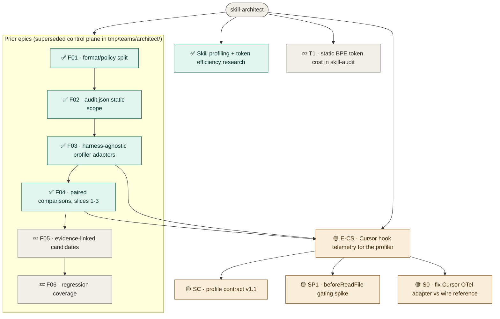

# skill-architect — roadmap
**Updated** 2026-09-10 02:55 · `scribe` · mirror `scuba-state/imagineux-gmail-com@59d7dbf`

## Now active
_One or two lines per currently-moving thread — what's happening right now._
- 🟡 **E-CS · Cursor hook telemetry** — spec gate round 4: conformance 3 MED + 6 LOW (no HIGH); verifiability 1 HIGH (S0 bypasses the single token writer) + 8 MED. Final revision round 4 running; will present to user after with a Known-residue section. → [status](teams/cursorscope-go/status.md)
- ✅ **E-CS · deep research** — ✅ deep-research done: no existing tool attributes cost per skill run in Cursor; report in `../cursor-profiler/docs/research/existing-per-skill-cost-tools.md`. → [status](teams/cursorscope-go/status.md)
- ✅ **E-CS · research collection** — ✅ six research files + deep-research report collected into `../cursor-profiler/docs/research/`. → [status](teams/cursorscope-go/status.md)
- ✅ **research-profiling** — ledger landed at `teams/research-profiling/ledger.md`; folded into the E-CS grooming. → [status](teams/research-profiling/ledger.md)
- ✅ **F04 · paired comparisons** — slices 1–3 are on `main` (`0a83615`, `236152c`, `e0e2a52`); its status file `tmp/teams/architect/F04.status.md` still reads "parked" and is **stale** — trust git, not that file.

## Decisions waiting on me
_(Empty when none; never bury a decision.)_
1. **E-CS forks and the top-3 user questions** — ingest model, OTLP sequencing, code location, naming, deps, token honesty → [context](teams/cursorscope-go/roadmap.md) §D and §E
2. **Cursor availability** — `~/.cursor/` is **absent on this machine**; will the user install Cursor and the hook? If not, the hooks half (S1–S5, S7, S9–S11) is unbuildable-as-verified and the epic collapses to **S0 + T1** → [context](teams/cursorscope-go/roadmap.md) §E Q1
3. **Dispatch S0 now?** — bug fix to the already-merged `profiler/cursor.go`; independent of the epic once the spec gate is CLEAN → [context](teams/cursorscope-go/slices/S0.status.md)
4. **Concurrent writer in `../cursor-profiler/docs/research/`** — its `research-contradictions.md` claims the `cursor.*` names are unverified; the conformance hunter verified all 21 against Cursor's wire reference (keys wrong, names real). Reconcile which session owns that directory. → [context](teams/cursorscope-go/review/hunter-conformance.md)

## Roadmap

_Node labels carry the stage emoji (🟡 spec · 🔵 plan · 🟢 execution · 🔎 review · ⛔ blocked · ✅ done · 💤 parked); colour comes from the matching `classDef` — don't invent new ones. Click a node to open its artifact; artifacts chain **spec → plan → executive brief**. Per-thread recovery detail (branch · worktree · last SHA · next · blocker) lives in each thread's `status.md`._
