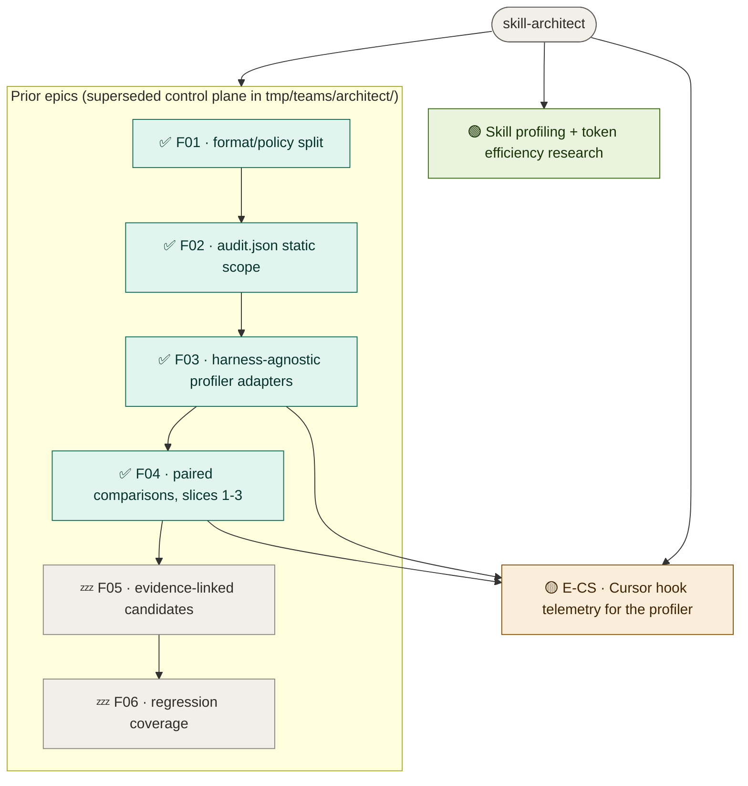

# skill-architect — roadmap
**Updated** 2026-09-10 00:47 · `scribe` · mirror `scuba-state/imagineux-gmail-com@pending`

## Now active
_One or two lines per currently-moving thread — what's happening right now._
- 🟡 **E-CS · Cursor hook telemetry** — mandate drafted; awaiting research fold-in and the user's fork calls before grooming into slices. → [status](teams/cursorscope-go/status.md)
- 🟢 **research-profiling** — researcher running on skill profiling + token-efficiency evidence; ledger not yet written. → [status](teams/research-profiling/ledger.md)
- ✅ **F04 · paired comparisons** — slices 1–3 are on `main` (`0a83615`, `236152c`, `e0e2a52`); its status file `tmp/teams/architect/F04.status.md` still reads "parked" and is **stale** — trust git, not that file.

## Decisions waiting on me
_(Empty when none; never bury a decision.)_
1. **E-CS mandate forks** — ingest model, OTLP, location, naming, deps, token honesty → [context](teams/cursorscope-go/mandate-draft.md) §7 and §10

## Roadmap

_Node labels carry the stage emoji (🟡 spec · 🔵 plan · 🟢 execution · 🔎 review · ⛔ blocked · ✅ done · 💤 parked); colour comes from the matching `classDef` — don't invent new ones. Click a node to open its artifact; artifacts chain **spec → plan → executive brief**. Per-thread recovery detail (branch · worktree · last SHA · next · blocker) lives in each thread's `status.md`._
