# skill-architect — roadmap
**Updated** 2026-09-13 17:00 · `scribe` · mirror `scuba-state/imagineux-gmail-com@56c02b4` (pushed & SHA-verified)

## Now active
_One or two lines per currently-moving thread — what's happening right now._
- 🟢 **ACTIVE: release/0.4.1 — patch + OTLP parser** — PR [#2](https://github.com/Okja-Engineering/skill-architect/pull/2) OPEN, non-draft, head `527ba4e`, base `main`, 17 files +883/−255; CI `test` **pass**, `MERGEABLE`/`CLEAN`; no external review posted (0 reviews — hunters are the gate). Ship-gate round 1 ran on `7cb32e2` (3 hunters → [worklist-round1](teams/release-0.4.1/worklist-round1.md)); bug-fixer root repair pushed `527ba4e` (11 commits); the confirming pass found the **code CLEAN at the root**, leaving six residuals R-F2…R-F7 that ride with item 19 → [residuals](teams/release-0.4.1/worklist-round1-residuals.md). Item 19 (parse real OTLP/JSON) is building in worktree `skill-architect-wt/release-0.4.1` against [otlp-plan.md v3](teams/release-0.4.1/otlp-plan.md) (research `otlp-research.md` live-captured; two gate rounds closed), est. ≈ +1570/−300 — worktree clean at `527ba4e`, no implementer commits yet. → [status](teams/release-0.4.1/status.md) · [mandate](teams/release-0.4.1/mandate.md)
- 🟡 **skillgate → renumbered to 0.6.0** — Devin reconciling control plane in [teams/release-v0.5.0/](teams/release-v0.5.0/plan.md) (directory name stale, now 0.6.0 scope). The staged PR-0..PR-4 chain there is superseded by the release ladder below. Pre-flight done in tree: `.gitignore` covers `.venv*/`+`.scuba/`; both modules renamed to `github.com/Okja-Engineering/...`; `difftest` repaired (missing `x/text` require; `{0,8192}`→`*` RE2 fix); both modules build/vet/test green.
- 🟡 **v1.0 pilot — charter ratified** — single-team lifecycle tool: audit → evidence → digest → recommend → consumer decides. Three questions: quality (opinionated), cost to run, how often run; honest `unknown` where telemetry can't answer. Charter + ~1,000h allocation: [teams/v1-pilot/plan.md](teams/v1-pilot/plan.md). Lands as 1.0.0 on the ladder.
- 🟢 **skillgate program — complete in tree** — gate + G0 quarantine, G1 ledger, 20 tripwires SK-T001..T020, refgraph, ICM I001–I005, Pack E budget, advisory shell-outs, baselines, report/v1 + SARIF, `skills/skill-gate`. Normative docs: `docs/skillgate-spec.md`, `docs/skillgate-intent.md`. Dogfooded: `anthropics/skills` 263→47 findings; `pi` 565→259; arena reports `.scuba/arena/dogfood-1/` (predicted, not runs). CAUTION is the reachable ceiling by design (F14 `preactivation-bash-leg`). Ships as **0.6.0**, not 0.5.0.
- 🟢 **profiler program in tree** — 7 unpushed commits (F03 adapters, F04 compare/experiment) + uncommitted hook-spool (`ingest`/`doctor`/`hooks`/`analyze`/`experiment`, `queries/`). Ships as **0.5.0** (rebased onto main after 0.4.1 merges); carries skill-rewrite commits b73326d/f13173e.
- 🟡 **E-CS · Cursor hook telemetry** — superseded in part by skillgate program (S-numbering folds into slices 4–5; SP1 spike still gates Cursor pre-activation). `teams/cursorscope-go/` plan names a `skill-scope` binary the tree does not implement — reconcile when slices 4–5 dispatch.
- 📋 **Release ladder (decided 2026-09-13)** — user call; plan: [~/.claude/plans/determine-the-next-menaingful-glistening-horizon.md](file:///Users/matthewvandusen/.claude/plans/determine-the-next-menaingful-glistening-horizon.md). Priority order **0.4.1 → 0.5.0 → 0.6.0 → 0.7.0 → 1.0**. (Held here rather than as a new `##` section: the roadmap's three-section frame is frozen; the ladder's canonical home is the tree below.)
  - **0.4.1 · patch — make 0.4.0 true, plus item 19.** Cut from `origin/main` 30f374c, not local main. Mandate items 1–18 (the partial-OTel data-loss bug plus install/spec/changelog truth and the version bump) landed at `7cb32e2` and were repaired at `527ba4e`. **Item 19, added by user decision 2026-09-13 ~15:55, is now in scope:** the Claude Code adapter must parse real OTLP/JSON (`resourceMetrics`/`resourceLogs`, real attribute keys), dropping the bespoke `{"metrics":[…],"logs":[…]}` envelope. Still no skillgate file; still no `cache_creation`→`cache_write`.
  - **0.5.0 · minor — the profiler grows up.** The 7 unpushed commits (Cursor/Codex/Devin adapters, `compare`, `experiment`), the uncommitted hook spool, skill-rewrite self-contained, profile schema **v2** (`cache_write` rename, Duration acknowledged), Devin honesty, version lockstep + drift asserts. **Also inherits 0.4.1's found-not-fixed:** `check-frontmatter.sh` prints `frontmatter OK` when `skill-validator` is missing; `check-structure.sh --json` silently drops findings without `jq`; the Devin install rows are unverified (no Devin CLI available); CI still runs no `go vet`/`-race`/`gofmt` and its `curl`/`npm` installs are unpinned; W4's `ToolCallEntry.Success` rename; `CaptureOpts.APIKey` never read.
  - **0.6.0 · minor — skill-gate v1.** The reconciled Devin boundary, renumbered: `skillgate gate`/`version`, G0–G3 + G7, 20 tripwires, refgraph, ICM I001–I005, Pack E, advisory shell-outs, report/v1 + SARIF, `skills/skill-gate`, difftest carved out, ceded-lane sentence naming every gap.
  - **0.7.0 · minor — the engine.** Typed `Rule` with declared views, the artifact model (`BuildModel`→`Model`, manifests parsed once), derived views in port order with view coverage in the ledger, view-level difftest corpus, semgrep advisory leg, line-0 class fixed at the root. Spec: `docs/research/rule-language.md`.
  - **1.0.0 · major — the three questions.** Safe to install (gate + views + artifact model; **CAUTION stays the reachable ceiling** per F14 and 1.0 says so rather than promising APPROVE), what it costs (`skillgate env`, Pack D/E), did it pay (`skillgate scan`, calibration, dynamic attribution, SDY), plus report/v1 + CLI stability.

## Decisions waiting on me
_Open calls only — ratified items are recorded in the plan._
1. **⛔ Merge PR [#2](https://github.com/Okja-Engineering/skill-architect/pull/2) — HELD by your own call (2026-09-13): do NOT merge yet.** The PR is green and mergeable at `527ba4e`, but item 19 (the real OTLP parser) is still being built into this same branch. Sequence before the merge is yours to make: implementer pushes → **final hunter swarm on the new head** (code, DoD conformance including item 19, docs truth) → reconcile → **you merge** → tag `v0.4.1` (optionally retro-tag `v0.4.0` at 541af3e; the repo currently carries only `v0.2.0`, so the tag list does not match the changelog). → [mandate](teams/release-0.4.1/mandate.md) · [status](teams/release-0.4.1/status.md)
2. **⛔ Lift prototype mode for the rest of the world** — lifted 2026-09-13 **for `release/0.4.1` and its push only**. Local main's 7 unpushed commits and the whole uncommitted tree still wait; 0.5.0 cannot start until this lifts. Context: `.scuba/session-prompt-dogfood.md:7`.
3. **Durability mirror** — `scuba-state/imagineux-gmail-com` exists and is pushed; status recorded in the header line. Control plane survives session and machine loss when that SHA is current.
4. **Binary-asset REJECT policy on untrusted** — keep strict vs. an `inspected-as-binary` outcome that records the hash but admits content wasn't inspected. 0.6.0 content; not release-blocking.
5. **T006 placeholder-vocabulary exclusion** — `ghp_your_github_token` fires as credential-shaped; baseline vs. exclusion trades recall. 0.6.0 content; not release-blocking.
6. **D1–D8 — ratified by default, defaults in force** per `docs/skillgate-intent.md`. No further call needed; they govern 0.6.0's skill-gate v1 scope and gate neither 0.4.1 nor 0.5.0.
7. **E-CS forks (old §E Q1–Q8) + S0 dispatch** — deferred; S0 (`cursor.go` vs wire reference) still wanted, `cursor.go` is dirty in tree — verify before scoping.
8. **v1 positioning — plugin-of-skills vs toolchain** — README says plugin; tree is two Go binaries + skills. Needed before 1.0 docs land.
9. **Offline-pack approach** — vendored pinned binaries vs port-the-checks into Go (difftest precedent). Regulated/segmented-env blocker.
10. **Estate-mode home** — `skillgate` subcommand, `profiler` subcommand, or thin-skill wrapper.

_Resolved this session: release ladder set — 0.4.1 patch from `origin/main`, skill-gate renumbered to its own 0.6.0 after profiler 0.5.0, 1.0 is the three-question promise, priority 0.4.1 → 0.5.0 → 0.6.0 → 0.7.0 → 1.0; v1 scope ratified (single-team pilot; lifecycle = audit→evidence→recommend; remediation is the consumer's; charter at `teams/v1-pilot/plan.md`); module rename → `Okja-Engineering` both modules (done in tree); `docs/research/**` kept permanently (deletion chore cancelled — reconcile `skillgate-intent.md:62-69` when 0.6.0 lands); **H3 (ci.yml Go version) folded into 0.4.1 item 5** — 0.4.1 sets `go-version-file: profiler/go.mod`; the local tree's `go-version-file: go.work` fix is local-main-only and out of 0.4.1 scope; **ROOT A fork decided by you (15:55): Option B — parse real OTLP/JSON in 0.4.1**, landing as mandate item 19 after the round-1 repair. Item-19 calls taken by the chief of staff on defaults you may still override: `skill_activation` and `attribution` stay `unknown` in 0.4.1 with corrected reasons (user-defined, built-in, bundled and official-marketplace skill names appear verbatim on `skill.name` — only third-party plugin skills are redacted, so the old "redacted" reason was false); `ToolCallEntry.Success` means the execution outcome read from `tool_result` (rejections listed from `tool_decision` with success=false); the collector file-exporter route is documented in README/spec and the bundled receiver subcommand is deferred to 0.5.0; `ClaudeCodeAdapter.Capture` refuses `CaptureOpts.ExportFile` at the adapter rather than only at the CLI (R-F3/R-F4); data points whose temporality or leaves cannot be read are refused and counted, never serialised as a value._

## Roadmap

```mermaid
flowchart TD
  L([skill-architect]):::root

  L --> R041[🟢 0.4.1 · patch + OTLP parser — PR #2 open, ship-gate in progress]:::exec
  R041 --> O19[🟢 Item 19 · parse real OTLP/JSON — plan v3, implementer building]:::exec
  R041 --> SGR1[🔎 Ship-gate round 1 — code CLEAN at root; 6 residuals ride with item 19]:::review
  R041 --> R050[🔵 0.5.0 · profiler grows up]:::plan
  R050 --> R060[🔵 0.6.0 · skill-gate v1]:::plan
  R060 --> R070[💤 0.7.0 · engine — typed rules, artifact, views]:::parked
  R070 --> R100[💤 1.0.0 · three questions]:::parked

  L --> REL[💤 v0.5.0 staged PR chain PR-0..PR-4 — superseded by the release ladder]:::parked
  L --> V1[🟡 v1.0 pilot — single-team lifecycle; charter ratified]:::spec
  L --> SG[🟢 skillgate · skill audit / gate / inspector — complete in tree]:::exec
  L --> RP[✅ Skill profiling + token efficiency research]:::done
  L --> T1[💤 T1 · static BPE token cost — absorbed into Pack E]:::parked

  REL --> PR0[💤 PR-0 · docs/research-and-repairs — superseded; folds into 0.6.0]:::parked
  REL --> PR2[💤 PR-2 · profiler/hook-spool-and-adapters — superseded; folds into 0.5.0]:::parked
  PR2 --> PR3[💤 PR-3 · skill-rewrite/self-contained — superseded; folds into 0.5.0]:::parked
  PR3 --> PR1[💤 PR-1 · skillgate/gate-v1 — superseded; folds into 0.6.0]:::parked
  PR1 --> PR4[💤 PR-4 · release/v0.5.0 — superseded by the ladder]:::parked

  REL --> V1
  V1 --> EST[🔵 Estate mode — per-skill gate+audit joined to activations; ranked plan]:::plan
  V1 --> LOOP[🔵 Proof loop — rewrite → re-capture → compare receipt]:::plan
  V1 --> REGP[🔵 Regulated adoption — pinned/vendored deps, SBOM, offline doc]:::plan
  V1 --> TPI[🟡 Trigger precision/recall — SP1 + should-not-fire stratum]:::spec

  SG --> R060
  SG --> SL1[✅ Slice 1 · safety gate — in tree, 0.6.0 content]:::done
  SG --> SL2[✅ Slice 2 · env-aware static — agnix + Pack E in tree, 0.6.0 content]:::done
  SG --> SL3[✅ Slice 3 · ICM + graph — in tree, 0.6.0 content; calibration deferred]:::done
  SG --> SL4[💤 Slice 4 · dynamic, Claude Code — not in 0.6.0]:::parked
  SG --> SL5[💤 Slice 5 · dynamic, Cursor — not in 0.6.0]:::parked
  SG --> SL6[💤 Slice 6 · rank + prove — SDY, three-arm]:::parked

  subgraph PRIOR["Prior epics (superseded control plane in tmp/teams/architect/ and .scuba/teams/cursorscope-go/)"]
    F01[✅ F01 · format/policy split]:::done
    F02[✅ F02 · audit.json static scope]:::done
    F03[✅ F03 · harness-agnostic profiler adapters]:::done
    F04[✅ F04 · paired comparisons, slices 1-3]:::done
    CS[🟡 E-CS · Cursor hook telemetry — superseded in part; SP1 spike still gates Cursor pre-activation]:::spec
    F05[💤 F05 · evidence-linked candidates]:::parked
    F06[💤 F06 · regression coverage]:::parked
  end

  L --> PRIOR
  F01 --> F02
  F02 --> F03
  F03 --> F04
  F04 --> F05
  F05 --> F06
  F04 --> SL4
  CS --> SL5
  SL1 --> SL2
  SL2 --> SL3
  SL3 --> SL4
  SL4 --> SL5
  SL5 --> SL6

  click R041 "teams/release-0.4.1/status.md" "Live status — branch, head 527ba4e, PR #2, per-item evidence"
  click O19 "teams/release-0.4.1/otlp-plan.md" "Plan v3 — two gate rounds closed; research otlp-research.md"
  click SGR1 "teams/release-0.4.1/worklist-round1-residuals.md" "Round-1 residuals R-F2…R-F7 — ride with item 19"
  click REL "teams/release-v0.5.0/plan.md" "Superseded release plan — PR chain, gates, tag procedure"
  click V1 "teams/v1-pilot/plan.md" "v1.0 pilot charter — lifecycle, commitments, ~1,000h allocation"
  click PR0 "teams/release-v0.5.0/PR-0.status.md" "status"
  click PR2 "teams/release-v0.5.0/PR-2.status.md" "status"
  click PR3 "teams/release-v0.5.0/PR-3.status.md" "status"
  click PR1 "teams/release-v0.5.0/PR-1.status.md" "status"
  click PR4 "teams/release-v0.5.0/PR-4.status.md" "status"
  click SL1 "../docs/skillgate-spec.md" "Normative gate contract"
  click CS "teams/cursorscope-go/roadmap.md" "Groomed 5-round plan — superseded in part by skillgate program"
  click RP "teams/research-profiling/ledger.md" "Research ledger"
  click T1 "teams/cursorscope-go/slices/T1.status.md" "Absorbed into Pack E — use skill-validator check -o json"
  click F01 "../tmp/teams/architect/F01.status.md" "Done — status"
  click F02 "../tmp/teams/architect/F02.status.md" "Done — status"
  click F03 "../tmp/teams/architect/profiler-design-space.md" "Done — design space (no status file)"
  click F04 "../tmp/teams/architect/F04.status.md" "Done for slices 1-3 — status file stale"
  click F05 "../tmp/teams/architect/F05.status.md" "Parked — status"
  click F06 "../tmp/teams/architect/F06.status.md" "Parked — status"

  classDef root fill:#F1EFE8,stroke:#5F5E5A,color:#2C2C2A
  classDef spec fill:#FAEEDA,stroke:#854F0B,color:#412402
  classDef plan fill:#E6F1FB,stroke:#185FA5,color:#042C53
  classDef exec fill:#EAF3DE,stroke:#3B6D11,color:#173404
  classDef review fill:#EEEDFE,stroke:#534AB7,color:#26215C
  classDef blocked fill:#FCEBEB,stroke:#A32D2D,color:#501313
  classDef done fill:#E1F5EE,stroke:#0F6E56,color:#04342C
  classDef parked fill:#F1EFE8,stroke:#888780,color:#2C2C2A
```

_Node labels carry the stage emoji (🟡 spec · 🔵 plan · 🟢 execution · 🔎 review · ⛔ blocked · ✅ done · 💤 parked); colour comes from the matching `classDef` — don't invent new ones. Click a node to open its artifact; artifacts chain **spec → plan → executive brief**. Per-thread recovery detail (branch · worktree · last SHA · next · blocker) lives in each thread's `status.md`._
