# skill-architect — roadmap
**Updated** 2026-09-14 09:20 CDT · `scribe` · mirror `scuba-state/imagineux-gmail-com@6cd92f4` (pushed & SHA-verified)

## Now active
_One or two lines per currently-moving thread — what's happening right now._
- ✅ **0.4.2 — BOTH PRs MERGED.** Verified via `gh`: PR [#3](https://github.com/Okja-Engineering/skill-architect/pull/3) `release/0.4.2` @ `bad47c5` merged **2026-09-14T13:33:49Z** as squash commit **`bd32b26`**, and PR [#4](https://github.com/Okja-Engineering/skill-architect/pull/4) `fix/skill-audit-tool-guards` @ `85ad0ea` merged **2026-09-14T13:34:32Z** as squash commit **`5c847e1`**. **`origin/main` is now `5c847e1`.** Verified on the merged branch: **zero merge commits** (linear history held, as the ruleset requires) and **zero `Co-Authored-By` trailers** anywhere in `origin/main`'s history. The profiler's token series is now identified by resource + scope + metric + attributes with `startTimeUnixNano` reset boundaries and an unplaced-run floor; no skill-audit script emits a verdict a missing tool could not compute. **No `v0.4.2` tag exists** — local and remote tag lists are still exactly `v0.2.0` and `v0.4.1`. → [profiler status](teams/release-0.4.2/status.md) · [scripts status](teams/release-0.4.2-scripts/status.md)
- 🔎 **PR [#5](https://github.com/Okja-Engineering/skill-architect/pull/5) — the version bump, open and waiting only on your merge.** Branch `release/0.4.2-version`, head **`13b3141`**, a **single commit whose parent is `5c847e1`** — verified, so it sits directly on the merged main. **OPEN, non-draft, base `main`, MERGEABLE / CLEAN**, CI check `test` **pass** in 1m13s. Authorship is `imagineux <imagineux@gmail.com>` as both author and committer, with **zero `Co-Authored-By` trailers** (verified by grep on the commit body). It moves **16 version surfaces across 9 files** — counted from the diff, not the prose: five plugin/marketplace manifests, `README.md` ×2, `profiler/types.go` ×2 (`AdapterVersion` + the stale comment above it), `profiler/profiler_test.go` ×2 (including the `const want = "0.4.2"` pin that would otherwise fail CI on the release commit itself), and `tests/test_skill.sh` ×5. It also lands **71 lines of new release prose** (`CHANGELOG.md` +52, `RELEASE_NOTES.md` +19) superseding the three false claims in the released 0.4.1 entries. **A hunter is gating that 71 lines of prose and is still running** — worktree `scratchpad/wt-prose` @ `13b3141`, verified present. **No tag is pushed**; `v0.4.2` follows your merge and is yours. → [draft](teams/release-0.4.2/release-commit-draft.md) · [apply record](teams/release-0.4.2/apply-record.md)
- 🟢 **Gap audit toward 0.4.3 — five lenses landed, reconciliation in flight.** User directive 2026-09-14: 0.5 is additional features, so gaps in **already-delivered** functionality get closed first. All five hunters audited **`origin/main` @ `5c847e1` only** — local main's 7 unpushed commits, the 21-file uncommitted tree, and `skillgate/`/`skills/skill-gate/` are all explicitly out of scope per [mandate](teams/gap-audit-0.4.3/mandate.md). All five reports are persisted and verified on disk (1,969 lines total): **skills-function** 26 findings / 3 P1 · **install-truth** 25 / 1 P1 · **deferred-ledger** 33 tracked items, 18 still open · **adapter-honesty** 10 / 1 P1 · **docs-truth** 10 / 0 P1 — **104 line items in all**. An `architect` is reconciling the five into `teams/gap-audit-0.4.3/worklist.md` — dedupe, root clusters, independent P1 re-verification, the 0.4.3/0.5.0 line, sequencing, and an explicit answer on whether anything blocks PR 5. **That file does not exist yet** (verified); the architect is still running. → [mandate](teams/gap-audit-0.4.3/mandate.md)
- ⛔ **The six open P1s, each re-verified against `5c847e1` by this pass — not transcribed.** (1) **The profiler ignores the `sessionID` it is given**: `sessionID` occurs at exactly two lines in `claude_code.go` — the `Capture` parameter at `:173` and the stamp at `:188` — and `resolve()` at `:87` takes no identity argument, so nothing is filtered and a multi-session export yields wrong token, tool and timing numbers. (2) **`check-structure.sh` never strips frontmatter** — zero occurrences of any frontmatter handling in the file — so the whole policy verdict is satisfiable from frontmatter and the headline command reports `passed: true` for a skill whose body is one prose line. (3) **`check-paths.sh`'s frontmatter stripper is a toggle** (`:65-70`, `/^---$/ { if (in_fm) {in_fm=0; next} in_fm=1; next }`), so a third `---` re-enters skip mode and a markdown horizontal rule silently disables all path checking. (4) **`tests/test_skill.sh` is itself defective** — exactly **16** assertions pass the literal `true` and cannot fail, and **11** bare `[[ ]]` guards do not fire under macOS bash 3.2; anything verified only by that suite is unverified. It also still lacks `cd "$(dirname "$0")/.."`. (5) **`check-frontmatter.sh` requests JSON and never parses it** — `:44` captures `skill-validator validate structure -o json` into `output` and every branch below reads only `$code`. (6) **`AdapterVersion` stamps 0.4.1 over changed totals** — ledger L29, and **PR 5 is the fix**, so this P1 closes on your merge. → [skills-function](teams/gap-audit-0.4.3/skills-function.md) · [install-truth](teams/gap-audit-0.4.3/install-truth.md) · [adapter-honesty](teams/gap-audit-0.4.3/adapter-honesty.md) · [deferred-ledger](teams/gap-audit-0.4.3/deferred-ledger.md)
- 🔎 **One correction to the P1 set as briefed, recorded rather than silently adopted.** The **kvlist order-sensitive identity** finding — `otlp.go:714-715` returns `"k" + compactJSON(v.KvlistValue)`, so reordered members split one series into two and the total over-counts, contradicting the OTel spec — is real and reproduced, but its own lens rates it **P2, not P1** (`deferred-ledger.md:45`, item **L14**). What makes L14 notable is different: its **recorded deferral reason is now false** — it was filed as "a bound on the fix, not a known bug", and it is a known bug producing a wrong number. The deferred ledger's two P1s are **L2** (the `test_skill.sh` guards, which overlaps skills-function's own `test_skill.sh` P1) and **L29** (in flight on PR 5). So: **7 items rated P1 across the five reports, 6 of them open, one of those a probable cross-lens duplicate** — the dedupe is the architect's call, not this pass's. → [deferred-ledger](teams/gap-audit-0.4.3/deferred-ledger.md)
- 🔎 **A shared root spans three lenses.** PR 4 established the right invariant, built `scripts/verdict-guard.sh`, and applied it to only part of the surface. Verified at `5c847e1`: `check-structure.sh`, `check-paths.sh` and `check-frontmatter.sh` each reference the guard, `audit-report.sh` twice — and **`check-quality.sh` references it zero times, sitting entirely outside it**. `require_tool` is likewise never routed over `grep`/`awk`/`wc`, so a failing text utility still yields a verdict. Fixing the leaves without closing the root would re-open this in 0.5.0. Separately, the shipped `attribution` reason asserts something **false about the harness**: `claude_code.go:208` emits `UnknownAttributionResult("Claude Code telemetry carries no output-to-skill mapping")` while `skill.name` is documented by Anthropic on the token counter and three request events — and is referenced three times in `claude_code.go` itself. → [skills-function](teams/gap-audit-0.4.3/skills-function.md) · [adapter-honesty](teams/gap-audit-0.4.3/adapter-honesty.md)
- 🟡 **skillgate → renumbered to 0.6.0** — Devin reconciling control plane in [teams/release-v0.5.0/](teams/release-v0.5.0/plan.md) (directory name stale, now 0.6.0 scope). The staged PR-0..PR-4 chain there is superseded by the release ladder below. Pre-flight done in tree: `.gitignore` covers `.venv*/`+`.scuba/`; both modules renamed to `github.com/Okja-Engineering/...`; `difftest` repaired (missing `x/text` require; `{0,8192}`→`*` RE2 fix); both modules build/vet/test green.
- 🟡 **v1.0 pilot — charter ratified** — single-team lifecycle tool: audit → evidence → digest → recommend → consumer decides. Three questions: quality (opinionated), cost to run, how often run; honest `unknown` where telemetry can't answer. Charter + ~1,000h allocation: [teams/v1-pilot/plan.md](teams/v1-pilot/plan.md). Lands as 1.0.0 on the ladder.
- 🟢 **skillgate program — complete in tree** — gate + G0 quarantine, G1 ledger, 20 tripwires SK-T001..T020, refgraph, ICM I001–I005, Pack E budget, advisory shell-outs, baselines, report/v1 + SARIF, `skills/skill-gate`. Normative docs: `docs/skillgate-spec.md`, `docs/skillgate-intent.md`. Dogfooded: `anthropics/skills` 263→47 findings; `pi` 565→259; arena reports `.scuba/arena/dogfood-1/` (predicted, not runs). CAUTION is the reachable ceiling by design (F14 `preactivation-bash-leg`). Ships as **0.6.0**, not 0.5.0.
- 🟢 **profiler program in tree** — local `main` is now **7 ahead / 3 behind** `origin/main` (re-verified this pass; it was 7/1 before the two merges), merge base `30f374c`. Those 7 commits (F03 adapters, F04 compare/experiment) need **rebasing onto the merged `main` at `5c847e1`**; the uncommitted hook-spool (`ingest`/`doctor`/`hooks`/`analyze`/`experiment`, `queries/`) in the primary tree carries forward. Ships as **0.5.0**; carries skill-rewrite commits b73326d/f13173e.
- 🟡 **E-CS · Cursor hook telemetry** — superseded in part by skillgate program (S-numbering folds into slices 4–5; SP1 spike still gates Cursor pre-activation). `teams/cursorscope-go/` plan names a `skill-scope` binary the tree does not implement — reconcile when slices 4–5 dispatch.
- 📋 **Release ladder (decided 2026-09-13; 0.4.3 inserted 2026-09-14)** — user call; plan: [~/.claude/plans/determine-the-next-menaingful-glistening-horizon.md](file:///Users/matthewvandusen/.claude/plans/determine-the-next-menaingful-glistening-horizon.md). Priority order **0.4.1 → 0.4.2 → 0.4.3 → 0.5.0 → 0.6.0 → 0.7.0 → 1.0**. (Held here rather than as a new `##` section: the roadmap's three-section frame is frozen; the ladder's canonical home is the tree below.)
  - **0.4.1 · patch — make 0.4.0 true, plus item 19. ✅ COMPLETE — merged at `2ed34b8`, tagged `v0.4.1`.** Cut from `origin/main` 30f374c, not local main. Mandate items 1–18 (the partial-OTel data-loss bug plus install/spec/changelog truth and the version bump) landed at `7cb32e2`, were repaired at `527ba4e`, and item 19 — the real OTLP/JSON parser (`resourceMetrics`/`resourceLogs`, real attribute keys), added by user decision 2026-09-13 ~15:55, dropping the bespoke `{"metrics":[…],"logs":[…]}` envelope — landed and was hardened across five fix rounds to `f7311f8`, then history-cleaned to `f3f35ff`, which squash-merged to **`2ed34b8`**. Annotated tag **`v0.4.1` → `2ed34b8`**, pushed. Remote install verified live post-merge (`claude plugin list` → 0.4.1). Still no skillgate file; still no `cache_creation`→`cache_write`.
  - **0.4.2 · patch — the accumulator's time-series model, plus the skill-audit tool guards. ✅ CODE MERGED; version bump open as PR [#5](https://github.com/Okja-Engineering/skill-architect/pull/5).** It shipped as **two disjoint PRs**, both cut from `origin/main` at `2ed34b8`: **#3** `release/0.4.2` @ `bad47c5` (8 commits) for the profiler root — series identity, `startTimeUnixNano` resets, the unplaced-run floor, per-series mixed-temporality refusal — squash-merged to **`bd32b26`**; and **#4** `fix/skill-audit-tool-guards` @ `85ad0ea` (9 commits) for the two silent-wrong-answer script guards, squash-merged to **`5c847e1`**, which is `origin/main`. No schema change; `profile/v1` keys unchanged, only values become correct. Delta temporality, Claude Code's default, is unaffected. Neither PR touched a version surface — that is **PR 5's** job, which is open at `13b3141` and precedes the `v0.4.2` tag. → [profiler status](teams/release-0.4.2/status.md) · [scripts status](teams/release-0.4.2-scripts/status.md) · [release-commit requirements](teams/release-0.4.2/release-commit-requirements.md)
  - **0.4.3 · patch — close the gaps in what is already delivered. 🟡 AUDITED, being scoped.** New rung, inserted by user directive 2026-09-14 ahead of 0.5.0's features. Five lenses audited the delivered product at `5c847e1` and returned 104 line items, **6 open P1**: the profiler's unfiltered `sessionID`; `check-structure.sh`'s missing frontmatter strip; `check-paths.sh`'s toggle stripper; `tests/test_skill.sh`'s 16 always-true assertions and 11 inert bash-3.2 guards; `check-frontmatter.sh` never parsing the JSON it asks for; and `AdapterVersion` stamping 0.4.1 over changed totals, which PR 5 closes. Two structural notes carried into scoping: the **`verdict-guard.sh` root is only partly applied** (`check-quality.sh` is entirely outside it, and `grep`/`awk`/`wc` are never routed through `require_tool`), and the shipped `attribution` reason is **false about the harness**. The 0.4.3/0.5.0 line and the sequencing are the architect's worklist, still in flight. → [mandate](teams/gap-audit-0.4.3/mandate.md)
  - **0.5.0 · minor — the profiler grows up.** The 7 unpushed commits (Cursor/Codex/Devin adapters, `compare`, `experiment`) — which now need a **rebase onto the merged `main` at `5c847e1`**, local `main` being 7 ahead / 3 behind — plus the **uncommitted 0.5.0 prototype in the primary tree, which carries forward**: the hook spool, skill-rewrite self-contained, profile schema **v2** (`cache_write` rename, Duration acknowledged), Devin honesty, version lockstep + drift asserts. **Environmental constraint discovered in 0.4.2 (verified): local `bash` is 3.2.57 on macOS while CI runs bash 5 on `ubuntu-latest`, so the shell suites and helpers must stay 3.2-compatible — no associative arrays.** That skew is exactly the shape that fails locally and passes in CI, so it has to be held as a standing rule, not rediscovered — and the gap audit has now shown it already bit: 11 of `test_skill.sh`'s guards are inert for precisely this reason. **Also inherits 0.4.1's found-not-fixed, carried from [status.md](teams/release-0.4.1/status.md):** the whole-export slurp memory ceiling (~6× the file's size in RSS); thin `profiler/cmd` coverage (12.6%); unpinned CI installs (`npm install -g skillscore` untagged; CI still runs no `go vet`/`-race`/`gofmt`); `profiler -h`, `probe -h` and `capture -h` exit 1; the not-a-count bound wording at `claude_code.go:343`; the W4 tool-call success rename; the Devin/Codex/Cursor install rows still unverified (README marks all three "not verified in this release"); `CaptureOpts.APIKey` never read. New 0.5.0 carry-overs recorded in [release-commit-requirements](teams/release-0.4.2/release-commit-requirements.md): `isMonotonic` unread, `flags` unread, a `--json` exit 3 that does not always carry a payload, and schema v1 having no channel to report a malformed series excluded from a `present` total. **The local-main divergence ruling still stands, re-verified this pass:** local `main` is `0a83615`, `origin/main` is `5c847e1`, merge base `30f374c`, **7 ahead / 3 behind**, `v0.4.1` is **not** an ancestor of local main, on top of **21 modified tracked files**. This is recorded and is explicitly **NOT a blocker** for the 0.4.2 release work — every release commit is cut in a worktree from post-merge `origin/main`, exactly as v0.4.1 and PR 5 were done, so the divergence cannot reach it. This *is* the planned 0.5.0 item: those seven commits rebase onto the new `main` and the working tree carries forward.
  - **0.6.0 · minor — skill-gate v1.** The reconciled Devin boundary, renumbered: `skillgate gate`/`version`, G0–G3 + G7, 20 tripwires, refgraph, ICM I001–I005, Pack E, advisory shell-outs, report/v1 + SARIF, `skills/skill-gate`, difftest carved out, ceded-lane sentence naming every gap.
  - **0.7.0 · minor — the engine.** Typed `Rule` with declared views, the artifact model (`BuildModel`→`Model`, manifests parsed once), derived views in port order with view coverage in the ledger, view-level difftest corpus, semgrep advisory leg, line-0 class fixed at the root. Spec: `docs/research/rule-language.md`.
  - **1.0.0 · major — the three questions.** Safe to install (gate + views + artifact model; **CAUTION stays the reachable ceiling** per F14 and 1.0 says so rather than promising APPROVE), what it costs (`skillgate env`, Pack D/E), did it pay (`skillgate scan`, calibration, dynamic attribution, SDY), plus report/v1 + CLI stability.

- 🔁 **History cleaned before merge (2026-09-13 ~21:40):** all 47 commits on `release/0.4.1` carried a `Co-Authored-By: Claude` trailer; the user does not want AI co-authorship. Stripped with `git filter-repo` in a fresh clone (the primary repo and its worktrees were never touched), force-pushed with a lease. Head `f7311f8` → **`f3f35ff`**; `git diff f7311f8 f3f35ff` is empty, tree hash unchanged (`dcabe9ec`), 47 commits, subjects identical, authorship entirely `imagineux`, CI green on the new head. `origin/main` never carried a trailer, so no published history was rewritten. Standing rule: never add the trailer again. **Held through both 0.4.2 merges and into PR 5, re-verified this pass:** `origin/main` at `5c847e1` greps **zero** `Co-Authored-By` trailers across its whole history, and PR 5's single commit at `13b3141` carries none either.

## Decisions waiting on me
_Open calls only — ratified items are recorded in the plan._
1. **Merge PR [#5](https://github.com/Okja-Engineering/skill-architect/pull/5), then tag `v0.4.2` — the only open action on 0.4.2.** The code is already on `main` (`bd32b26`, `5c847e1`); PR 5 is the version bump alone and is finished: single commit `13b3141` parented directly on `5c847e1`, **OPEN / non-draft / MERGEABLE / CLEAN**, CI `test` green, authorship `imagineux` only with zero trailers, 16 version surfaces across 9 files plus 71 lines of release prose. **Squash it** (the `main` ruleset requires linear history), then create and push the annotated tag **`v0.4.2`** — verified absent from both the local and remote tag lists, which still read exactly `v0.2.0`, `v0.4.1`. The tag is yours; no agent will create it. One gate is still open on it: **a hunter is auditing the 71 lines of new release prose and has not reported.** → [draft](teams/release-0.4.2/release-commit-draft.md) · [apply record](teams/release-0.4.2/apply-record.md)
2. **Skill metadata versions — a separate version axis, and yours to set.** At `origin/main` `5c847e1`, `skills/skill-audit/SKILL.md` declares `metadata.version: "0.2.0"` and `skills/skill-rewrite/SKILL.md` declares `"0.1.0"`; the last move was `7607210` taking skill-audit 0.1.0 → 0.2.0, and neither v0.4.0 nor v0.4.1 touched them. **PR #4 has now merged skill-audit changes substantially without moving its version** — 480 insertions across six files, five scripts rewritten plus a new `scripts/verdict-guard.sh`, and two `SKILL.md` lines rewritten to document new `DEP001`/`DEP002` findings and an `unverified` level — so its version arguably moves. **PR 5 does not touch either skill's metadata version** (verified: neither `SKILL.md` appears in its diff), so this call is still entirely open. Your options: fold a skill-audit bump into 0.4.3, bump it in a standalone follow-up, or hold skill metadata versions deliberately decoupled from the plugin version. → [draft](teams/release-0.4.2/release-commit-draft.md) · [PR 4 status](teams/release-0.4.2-scripts/status.md)
3. **Retro-tag `v0.4.0` at `541af3e`?** Still outstanding, re-verified this pass: the remote tag list is exactly `v0.2.0` and `v0.4.1`, so it does not match the changelog, which documents a 0.4.0. `541af3e` is the 0.4.0 commit (`feat: profiler preview v0.4.0 — harness-agnostic runtime signal capture`) and is confirmed an ancestor of `origin/main` at `5c847e1`, so an annotated retro-tag is available at any time. Your call whether the tag list should mirror the changelog. → [status](teams/release-0.4.1/status.md)
4. **Publish the GitHub Release for `v0.4.1`.** Still outstanding, re-verified this pass: `gh release list` shows only `v0.2.0`, and `gh release view v0.4.1` returns `release not found`, while the tag itself exists and is pushed at `2ed34b8`. This is gated **only on your go-ahead**, since the clean-config install check has passed against the merged `main`. Note it will shortly be joined by a `v0.4.2` release once you tag. → [status](teams/release-0.4.1/status.md)
5. **⛔ Lift prototype mode for the rest of the world** — lifted 2026-09-13 for `release/0.4.1` and its push, and extended to the two 0.4.2 branches and the 0.4.2 version branch. Local main's 7 unpushed commits and the whole uncommitted tree still wait; 0.5.0 cannot start until this lifts (and until local main rebases onto the merged main at `5c847e1`). Context: `.scuba/session-prompt-dogfood.md:7`.
6. **Durability mirror** — `scuba-state/imagineux-gmail-com` exists and is pushed; status recorded in the header line. Control plane survives session and machine loss when that SHA is current.
7. **Binary-asset REJECT policy on untrusted** — keep strict vs. an `inspected-as-binary` outcome that records the hash but admits content wasn't inspected. 0.6.0 content; not release-blocking.
8. **T006 placeholder-vocabulary exclusion** — `ghp_your_github_token` fires as credential-shaped; baseline vs. exclusion trades recall. 0.6.0 content; not release-blocking.
9. **D1–D8 — ratified by default, defaults in force** per `docs/skillgate-intent.md`. No further call needed; they govern 0.6.0's skill-gate v1 scope and gate neither 0.4.2 nor 0.5.0.
10. **E-CS forks (old §E Q1–Q8) + S0 dispatch** — deferred; S0 (`cursor.go` vs wire reference) still wanted, `cursor.go` is dirty in tree — verify before scoping.
11. **v1 positioning — plugin-of-skills vs toolchain** — README says plugin; tree is two Go binaries + skills. Needed before 1.0 docs land.
12. **Offline-pack approach** — vendored pinned binaries vs port-the-checks into Go (difftest precedent). Regulated/segmented-env blocker.
13. **Estate-mode home** — `skillgate` subcommand, `profiler` subcommand, or thin-skill wrapper.

_Resolved this session: **0.4.2's code is merged** — PR #3 squash-merged to `bd32b26` and PR #4 to `5c847e1` on 2026-09-14, leaving `origin/main` at `5c847e1` with linear history and zero AI co-authorship both re-verified on the merged branch; the merge action that sat at decision 1 for two passes is closed, and only the version bump (PR #5) and the `v0.4.2` tag remain. **0.4.1 merged and tagged** — PR #2 squash-merged to `2ed34b8` by you, annotated `v0.4.1` pushed at that commit, and the documented remote install route confirmed live at version 0.4.1; the merge-blocking rules (CodeQL code scanning with zero analyses, the Copilot code-quality signal, and a merge queue that fired no CI for want of a `merge_group` trigger) were removed by you and `required_linear_history` added, which is why every release is squashed. **The 0.4.2 fold question is closed** — the two skill-audit script guards shipped inside 0.4.2 as their own disjoint PR (#4), not as a 0.4.3. **0.4.3's existence is a user call already taken (2026-09-14)** — gaps in delivered functionality are closed before 0.5.0's features; what goes in it is still being scoped. Release ladder set — priority 0.4.1 → 0.4.2 → 0.4.3 → 0.5.0 → 0.6.0 → 0.7.0 → 1.0; v1 scope ratified (single-team pilot; lifecycle = audit→evidence→recommend; remediation is the consumer's; charter at `teams/v1-pilot/plan.md`); module rename → `Okja-Engineering` both modules (done in tree); `docs/research/**` kept permanently (deletion chore cancelled — reconcile `skillgate-intent.md:62-69` when 0.6.0 lands); **H3 (ci.yml Go version) folded into 0.4.1 item 5**; **ROOT A fork decided by you (15:55): Option B — parse real OTLP/JSON in 0.4.1**, landing as mandate item 19 after the round-1 repair. Item-19 calls taken by the chief of staff on defaults you may still override: `skill_activation` and `attribution` stay `unknown` in 0.4.1 with corrected reasons — **the gap audit has now found that corrected `attribution` reason is itself false about the harness, and it is 0.4.3 material**; `ToolCallEntry.Success` means the execution outcome read from `tool_result`; the collector file-exporter route is documented in README/spec and the bundled receiver subcommand is deferred to 0.5.0; `ClaudeCodeAdapter.Capture` refuses `CaptureOpts.ExportFile` at the adapter rather than only at the CLI (R-F3/R-F4); data points whose temporality or leaves cannot be read are refused and counted, never serialised as a value. **Ship-gate closed CLEAN at `f3f35ff`**, which is the tree that merged._

## Roadmap

```mermaid
flowchart TD
  L([skill-architect]):::root

  L --> R041[✅ 0.4.1 · MERGED 2ed34b8, tagged v0.4.1]:::done
  R041 --> O19[✅ Item 19 · parse real OTLP/JSON — landed, bespoke envelope dropped]:::done
  R041 --> SGR1[✅ Ship-gate — 5 fix rounds, 5 hunter rounds, CLEAN at f3f35ff]:::done
  R041 --> R042[✅ 0.4.2 · code MERGED — bd32b26 and 5c847e1 on main]:::done
  R042 --> R043[🟡 0.4.3 · close the gaps in delivered state]:::spec
  R043 --> R050[🔵 0.5.0 · profiler grows up]:::plan
  R050 --> R060[🔵 0.6.0 · skill-gate v1]:::plan
  R060 --> R070[💤 0.7.0 · engine — typed rules, artifact, views]:::parked
  R070 --> R100[💤 1.0.0 · three questions]:::parked

  R042 --> P3[✅ PR 3 · release/0.4.2 — squash-merged to bd32b26]:::done
  R042 --> P4[✅ PR 4 · fix/skill-audit-tool-guards — squash-merged to 5c847e1]:::done
  R042 --> RCD[✅ Release commit pre-drafted — applied as PR 5]:::done
  R042 --> P5[🔎 PR 5 · release/0.4.2-version @ 13b3141 — 16 version surfaces, CI green, awaiting your merge then tag v0.4.2]:::review
  P5 --> PGATE[🔎 Prose gate — hunter auditing 71 lines of new release prose, still running]:::review

  R043 --> GA1[✅ Lens · skills-function — 26 findings, 3 P1]:::done
  R043 --> GA2[✅ Lens · install-truth — 25 findings, 1 P1]:::done
  R043 --> GA3[✅ Lens · deferred-ledger — 33 items, 18 open]:::done
  R043 --> GA4[✅ Lens · adapter-honesty — 10 findings, 1 P1]:::done
  R043 --> GA5[✅ Lens · docs-truth — 10 findings, 0 P1]:::done
  R043 --> GAW[🟢 Architect reconciling five lenses into one worklist — in flight]:::exec

  L --> REL[💤 v0.5.0 staged PR chain PR-0..PR-4 — superseded by the release ladder]:::parked
  L --> V1[🟡 v1.0 pilot — single-team lifecycle; charter ratified]:::spec
  L --> SG[🟢 skillgate · skill audit / gate / inspector — complete in tree]:::exec
  L --> RP[✅ Skill profiling + token efficiency research]:::done
  L --> T1[💤 T1 · static BPE token cost — absorbed into Pack E]:::parked

  REL --> PR0[💤 PR-0 · docs/research-and-repairs — superseded; folds into 0.6.0]:::parked
  REL --> PR2[💤 PR-2 · profiler/hook-spool-and-adapters — superseded; folds into 0.5.0]:::parked
  PR2 --> PR3[💤 PR-3 · skill-rewrite/self-contained — superseded; folds into 0.5.0]:::parked
  PR3 --> PR1[💤 PR-1 · skillgate/gate-v1 — superseded; folds into 0.6.0]:::parked
  PR1 --> PR4[💤 PR-4 · release/v0.5.0 — superseded by the ladder]:::parked

  REL --> V1
  V1 --> EST[🔵 Estate mode — per-skill gate+audit joined to activations; ranked plan]:::plan
  V1 --> LOOP[🔵 Proof loop — rewrite → re-capture → compare receipt]:::plan
  V1 --> REGP[🔵 Regulated adoption — pinned/vendored deps, SBOM, offline doc]:::plan
  V1 --> TPI[🟡 Trigger precision/recall — SP1 + should-not-fire stratum]:::spec

  SG --> R060
  SG --> SL1[✅ Slice 1 · safety gate — in tree, 0.6.0 content]:::done
  SG --> SL2[✅ Slice 2 · env-aware static — agnix + Pack E in tree, 0.6.0 content]:::done
  SG --> SL3[✅ Slice 3 · ICM + graph — in tree, 0.6.0 content; calibration deferred]:::done
  SG --> SL4[💤 Slice 4 · dynamic, Claude Code — not in 0.6.0]:::parked
  SG --> SL5[💤 Slice 5 · dynamic, Cursor — not in 0.6.0]:::parked
  SG --> SL6[💤 Slice 6 · rank + prove — SDY, three-arm]:::parked

  subgraph PRIOR["Prior epics (superseded control plane in tmp/teams/architect/ and .scuba/teams/cursorscope-go/)"]
    F01[✅ F01 · format/policy split]:::done
    F02[✅ F02 · audit.json static scope]:::done
    F03[✅ F03 · harness-agnostic profiler adapters]:::done
    F04[✅ F04 · paired comparisons, slices 1-3]:::done
    CS[🟡 E-CS · Cursor hook telemetry — superseded in part; SP1 spike still gates Cursor pre-activation]:::spec
    F05[💤 F05 · evidence-linked candidates]:::parked
    F06[💤 F06 · regression coverage]:::parked
  end

  L --> PRIOR
  F01 --> F02
  F02 --> F03
  F03 --> F04
  F04 --> F05
  F05 --> F06
  F04 --> SL4
  CS --> SL5
  SL1 --> SL2
  SL2 --> SL3
  SL3 --> SL4
  SL4 --> SL5
  SL5 --> SL6

  click R041 "teams/release-0.4.1/status.md" "Merged 2ed34b8, tagged v0.4.1 — per-item and per-round evidence"
  click O19 "teams/release-0.4.1/otlp-plan.md" "Plan v3 — built and shipped; deviations and residuals recorded in status.md"
  click SGR1 "teams/release-0.4.1/status.md" "Rounds 1-5 — findings 18 → 26 → 9 → 4 → 4, CLEAN at f3f35ff"
  click R042 "teams/release-0.4.2/release-commit-requirements.md" "What the 0.4.2 release carries — code merged, version bump open as PR 5"
  click P3 "teams/release-0.4.2/status.md" "Profiler fix — three rounds, gate CLEAN at bad47c5, squash-merged to bd32b26"
  click P4 "teams/release-0.4.2-scripts/status.md" "Skill-audit tool guards — four rounds, three gates, CLEAN at 85ad0ea, squash-merged to 5c847e1"
  click RCD "teams/release-0.4.2/release-commit-draft.md" "The 0.4.2 release commit as drafted — surfaces, prose, apply checklist"
  click P5 "teams/release-0.4.2/apply-record.md" "PR 5 — what was applied, surface by surface"
  click PGATE "teams/release-0.4.2/release-commit-draft.md" "Prose under audit — changelog and release-notes text"
  click R043 "teams/gap-audit-0.4.3/mandate.md" "Gap audit mandate — scope, exclusions, ground rules"
  click GA1 "teams/gap-audit-0.4.3/skills-function.md" "Do the shipped skills do what they say — 26 findings, 3 P1"
  click GA2 "teams/gap-audit-0.4.3/install-truth.md" "Every documented install path executed — 25 findings, 1 P1"
  click GA3 "teams/gap-audit-0.4.3/deferred-ledger.md" "What 0.4.1 and 0.4.2 chose not to fix — 33 items, 18 open"
  click GA4 "teams/gap-audit-0.4.3/adapter-honesty.md" "Does the adapter tell the truth about what it read — 10 findings, 1 P1"
  click GA5 "teams/gap-audit-0.4.3/docs-truth.md" "186 documented claims walked — 10 findings, 0 P1"
  click GAW "teams/gap-audit-0.4.3/mandate.md" "Worklist not yet written — architect still reconciling the five lenses"
  click REL "teams/release-v0.5.0/plan.md" "Superseded release plan — PR chain, gates, tag procedure"
  click V1 "teams/v1-pilot/plan.md" "v1.0 pilot charter — lifecycle, commitments, ~1,000h allocation"
  click PR0 "teams/release-v0.5.0/PR-0.status.md" "status"
  click PR2 "teams/release-v0.5.0/PR-2.status.md" "status"
  click PR3 "teams/release-v0.5.0/PR-3.status.md" "status"
  click PR1 "teams/release-v0.5.0/PR-1.status.md" "status"
  click PR4 "teams/release-v0.5.0/PR-4.status.md" "status"
  click SL1 "../docs/skillgate-spec.md" "Normative gate contract"
  click CS "teams/cursorscope-go/roadmap.md" "Groomed 5-round plan — superseded in part by skillgate program"
  click RP "teams/research-profiling/ledger.md" "Research ledger"
  click T1 "teams/cursorscope-go/slices/T1.status.md" "Absorbed into Pack E — use skill-validator check -o json"
  click F01 "../tmp/teams/architect/F01.status.md" "Done — status"
  click F02 "../tmp/teams/architect/F02.status.md" "Done — status"
  click F03 "../tmp/teams/architect/profiler-design-space.md" "Done — design space (no status file)"
  click F04 "../tmp/teams/architect/F04.status.md" "Done for slices 1-3 — status file stale"
  click F05 "../tmp/teams/architect/F05.status.md" "Parked — status"
  click F06 "../tmp/teams/architect/F06.status.md" "Parked — status"

  classDef root fill:#F1EFE8,stroke:#5F5E5A,color:#2C2C2A
  classDef spec fill:#FAEEDA,stroke:#854F0B,color:#412402
  classDef plan fill:#E6F1FB,stroke:#185FA5,color:#042C53
  classDef exec fill:#EAF3DE,stroke:#3B6D11,color:#173404
  classDef review fill:#EEEDFE,stroke:#534AB7,color:#26215C
  classDef blocked fill:#FCEBEB,stroke:#A32D2D,color:#501313
  classDef done fill:#E1F5EE,stroke:#0F6E56,color:#04342C
  classDef parked fill:#F1EFE8,stroke:#888780,color:#2C2C2A
```

_Node labels carry the stage emoji (🟡 spec · 🔵 plan · 🟢 execution · 🔎 review · ⛔ blocked · ✅ done · 💤 parked); colour comes from the matching `classDef` — don't invent new ones. Click a node to open its artifact; artifacts chain **spec → plan → executive brief**. Per-thread recovery detail (branch · worktree · last SHA · next · blocker) lives in each thread's `status.md`._
