# skill-architect — roadmap
**Updated** 2026-09-14 04:13 CDT · `scribe` · mirror `scuba-state/imagineux-gmail-com@__MIRROR_SHA__` (pushed & SHA-verified)

## Now active
_One or two lines per currently-moving thread — what's happening right now._
- ✅ **release/0.4.1 — MERGED and TAGGED** — PR [#2](https://github.com/Okja-Engineering/skill-architect/pull/2) is **MERGED**, 2026-09-14T03:31:41Z, by `imagineux`, **squash** (merge commit `2ed34b8`, single parent `30f374c`), authored `Matthew Van Dusen <imagineux@gmail.com>`. Verified on the merged `main`: **zero merge commits** across all 13 commits (linear history preserved) and **zero `Co-Authored-By` trailers** anywhere in the history. Annotated tag **`v0.4.1`** created and pushed, resolving to `2ed34b8`; the full tag list is now `v0.2.0` and `v0.4.1` (local and remote agree). **The documented remote install route was verified live after the merge** in an isolated `CLAUDE_CONFIG_DIR`: `claude plugin marketplace add Okja-Engineering/skill-architect` then `claude plugin install skill-architect@skill-architect` succeeded, and `claude plugin list` reports **version 0.4.1** — confirming the claim the release notes had to write conditionally ("works once this release is on main"). `.claude-plugin/plugin.json` on `main` reads `"version": "0.4.1"`. **What unblocked the merge, for the record:** the `main` ruleset originally required CodeQL code scanning (state `not-configured`, zero analyses — unsatisfiable), a Copilot code-quality signal, and a merge queue whose branch fired no CI because `.github/workflows/ci.yml` has no `merge_group` trigger (verified on `main`: triggers are `push` and `pull_request` only). The user removed the code-scanning, code-quality and merge-queue rules and added `required_linear_history`, which is why the release was squashed. Remaining rules on `main`, verified via the rulesets API: `copilot_code_review`, `deletion`, `non_fast_forward`, `pull_request`, `required_linear_history`, `required_status_checks` (context `test`). **Still latent:** `copilot_code_review` with `review_on_push: true` remains configured and has produced **zero reviews** (PR #2 closed with an empty `reviews` array across every pushed head), and a Vercel check suite sat `queued` and never completed on five consecutive heads checked (`f3f35ff`, `f3c51a4`, `82ecdbb`, `847b7dc`, `f7311f8`). → [status](teams/release-0.4.1/status.md) · [mandate](teams/release-0.4.1/mandate.md)
- 🔎 **release/0.4.2 — both PRs finished and CLEAN; waiting only on your merge.** **PR [#3](https://github.com/Okja-Engineering/skill-architect/pull/3)** `release/0.4.2`, head **`bad47c5`**, 8 commits, CI `test` **green**, **MERGEABLE / CLEAN**: the profiler token series is now identified by resource + scope + metric + attributes; cumulative resets are read from `startTimeUnixNano`; a point that cannot identify its run **sets a floor rather than adding mass**, the series total being the placed runs' sum plus whatever the greatest unplaced total exceeds the largest run by; a mixed-temporality series is refused **per series** and counted. Three fix rounds; final gate verdict **CLEAN** — the bound was independently re-derived and brute-forced against **520,000 random series with 0 unsound and 0 untight**, 39/39 v0.4.1 fixtures and 51/51 prior-head fixtures byte-identical, 39 mutants with 36 killed and 3 provably equivalent. **PR [#4](https://github.com/Okja-Engineering/skill-architect/pull/4)** `fix/skill-audit-tool-guards`, head **`85ad0ea`**, 9 commits, CI `test` **green**, **MERGEABLE / CLEAN**: no skill-audit script emits a verdict a missing tool could not compute, `--json` requires `jq` unconditionally, every JSON source is proven to carry the shape it is read as before any field is selected, and the composer no longer reads an unparseable child payload as "no findings". Four fix rounds and three gates; invocations exiting outside each script's documented set went **89 at the release base → 25 → 22 → 3 at head**, and those 3 are exit 1 from `check-quality.sh`, inside its documented `{0,1,2,3}`; suites went **134 assertions at base → 850 at head**. **Verified by the chief of staff directly, not from reports:** both heads CI-green and MERGEABLE/CLEAN, non-draft, base `main`; a single identity `imagineux <imagineux@gmail.com>` as author *and* committer on all **17** commits across both branches; **zero** `Co-Authored-By` or AI-attribution trailers; **no version surface touched** by either. Both branches edit `README.md` in sections ~150 lines apart and **auto-merge cleanly** — confirmed by merging both onto `main` in a throwaway worktree, where the combined tree gives **27/19/561/243 shell assertions passing** and both Go packages building, vetting and testing clean. **Merge order does not matter.** **Recommendation delivered:** merge both, **squash each** (linear history is required by the ruleset), then the release commit per [release-commit-requirements](teams/release-0.4.2/release-commit-requirements.md) — all version surfaces to 0.4.2 **including `AdapterVersion`**, the 0.4.2 changelog superseding the three false claims still live in the released 0.4.1 entries (`CHANGELOG.md:15`, `CHANGELOG.md:47`, `RELEASE_NOTES.md:20`) and folding in two stale code comments — then tag **`v0.4.2`**. → [profiler status](teams/release-0.4.2/status.md) · [scripts status](teams/release-0.4.2-scripts/status.md)
- ✅ **0.4.2 release commit — pre-drafted in full; nothing applied to the repo.** A `senior-implementer` wrote the entire release commit into [release-commit-draft](teams/release-0.4.2/release-commit-draft.md) (666 lines, verified) and **made no repo edit, no commit, no branch and no tag** — verified independently: local `main` is still `0a83615`, the tag list is still exactly `v0.2.0` and `v0.4.1`, no new branch exists, and no manifest literal or `AdapterVersion` has moved. Both PRs are still **OPEN / MERGEABLE / CLEAN** at `bad47c5` and `85ad0ea`; `origin/main` is still `2ed34b8`. **It found 16 version surfaces by search, not from the requirements list, which named only 12** — five plugin/marketplace manifests, `profiler/types.go:234` (`AdapterVersion`) and `:233` (the stale comment above it), **`profiler/profiler_test.go:410` and `:408`**, five asserts in `tests/test_skill.sh`, and `README.md:55` and `:269`. (Those 16 lines sit in **9** files; the draft's own section header says 8 — a miscount in the prose, not in the table, which lists all nine paths.) **The highest-value catch:** `TestAdapterVersionIsThisRelease` pins `const want = "0.4.1"` independently of the constant and of the shell assertion — confirmed live at `bad47c5:profiler/profiler_test.go:410` — so missing it would have failed CI on the release commit itself. **Exactly one line number shifts post-merge:** `README.md:269` → **`:327`**, because both PRs edit the readme in disjoint hunks — PR 3 is net +24 at line 94 (31 added / 7 removed) and PR 4 net +34 at line 242 (40 / 6), both above it; diffstats and hunk headers verified. Every other surface holds at the revision it will have post-merge. Two further `0.4.1` hits in `profiler/testdata/otlp/README.md:58,83` are historical prose reading “before 0.4.1” and are correctly excluded from the bump. The draft also carries the final changelog and release-notes prose derived from the branches' real diffs, the three false-claim corrections following the convention `CHANGELOG.md` already uses, the two stale comments, the deferred list, the commit message with **no AI attribution**, and an ordered apply checklist. → [draft](teams/release-0.4.2/release-commit-draft.md) · [requirements](teams/release-0.4.2/release-commit-requirements.md)
- 🔎 **0.4.2 release-commit open items, recorded as such.** **`skillgate/` cannot be in the release verification suite** — verified: it is untracked local work (`git ls-files skillgate` is empty), absent from `origin/main`'s tree, absent from both PR diffs, and absent from CI; `origin/main`'s `ci.yml` runs `test_skill.sh`, `test_walk.sh`, `test_f01.sh`, `test_f02.sh` plus `cd profiler && go build/vet` and `go test -race`, and nothing else. The suite for this release is therefore **the `profiler` module plus those four shell suites** — what CI runs. Recorded without promotion: the changelog has **no existing home for deferred items**, so the draft proposes a new heading rather than inventing one silently; the scripts team's **four found-and-not-fixed items** are absent from the requirements' deferred list and the draft declined to extend that list on its own judgement (the syntax-shaped `test_f01.sh` rule-ID census; `check-quality.sh` forwarding `skillscore`'s own exit status outside its documented `{0, 3}`; one `jq` spawned per finding, ~95s on a 4,000-finding payload; and `tests/test_skill.sh` having no `cd "$(dirname "$0")/.."`); two stale “v0.4.0 preview” readme references at `README.md:28` and post-merge `:423` are out of scope; and because `tests/test_skill.sh` still lacks that `cd`, **the apply checklist must be run from the repo root**. → [draft](teams/release-0.4.2/release-commit-draft.md) · [scripts status](teams/release-0.4.2-scripts/status.md)
- 🟡 **skillgate → renumbered to 0.6.0** — Devin reconciling control plane in [teams/release-v0.5.0/](teams/release-v0.5.0/plan.md) (directory name stale, now 0.6.0 scope). The staged PR-0..PR-4 chain there is superseded by the release ladder below. Pre-flight done in tree: `.gitignore` covers `.venv*/`+`.scuba/`; both modules renamed to `github.com/Okja-Engineering/...`; `difftest` repaired (missing `x/text` require; `{0,8192}`→`*` RE2 fix); both modules build/vet/test green.
- 🟡 **v1.0 pilot — charter ratified** — single-team lifecycle tool: audit → evidence → digest → recommend → consumer decides. Three questions: quality (opinionated), cost to run, how often run; honest `unknown` where telemetry can't answer. Charter + ~1,000h allocation: [teams/v1-pilot/plan.md](teams/v1-pilot/plan.md). Lands as 1.0.0 on the ladder.
- 🟢 **skillgate program — complete in tree** — gate + G0 quarantine, G1 ledger, 20 tripwires SK-T001..T020, refgraph, ICM I001–I005, Pack E budget, advisory shell-outs, baselines, report/v1 + SARIF, `skills/skill-gate`. Normative docs: `docs/skillgate-spec.md`, `docs/skillgate-intent.md`. Dogfooded: `anthropics/skills` 263→47 findings; `pi` 565→259; arena reports `.scuba/arena/dogfood-1/` (predicted, not runs). CAUTION is the reachable ceiling by design (F14 `preactivation-bash-leg`). Ships as **0.6.0**, not 0.5.0.
- 🟢 **profiler program in tree** — local `main` is **7 ahead / 1 behind** `origin/main` (verified), so those 7 commits (F03 adapters, F04 compare/experiment) now need **rebasing onto the merged `main` at `2ed34b8`**; the uncommitted hook-spool (`ingest`/`doctor`/`hooks`/`analyze`/`experiment`, `queries/`) in the primary tree carries forward. Ships as **0.5.0**; carries skill-rewrite commits b73326d/f13173e.
- 🟡 **E-CS · Cursor hook telemetry** — superseded in part by skillgate program (S-numbering folds into slices 4–5; SP1 spike still gates Cursor pre-activation). `teams/cursorscope-go/` plan names a `skill-scope` binary the tree does not implement — reconcile when slices 4–5 dispatch.
- 📋 **Release ladder (decided 2026-09-13)** — user call; plan: [~/.claude/plans/determine-the-next-menaingful-glistening-horizon.md](file:///Users/matthewvandusen/.claude/plans/determine-the-next-menaingful-glistening-horizon.md). Priority order **0.4.1 → 0.4.2 → 0.5.0 → 0.6.0 → 0.7.0 → 1.0**. (Held here rather than as a new `##` section: the roadmap's three-section frame is frozen; the ladder's canonical home is the tree below.)
  - **0.4.1 · patch — make 0.4.0 true, plus item 19. ✅ COMPLETE — merged at `2ed34b8`, tagged `v0.4.1`.** Cut from `origin/main` 30f374c, not local main. Mandate items 1–18 (the partial-OTel data-loss bug plus install/spec/changelog truth and the version bump) landed at `7cb32e2`, were repaired at `527ba4e`, and item 19 — the real OTLP/JSON parser (`resourceMetrics`/`resourceLogs`, real attribute keys), added by user decision 2026-09-13 ~15:55, dropping the bespoke `{"metrics":[…],"logs":[…]}` envelope — landed and was hardened across five fix rounds to `f7311f8`, then history-cleaned to `f3f35ff`, which squash-merged to **`2ed34b8`**. Annotated tag **`v0.4.1` → `2ed34b8`**, pushed. Remote install verified live post-merge (`claude plugin list` → 0.4.1). Still no skillgate file; still no `cache_creation`→`cache_write`.
  - **0.4.2 · patch — the accumulator's time-series model, plus the skill-audit tool guards. 🔎 BOTH PRs DONE — awaiting your merge.** It ships as **two disjoint PRs**, both cut from `origin/main` at `2ed34b8`, both CI-green and MERGEABLE/CLEAN, both auto-merging cleanly in either order: **#3** `release/0.4.2` @ `bad47c5` (8 commits) for the profiler root — series identity, `startTimeUnixNano` resets, the unplaced-run floor, per-series mixed-temporality refusal — and **#4** `fix/skill-audit-tool-guards` @ `85ad0ea` (9 commits) for the two silent-wrong-answer script guards, which the fold decision put in this release rather than a 0.4.3. No schema change; `profile/v1` keys unchanged, only values become correct. Delta temporality, Claude Code's default, is unaffected. Neither PR touches a version surface — that is the **release commit's** job, which follows the merges and precedes the `v0.4.2` tag. → [profiler status](teams/release-0.4.2/status.md) · [scripts status](teams/release-0.4.2-scripts/status.md) · [release-commit requirements](teams/release-0.4.2/release-commit-requirements.md)
  - **0.5.0 · minor — the profiler grows up.** The 7 unpushed commits (Cursor/Codex/Devin adapters, `compare`, `experiment`) — which now need a **rebase onto the merged `main` at `2ed34b8`**, local `main` being 7 ahead / 1 behind — plus the **uncommitted 0.5.0 prototype in the primary tree, which carries forward**: the hook spool, skill-rewrite self-contained, profile schema **v2** (`cache_write` rename, Duration acknowledged), Devin honesty, version lockstep + drift asserts. **Environmental constraint discovered in 0.4.2 (verified): local `bash` is 3.2.57 on macOS while CI runs bash 5 on `ubuntu-latest`, so the shell suites and helpers must stay 3.2-compatible — no associative arrays.** That skew is exactly the shape that fails locally and passes in CI, so it has to be held as a standing rule, not rediscovered. **Also inherits 0.4.1's found-not-fixed, carried from [status.md](teams/release-0.4.1/status.md):** the whole-export slurp memory ceiling (~6× the file's size in RSS); thin `profiler/cmd` coverage (12.6%); unpinned CI installs (`npm install -g skillscore` untagged; CI still runs no `go vet`/`-race`/`gofmt`); `profiler -h`, `probe -h` and `capture -h` exit 1; the not-a-count bound wording at `claude_code.go:343`; the W4 tool-call success rename; the Devin/Codex/Cursor install rows still unverified (README marks all three "not verified in this release"); `CaptureOpts.APIKey` never read. **The two skill-audit script defects it used to carry are gone — they shipped in 0.4.2's PR #4.** New 0.5.0 carry-overs recorded in [release-commit-requirements](teams/release-0.4.2/release-commit-requirements.md): `isMonotonic` unread, `flags` unread, a `--json` exit 3 that does not always carry a payload, and schema v1 having no channel to report a malformed series excluded from a `present` total. **Local `main` has diverged from `origin/main` — recorded here, and explicitly NOT a blocker for the 0.4.2 release commit (the chief of staff's ruling).** Verified: local `main` is `0a83615`, `origin/main` is `2ed34b8`, merge base `30f374c`, 7 ahead / 1 behind; local main carries the seven F03/F04 commits and does **not** contain the v0.4.1 release commit (`git merge-base --is-ancestor v0.4.1 main` is false), on top of **21 modified tracked files**. The release commit belongs in a worktree cut from post-merge `origin/main`, exactly as v0.4.1 was done, so the divergence cannot reach it. This *is* the planned 0.5.0 item: those seven commits rebase onto the new `main` and the working tree carries forward. The drafting agent called it blocking on the assumption that the release commit would be made on local `main`; that assumption is wrong.
  - **0.6.0 · minor — skill-gate v1.** The reconciled Devin boundary, renumbered: `skillgate gate`/`version`, G0–G3 + G7, 20 tripwires, refgraph, ICM I001–I005, Pack E, advisory shell-outs, report/v1 + SARIF, `skills/skill-gate`, difftest carved out, ceded-lane sentence naming every gap.
  - **0.7.0 · minor — the engine.** Typed `Rule` with declared views, the artifact model (`BuildModel`→`Model`, manifests parsed once), derived views in port order with view coverage in the ledger, view-level difftest corpus, semgrep advisory leg, line-0 class fixed at the root. Spec: `docs/research/rule-language.md`.
  - **1.0.0 · major — the three questions.** Safe to install (gate + views + artifact model; **CAUTION stays the reachable ceiling** per F14 and 1.0 says so rather than promising APPROVE), what it costs (`skillgate env`, Pack D/E), did it pay (`skillgate scan`, calibration, dynamic attribution, SDY), plus report/v1 + CLI stability.

- 🔁 **History cleaned before merge (2026-09-13 ~21:40):** all 47 commits on `release/0.4.1` carried a `Co-Authored-By: Claude` trailer; the user does not want AI co-authorship. Stripped with `git filter-repo` in a fresh clone (the primary repo and its worktrees were never touched), force-pushed with a lease. Head `f7311f8` → **`f3f35ff`**; `git diff f7311f8 f3f35ff` is empty, tree hash unchanged (`dcabe9ec`), 47 commits, subjects identical, authorship entirely `imagineux`, CI green on the new head. `origin/main` never carried a trailer, so no published history was rewritten — and the merged `main` still greps **zero** trailers. Standing rule: never add the trailer again. **Held on both 0.4.2 branches:** all 17 commits across `release/0.4.2` and `fix/skill-audit-tool-guards` are authored and committed by `imagineux <imagineux@gmail.com>` with zero trailers, verified at head.

- 🆕 **0.4.2 scoped and mandated (user call, 2026-09-13 ~22:10):** two independently-reported findings, both reproduced at 82ecdbb — (a) independent resources' cumulative counters overwrite each other (two `service.instance.id`s, cumulative 100 and 200 → 200, correct 300; delta control correctly 300), and (b) a cumulative counter reset discards the earlier run (`startTimeUnixNano` unread; 100 then 20 across a reset → 20, capture holds 120). One root: the accumulator models a series as the data-point attribute set, while OTel identifies one by resource + scope + metric + attributes, plus a start time for reset boundaries. **Placed at 0.4.2, not 0.5.0** — they are bug fixes producing wrong numbers with no schema change, so a patch; 0.5.0 is the feature release and putting a correctness fix behind it would leave wrong numbers shipped for no reason. Both ship as **one** PR because splitting one root doubles the churn on the same two call sites. Mandate: `teams/release-0.4.2/mandate.md`. Cut from `origin/main` at `2ed34b8`. A third reported finding (malformed export tails silently accepted, real data after a stray `}` dropped while reporting `present`) **was** a 0.4.1 blocker — it contradicted the shipped "a parse failure is never swallowed" contract — and is fixed at `1196254`. The sibling skill-audit script guards **folded into this same release** as a second, disjoint PR rather than deferring to 0.4.3.

## Decisions waiting on me
_Open calls only — ratified items are recorded in the plan._
1. **Merge PR [#3](https://github.com/Okja-Engineering/skill-architect/pull/3) and PR [#4](https://github.com/Okja-Engineering/skill-architect/pull/4) — the only open action on 0.4.2.** Both are finished: CI-green, MERGEABLE/CLEAN, non-draft, based on `main`, single-identity authorship with no AI trailers, no version surface touched, and verified to auto-merge cleanly together. **Squash each** (the `main` ruleset requires linear history); **either order works.** Then land the release commit per [release-commit-requirements](teams/release-0.4.2/release-commit-requirements.md) — every version surface to 0.4.2 **including `AdapterVersion`** (profiles at both heads still stamp `0.4.1` while reporting different totals than 0.4.1 did), the 0.4.2 changelog superseding the three false claims still live in the released 0.4.1 entries (`CHANGELOG.md:15`, `CHANGELOG.md:47`, `RELEASE_NOTES.md:20`), and the two stale code comments folded in — and finally tag **`v0.4.2`**. → [profiler status](teams/release-0.4.2/status.md) · [scripts status](teams/release-0.4.2-scripts/status.md)
2. **Skill metadata versions — a separate version axis, and yours to set.** At `origin/main`, `skills/skill-audit/SKILL.md` declares `metadata.version: "0.2.0"` and `skills/skill-rewrite/SKILL.md` declares `"0.1.0"` — both verified; the last move was `7607210` taking skill-audit 0.1.0 → 0.2.0, and neither v0.4.0 nor v0.4.1 touched them. **PR [#4](https://github.com/Okja-Engineering/skill-architect/pull/4) changes skill-audit substantially without moving its version** — verified: 480 insertions across six files, five scripts rewritten plus a new `scripts/verdict-guard.sh`, and two `SKILL.md` lines rewritten to document new `DEP001`/`DEP002` findings and an `unverified` level — so its version arguably moves. The release-commit requirements never mention this axis, and it is not a call to make inside a release commit. Your options: bump skill-audit as part of 0.4.2, bump it in a follow-up, or hold skill metadata versions deliberately decoupled from the plugin version. → [draft](teams/release-0.4.2/release-commit-draft.md) · [PR 4 status](teams/release-0.4.2-scripts/status.md)
3. **Retro-tag `v0.4.0` at `541af3e`?** Still outstanding, re-verified: the remote tag list is exactly `v0.2.0` and `v0.4.1`, so it does not match the changelog, which documents a 0.4.0. `541af3e` is the 0.4.0 commit (`feat: profiler preview v0.4.0 — harness-agnostic runtime signal capture`) and an ancestor of `origin/main`, so an annotated retro-tag is available at any time. Your call whether the tag list should mirror the changelog. → [status](teams/release-0.4.1/status.md)
4. **Publish the GitHub Release for `v0.4.1`.** Still outstanding, re-verified: `gh release list` shows only `v0.2.0`, and `gh release view v0.4.1` returns `release not found`, while the tag itself exists and is pushed. This is gated **only on your go-ahead**, since the clean-config install check has now passed against the merged `main`. → [status](teams/release-0.4.1/status.md)
5. **⛔ Lift prototype mode for the rest of the world** — lifted 2026-09-13 **for `release/0.4.1` and its push only**, and extended to the two 0.4.2 branches. Local main's 7 unpushed commits and the whole uncommitted tree still wait; 0.5.0 cannot start until this lifts (and until local main rebases onto the merged main at `2ed34b8`). Context: `.scuba/session-prompt-dogfood.md:7`.
6. **Durability mirror** — `scuba-state/imagineux-gmail-com` exists and is pushed; status recorded in the header line. Control plane survives session and machine loss when that SHA is current.
7. **Binary-asset REJECT policy on untrusted** — keep strict vs. an `inspected-as-binary` outcome that records the hash but admits content wasn't inspected. 0.6.0 content; not release-blocking.
8. **T006 placeholder-vocabulary exclusion** — `ghp_your_github_token` fires as credential-shaped; baseline vs. exclusion trades recall. 0.6.0 content; not release-blocking.
9. **D1–D8 — ratified by default, defaults in force** per `docs/skillgate-intent.md`. No further call needed; they govern 0.6.0's skill-gate v1 scope and gate neither 0.4.2 nor 0.5.0.
10. **E-CS forks (old §E Q1–Q8) + S0 dispatch** — deferred; S0 (`cursor.go` vs wire reference) still wanted, `cursor.go` is dirty in tree — verify before scoping.
11. **v1 positioning — plugin-of-skills vs toolchain** — README says plugin; tree is two Go binaries + skills. Needed before 1.0 docs land.
12. **Offline-pack approach** — vendored pinned binaries vs port-the-checks into Go (difftest precedent). Regulated/segmented-env blocker.
13. **Estate-mode home** — `skillgate` subcommand, `profiler` subcommand, or thin-skill wrapper.

_Resolved this session: **0.4.1 merged and tagged** — PR #2 squash-merged to `2ed34b8` on `main` 2026-09-14T03:31:41Z by you, annotated `v0.4.1` pushed at that commit, linear history and zero AI co-authorship both verified on the merged branch, and the documented remote install route confirmed live at version 0.4.1; the merge-blocking rules (CodeQL code scanning with zero analyses, the Copilot code-quality signal, and a merge queue that fired no CI for want of a `merge_group` trigger) were removed by you and `required_linear_history` added, which is why the release was squashed. **The 0.4.2 fold question is closed** — the two skill-audit script guards ship inside 0.4.2 as their own disjoint PR (#4), not as a 0.4.3, and both 0.4.2 PRs have now closed CLEAN at `bad47c5` and `85ad0ea`. Release ladder set — 0.4.1 patch from `origin/main`, skill-gate renumbered to its own 0.6.0 after profiler 0.5.0, 1.0 is the three-question promise, priority 0.4.1 → 0.4.2 → 0.5.0 → 0.6.0 → 0.7.0 → 1.0; v1 scope ratified (single-team pilot; lifecycle = audit→evidence→recommend; remediation is the consumer's; charter at `teams/v1-pilot/plan.md`); module rename → `Okja-Engineering` both modules (done in tree); `docs/research/**` kept permanently (deletion chore cancelled — reconcile `skillgate-intent.md:62-69` when 0.6.0 lands); **H3 (ci.yml Go version) folded into 0.4.1 item 5** — 0.4.1 sets `go-version-file: profiler/go.mod`; the local tree's `go-version-file: go.work` fix is local-main-only and out of 0.4.1 scope; **ROOT A fork decided by you (15:55): Option B — parse real OTLP/JSON in 0.4.1**, landing as mandate item 19 after the round-1 repair. Item-19 calls taken by the chief of staff on defaults you may still override: `skill_activation` and `attribution` stay `unknown` in 0.4.1 with corrected reasons (user-defined, built-in, bundled and official-marketplace skill names appear verbatim on `skill.name` — only third-party plugin skills are redacted, so the old "redacted" reason was false); `ToolCallEntry.Success` means the execution outcome read from `tool_result` (rejections listed from `tool_decision` with success=false); the collector file-exporter route is documented in README/spec and the bundled receiver subcommand is deferred to 0.5.0; `ClaudeCodeAdapter.Capture` refuses `CaptureOpts.ExportFile` at the adapter rather than only at the CLI (R-F3/R-F4); data points whose temporality or leaves cannot be read are refused and counted, never serialised as a value. **Ship-gate closed CLEAN at `f3f35ff`**, which is the tree that merged._

## Roadmap

```mermaid
flowchart TD
  L([skill-architect]):::root

  L --> R041[✅ 0.4.1 · MERGED 2ed34b8, tagged v0.4.1]:::done
  R041 --> O19[✅ Item 19 · parse real OTLP/JSON — landed, bespoke envelope dropped]:::done
  R041 --> SGR1[✅ Ship-gate — 5 fix rounds, 5 hunter rounds, CLEAN at f3f35ff]:::done
  R041 --> R042[🔎 0.4.2 · both PRs CLEAN, awaiting user merge]:::review
  R042 --> R050[🔵 0.5.0 · profiler grows up]:::plan
  R050 --> R060[🔵 0.6.0 · skill-gate v1]:::plan
  R060 --> R070[💤 0.7.0 · engine — typed rules, artifact, views]:::parked
  R070 --> R100[💤 1.0.0 · three questions]:::parked

  R042 --> P3[🔎 PR 3 · release/0.4.2 @ bad47c5 — 8 commits, CI green, MERGEABLE/CLEAN]:::review
  R042 --> P4[🔎 PR 4 · fix/skill-audit-tool-guards @ 85ad0ea — 9 commits, CI green, MERGEABLE/CLEAN]:::review
  R042 --> RCD[✅ Release commit pre-drafted · 16 version surfaces in 9 files — nothing applied]:::done

  L --> REL[💤 v0.5.0 staged PR chain PR-0..PR-4 — superseded by the release ladder]:::parked
  L --> V1[🟡 v1.0 pilot — single-team lifecycle; charter ratified]:::spec
  L --> SG[🟢 skillgate · skill audit / gate / inspector — complete in tree]:::exec
  L --> RP[✅ Skill profiling + token efficiency research]:::done
  L --> T1[💤 T1 · static BPE token cost — absorbed into Pack E]:::parked

  REL --> PR0[💤 PR-0 · docs/research-and-repairs — superseded; folds into 0.6.0]:::parked
  REL --> PR2[💤 PR-2 · profiler/hook-spool-and-adapters — superseded; folds into 0.5.0]:::parked
  PR2 --> PR3[💤 PR-3 · skill-rewrite/self-contained — superseded; folds into 0.5.0]:::parked
  PR3 --> PR1[💤 PR-1 · skillgate/gate-v1 — superseded; folds into 0.6.0]:::parked
  PR1 --> PR4[💤 PR-4 · release/v0.5.0 — superseded by the ladder]:::parked

  REL --> V1
  V1 --> EST[🔵 Estate mode — per-skill gate+audit joined to activations; ranked plan]:::plan
  V1 --> LOOP[🔵 Proof loop — rewrite → re-capture → compare receipt]:::plan
  V1 --> REGP[🔵 Regulated adoption — pinned/vendored deps, SBOM, offline doc]:::plan
  V1 --> TPI[🟡 Trigger precision/recall — SP1 + should-not-fire stratum]:::spec

  SG --> R060
  SG --> SL1[✅ Slice 1 · safety gate — in tree, 0.6.0 content]:::done
  SG --> SL2[✅ Slice 2 · env-aware static — agnix + Pack E in tree, 0.6.0 content]:::done
  SG --> SL3[✅ Slice 3 · ICM + graph — in tree, 0.6.0 content; calibration deferred]:::done
  SG --> SL4[💤 Slice 4 · dynamic, Claude Code — not in 0.6.0]:::parked
  SG --> SL5[💤 Slice 5 · dynamic, Cursor — not in 0.6.0]:::parked
  SG --> SL6[💤 Slice 6 · rank + prove — SDY, three-arm]:::parked

  subgraph PRIOR["Prior epics (superseded control plane in tmp/teams/architect/ and .scuba/teams/cursorscope-go/)"]
    F01[✅ F01 · format/policy split]:::done
    F02[✅ F02 · audit.json static scope]:::done
    F03[✅ F03 · harness-agnostic profiler adapters]:::done
    F04[✅ F04 · paired comparisons, slices 1-3]:::done
    CS[🟡 E-CS · Cursor hook telemetry — superseded in part; SP1 spike still gates Cursor pre-activation]:::spec
    F05[💤 F05 · evidence-linked candidates]:::parked
    F06[💤 F06 · regression coverage]:::parked
  end

  L --> PRIOR
  F01 --> F02
  F02 --> F03
  F03 --> F04
  F04 --> F05
  F05 --> F06
  F04 --> SL4
  CS --> SL5
  SL1 --> SL2
  SL2 --> SL3
  SL3 --> SL4
  SL4 --> SL5
  SL5 --> SL6

  click R041 "teams/release-0.4.1/status.md" "Merged 2ed34b8, tagged v0.4.1 — per-item and per-round evidence"
  click O19 "teams/release-0.4.1/otlp-plan.md" "Plan v3 — built and shipped; deviations and residuals recorded in status.md"
  click SGR1 "teams/release-0.4.1/status.md" "Rounds 1-5 — findings 18 → 26 → 9 → 4 → 4, CLEAN at f3f35ff"
  click R042 "teams/release-0.4.2/release-commit-requirements.md" "What the 0.4.2 release commit must carry after both PRs merge"
  click P3 "teams/release-0.4.2/status.md" "Profiler fix — three rounds, final gate CLEAN at bad47c5"
  click P4 "teams/release-0.4.2-scripts/status.md" "Skill-audit tool guards — four rounds, three gates, CLEAN at 85ad0ea"
  click RCD "teams/release-0.4.2/release-commit-draft.md" "Full 0.4.2 release commit pre-drafted — surfaces, prose, apply checklist; no repo edit made"
  click REL "teams/release-v0.5.0/plan.md" "Superseded release plan — PR chain, gates, tag procedure"
  click V1 "teams/v1-pilot/plan.md" "v1.0 pilot charter — lifecycle, commitments, ~1,000h allocation"
  click PR0 "teams/release-v0.5.0/PR-0.status.md" "status"
  click PR2 "teams/release-v0.5.0/PR-2.status.md" "status"
  click PR3 "teams/release-v0.5.0/PR-3.status.md" "status"
  click PR1 "teams/release-v0.5.0/PR-1.status.md" "status"
  click PR4 "teams/release-v0.5.0/PR-4.status.md" "status"
  click SL1 "../docs/skillgate-spec.md" "Normative gate contract"
  click CS "teams/cursorscope-go/roadmap.md" "Groomed 5-round plan — superseded in part by skillgate program"
  click RP "teams/research-profiling/ledger.md" "Research ledger"
  click T1 "teams/cursorscope-go/slices/T1.status.md" "Absorbed into Pack E — use skill-validator check -o json"
  click F01 "../tmp/teams/architect/F01.status.md" "Done — status"
  click F02 "../tmp/teams/architect/F02.status.md" "Done — status"
  click F03 "../tmp/teams/architect/profiler-design-space.md" "Done — design space (no status file)"
  click F04 "../tmp/teams/architect/F04.status.md" "Done for slices 1-3 — status file stale"
  click F05 "../tmp/teams/architect/F05.status.md" "Parked — status"
  click F06 "../tmp/teams/architect/F06.status.md" "Parked — status"

  classDef root fill:#F1EFE8,stroke:#5F5E5A,color:#2C2C2A
  classDef spec fill:#FAEEDA,stroke:#854F0B,color:#412402
  classDef plan fill:#E6F1FB,stroke:#185FA5,color:#042C53
  classDef exec fill:#EAF3DE,stroke:#3B6D11,color:#173404
  classDef review fill:#EEEDFE,stroke:#534AB7,color:#26215C
  classDef blocked fill:#FCEBEB,stroke:#A32D2D,color:#501313
  classDef done fill:#E1F5EE,stroke:#0F6E56,color:#04342C
  classDef parked fill:#F1EFE8,stroke:#888780,color:#2C2C2A
```

_Node labels carry the stage emoji (🟡 spec · 🔵 plan · 🟢 execution · 🔎 review · ⛔ blocked · ✅ done · 💤 parked); colour comes from the matching `classDef` — don't invent new ones. Click a node to open its artifact; artifacts chain **spec → plan → executive brief**. Per-thread recovery detail (branch · worktree · last SHA · next · blocker) lives in each thread's `status.md`._
