# skill-architect — roadmap
**Updated** 2026-09-22 09:01 CDT · `scribe` · mirror `scuba-state/imagineux-gmail-com@eb100de` (pushed & SHA-verified: local == remote)

## Now active
_One or two lines per currently-moving thread — what's happening right now._
- 🔎 **v0.5.0 is FINISHED as work and OPEN as a decision — PR [#22](https://github.com/Okja-Engineering/skill-architect/pull/22) is green and waiting on you.** Verified by `gh` and `git ls-remote`, not transcribed: head **`906a1b4`** on `release/0.5.0`, base `main`, state **OPEN**, `mergeable: MERGEABLE`, `mergeStateStatus: CLEAN`, not a draft, the `test` check **pass** (4m16s). **35 commits, every one authored `imagineux`, and a scan of all 35 message bodies for `Co-Authored-By` / "Generated with" returns **0** — the no-AI-trailer rule held through the whole gate.** **Not merged and not tagged** — both are yours, as all four existing tags were. `origin/main` is still **`10326b3`** (S1–S9, linear, zero merge commits) and #22 is the only open PR. → [S10 record](teams/release-0.5.0/s10-record.md) · [landing plan](teams/release-0.5.0/landing-plan.md)
- ✅ **Every number the release claims was re-verified at the PR head, and the frozen sections are provably untouched.** **3152** assertions across seven shell suites, **0 failed**, the same count *and* the same per-suite split under bash 3.2.57 and bash 5.3.15 — **1912 / 350 / 276 / 52 / 401 / 141 / 20** (against 0.4.3's 2499 measured the same way). **286** top-level Go test functions — 285 pass and one, `TestHomeBarrierChild`, skips by design because a parent test runs its body in a child process — and **1014** subtests under `-race` (against 0.4.3's 93 and 452). `go test -cover`: **97.9%** `profiler`, **94.7%** `profiler/cmd`, **95.9%** `profiler/internal/homesafe`. And the freeze holds byte-for-byte: `diff` of the last **240** lines of `CHANGELOG.md` and the last **112** lines of `RELEASE_NOTES.md` at `906a1b4` against the same tails at `v0.4.3` is **empty** — a released section is never edited, and none was. → [reconciled worklist](teams/release-0.5.0/reconciled-worklist.md)
- ✅ **The gate history is closed, and it is the substance of this release.** S10 wrote the release commit; then a **five-lens ship gate** (prose-truth, numbers, stale-markers, omissions, mechanics) plus **two dogfood lanes** (OTLP capture, hook spool) **all returned NOT CLEAN**. Repair followed in order — code before prose, so the notes could describe what actually ships: **Lane 1 (code)**, **Lane 2 (prose)**, a **barrier lane**, a **guards lane**, a **prose lane**, a **promise-guard fix**, and a **promise-guard repair**. Then **three confirming passes** (barriers, prose, guards) and a **final focused pass on the promise guard**. Every report lives in [teams/release-0.5.0/](teams/release-0.5.0/reconciled-worklist.md) — `gate-*.md`, `dogfood-*.md`, `confirm-*.md`, `lane*-record.md`, `barrier-fix-record.md`, `guards-fix-record.md`, `promise-guard-fix-record.md`, `promise-guard-repair-record.md` — and is not duplicated into the tree.
- 🔁 **The through-line, recorded once because it is what this release is about: one defect class recurred seven times.** Every instance was **a matcher enumerating forms where the vocabulary was about grammar** — `name ( ) {`, `assert ( ) {`, `trap cleanup 0`, the libraries the suites `source`, a `wc -l` denominator weighed against a record count, case-sensitive deferral verbs, and finally pattern *interiors* that still enumerate after the record around them had been normalised. Each was closed the same way: **derive the side, or handle the grammar — never extend the list of forms.** The seventh is why the final focused pass exists. → [confirm-promise-guard](teams/release-0.5.0/confirm-promise-guard.md) · [promise-guard repair](teams/release-0.5.0/promise-guard-repair-record.md)
- ✅ **All nine 0.5.0 implementation slices are merged; `origin/main` is `10326b3`, history linear, zero merge commits.** In merge order: **`01dce17`** S1 boundary and hygiene (PR 13), **`992a0fa`** S2 the adapter contract enforced (PR 14), **`b5338c8`** S3 profile type surface plus one registry (PR 15), **`a7de555`** S4 the Claude Code adapter reads skill activation (PR 16), **`e26b2a5`** S5 `profiler compare` (PR 17), **`d77d90e`** S6 `profiler experiment` (PR 18), **`c104f3c`** S7 the Cursor hook spool, capture only (PR 19), **`9c3ff3d`** S8 `analyze` and `doctor`, three tiers removed (PR 20), **`10326b3`** S9 the drafter's `-o|--output` flag and its bound (PR 21). Per-slice evidence is in the nine `s*-record.md` files, not duplicated here. `git log --merges origin/main` still returns nothing, so the linear-history ruleset holds. → [landing plan](teams/release-0.5.0/landing-plan.md)
- 🔁 **Known and disclosed, not blockers — the maintainer decided to ship each stated rather than fixed.** (1) **Tool-call hook payload shapes are unverified against a live emitter** — `[DOCS]` provenance; `tool_name`, `success` and `decision` *have* now been observed on a real Claude Code 2.1.221 export, but the activation attribute set and cumulative temporality remain documentary. (2) **The awk-apostrophe hazard**: a single apostrophe in any comment inside the single-quoted awk body breaks the program, and **CI has no `bash -n` and no `shellcheck` step** — exhaustive grep confirms it; `bash -n` *does* catch it and is simply never run. (3) **CRLF silently disables one of five promise shapes** — **dormant**: zero CRLF files in the tree and no `.gitattributes`. → [confirm-promise-guard](teams/release-0.5.0/confirm-promise-guard.md)
- 🔵 **Next milestone once you merge and tag is 0.6.0 — skill-gate v1**, per the approved release ladder. The program is already complete in tree (gate + G0 quarantine, G1 ledger, 20 tripwires SK-T001..T020, refgraph, ICM I001–I005, Pack E budget, advisory shell-outs, baselines, report/v1 + SARIF, `skills/skill-gate`); 0.6.0 is the slicing and release of it. **It inherits three concrete pieces of surface from the 0.5.0 gate, each now carrying a reason rather than a shrug** — see the three 🟡 nodes under 0.6.0 in the tree. Normative docs: `docs/skillgate-spec.md`, `docs/skillgate-intent.md`. Dogfooded: `anthropics/skills` 263→47 findings; `pi` 565→259. CAUTION is the reachable ceiling by design (F14 `preactivation-bash-leg`).
- ✅ **The unlanded 0.5.0 work is durable off-machine — but held in branches, which is decision 5.** Verified by `git ls-remote origin`: **`origin/wip/0.5.0-profiler` @ `0a83615`** and **`origin/archive/0.5.0-wip-tree` @ `a3673b8`**, both matching their local heads. The primary working tree is still at **`0a83615`** with **47** dirty entries, untouched by the whole gate. The sharp edge: **`origin/feat(profiler)/0.5.0-analyze-doctor` was pushed and later vanished from the remote** — the six other `feat(profiler)/0.5.0-*` branches are still there and it is not. That is this repo's own counter-example to holding frozen work in a branch, and both release documents now cite `0a83615`.
- 🟡 **Local `main` can be safely reset — known bookkeeping, explicitly NOT a blocker.** Verified: local `main` is `0a83615`, **7 ahead / 20 behind** `origin/main` @ `10326b3`. The 7 ahead are the old F03/F04 prototype commits, preserved twice on the remote by the two refs above, so resetting onto `origin/main` loses nothing. Release work never depended on it — every release commit from 0.4.1 through S10 was cut in a worktree from post-merge `origin/main`.
- ✅ **0.4.3 SHIPPED — merged AND tagged; the gap-audit rung is closed.** All six remaining clusters landed as squash merges — PR [#7](https://github.com/Okja-Engineering/skill-architect/pull/7) C2+G9-02 → **`be5c0aa`**, PR [#8](https://github.com/Okja-Engineering/skill-architect/pull/8) C6 → **`505a34b`**, PR [#9](https://github.com/Okja-Engineering/skill-architect/pull/9) C8 → **`a06af3f`**, PR [#10](https://github.com/Okja-Engineering/skill-architect/pull/10) C1/C3/C4 → **`2c155e7`**, PR [#11](https://github.com/Okja-Engineering/skill-architect/pull/11) C5 → **`8342b21`**, and the release commit PR [#12](https://github.com/Okja-Engineering/skill-architect/pull/12) → **`5b60fca`**. The annotated tag **`v0.4.3`** exists locally and on the remote. → [apply record](teams/release-0.4.3/apply-record.md) · [worklist](teams/gap-audit-0.4.3/worklist.md)
- 🟡 **v1.0 pilot — charter ratified** — single-team lifecycle tool: audit → evidence → digest → recommend → consumer decides. Three questions: quality (opinionated), cost to run, how often run; honest `unknown` where telemetry can't answer. Charter + ~1,000h allocation: [teams/v1-pilot/plan.md](teams/v1-pilot/plan.md). Lands as 1.0.0 on the ladder.
- 🟡 **E-CS · Cursor hook telemetry** — partly answered by 0.5.0 rather than deferred: S7 shipped the **Cursor hook spool, capture only**, and S8's `analyze` summarises it, but **no Cursor, Codex or Devin adapter ships in 0.5.0** — and the gate established *why*, per file rather than in bulk: `cursor.go` and `codex.go` **do not compile** at head and `devin.go` **compiles cleanly**; the reason none lands is the second finding, that two of them advertise capabilities they cannot deliver on any input. The README keeps saying "Planned" for all three. The SP1 spike still gates Cursor pre-activation. `teams/cursorscope-go/` plan names a `skill-scope` binary the tree does not implement — reconcile when slices 4–5 dispatch.
- 💤 **The superseded v0.5.0 staged PR-0..PR-4 chain** in [teams/release-v0.5.0/](teams/release-v0.5.0/plan.md) is fully superseded by the release ladder below; the directory name is stale. Kept only as a pointer so a fresh reader doesn't mistake it for live work.
- 📋 **Release ladder (decided 2026-09-13; 0.4.3 inserted 2026-09-14)** — user call; plan: [~/.claude/plans/determine-the-next-menaingful-glistening-horizon.md](file:///Users/matthewvandusen/.claude/plans/determine-the-next-menaingful-glistening-horizon.md). Priority order **0.4.1 → 0.4.2 → 0.4.3 → 0.5.0 → 0.6.0 → 0.7.0 → 1.0**. (Held here rather than as a new `##` section: the roadmap's three-section frame is frozen; the ladder's canonical home is the tree below.)
  - **0.4.1 · patch — make 0.4.0 true, plus item 19. ✅ COMPLETE — merged at `2ed34b8`, tagged `v0.4.1`.** Cut from `origin/main` `30f374c`, not local main. Items 1–18 (the partial-OTel data-loss bug plus install/spec/changelog truth and the version bump) plus item 19, the real OTLP/JSON parser (`resourceMetrics`/`resourceLogs`, real attribute keys, bespoke envelope dropped), hardened across five fix rounds to `f7311f8`, history-cleaned to `f3f35ff`, squash-merged to **`2ed34b8`**. Its **GitHub Release is still unpublished** — decision 4.
  - **0.4.2 · patch — the accumulator's time-series model, plus the skill-audit tool guards. ✅ SHIPPED — merged and tagged.** Three PRs, all cut from post-merge `origin/main`: **#3** → `bd32b26` (profiler root: series identity, `startTimeUnixNano` resets, the unplaced-run floor, per-series mixed-temporality refusal), **#4** → `5c847e1` (the two silent-wrong-answer script guards), and the version bump **#5** → **`a90f632`**, **tagged `v0.4.2`** there. No schema change; `profile/v1` keys unchanged, only values become correct. Its **GitHub Release is still unpublished** — decision 4. → [requirements](teams/release-0.4.2/release-commit-requirements.md)
  - **0.4.3 · patch — close the gaps in what is already delivered. ✅ SHIPPED — merged `5b60fca`, tagged `v0.4.3`.** New rung, inserted by user directive 2026-09-14 ahead of 0.5.0's features. All nine root clusters accounted for: **C7** → `71cc866`, **C2 + G9-02** → `be5c0aa`, **C6 + G9-01** → `505a34b`, **C8** → `a06af3f`, **C1 + C3 + C4** (both remaining P1s) → `2c155e7`, **C5** → `8342b21`, release commit → `5b60fca`. C9's remainder was deferred to 0.5.0 by the worklist's own split. Its **GitHub Release is still unpublished** — decision 4. → [worklist](teams/gap-audit-0.4.3/worklist.md) · [apply record](teams/release-0.4.3/apply-record.md)
  - **0.5.0 · minor — the profiler grows up. 🔎 COMPLETE AND GREEN ON PR #22 @ `906a1b4`; not merged, not tagged.** Nine slices landed in one linear run from `5b60fca` to **`10326b3`**; S10 wrote the release surface on `release/0.5.0`, and the ship gate then rewrote a great deal of it. **What the release documents now say, each a real user-visible consequence:** the **removed `doctor` tiers** `hooks`/`server_api`/`enterprise` and *why*; **`experiment run` has no time limit** — S6 dropped the draft's `Budget` rather than ship a cap that does not cap; the **hook spool's payload-shape verification is documentary** while `AppendSpool`'s lock-free append was *measured* under concurrency (40 writers at 100 B and 200 KB, 16 at 8 MB, every round writing exactly as many lines as writers, every line parsed) with the **`O_APPEND`-on-a-network-filesystem** residual named rather than implied; **no Cursor, Codex or Devin adapter ships**, with the per-file compile evidence above; **`draft-rewrite.sh`'s `-o|--output` and its four refusals** — an existing directory, a symlink, any `SKILL.md`, and anything inside `$HOME/{.claude,.cursor,.codex,.devin,.config}`, the bound applied *after* path resolution, the last refusal existing because an agent reads `~/.claude/skills/` as instructions; the **13 still-open 0.5.0 rows of the deferred ledger**, enumerated rather than counted loosely (two of the audited 15 closed — the composite-attribute identity defect, and the CLI coverage figure whose 12.6% was a measurement artifact and is 94.7% built with `-cover`); and **R4 as an explicitly accepted risk**. **Environmental constraint, still standing:** local `bash` is 3.2.57 while CI runs bash 5 on `ubuntu-latest`, so shell suites and helpers stay 3.2-compatible — no associative arrays. **Carried forward, not closed:** the whole-export slurp memory ceiling (~6× file size in RSS); unpinned CI installs; `CaptureOpts.APIKey` never read; schema v1's missing exclusion channel (`G9-03`, the highest-harm deferred item) and C9's `G9-03`…`G9-08`. The eight DuckDB spool queries ship but **no test or CI step runs them** — all eight were run by hand on DuckDB v1.5.5 and all eight returned rows. The `cache_creation` → `cache_write` rename stays **dropped outright** by your decision. → [landing plan](teams/release-0.5.0/landing-plan.md) · [reconciled worklist](teams/release-0.5.0/reconciled-worklist.md)
  - **0.6.0 · minor — skill-gate v1. 🔵 NEXT once 0.5.0 merges.** The reconciled Devin boundary, renumbered: `skillgate gate`/`version`, G0–G3 + G7, 20 tripwires, refgraph, ICM I001–I005, Pack E, advisory shell-outs, report/v1 + SARIF, `skills/skill-gate`, difftest carved out, ceded-lane sentence naming every gap. **Plus the three pieces of surface the 0.5.0 gate handed it:** the `macos-latest` CI job (R4, now load-bearing), the forward-promise matcher's pattern interiors, and unifying the two shell path-resolution copies into `verdict-guard.sh`.
  - **0.7.0 · minor — the engine.** Typed `Rule` with declared views, the artifact model (`BuildModel`→`Model`, manifests parsed once), derived views in port order with view coverage in the ledger, view-level difftest corpus, semgrep advisory leg, line-0 class fixed at the root. Spec: `docs/research/rule-language.md`.
  - **1.0.0 · major — the three questions.** Safe to install (gate + views + artifact model; **CAUTION stays the reachable ceiling** per F14 and 1.0 says so rather than promising APPROVE), what it costs (`skillgate env`, Pack D/E), did it pay (`skillgate scan`, calibration, dynamic attribution, SDY), plus report/v1 + CLI stability.

- 🔁 **History cleaned before merge (2026-09-13 ~21:40), and the rule has held through every merge since — including all 35 gate commits.** All 47 commits on `release/0.4.1` carried a `Co-Authored-By: Claude` trailer; the user does not want AI co-authorship. Stripped with `git filter-repo` in a fresh clone (the primary repo and its worktrees were never touched), force-pushed with a lease; `git diff f7311f8 f3f35ff` was empty, tree hash unchanged. Standing rule: never add the trailer again. **Re-verified this pass:** `origin/main` @ `10326b3` holds zero merge commits across its whole history, and **all 35 commits on PR #22 are trailer-free**.

- 🔁 **Operational notes recorded rather than absorbed.** (1) **A permission hook has blocked `Write`/`Edit` for gate hunters** in past rounds — blocked agents persist through the chief of staff, which works but costs a round trip and mislabels who did the work. (2) **The C7 fixer installed bash 5.3.15 via Homebrew on this machine** to run the dual-version mutation proof; the proof is genuine and is the strongest evidence in the 0.4.3 effort, but the change to the machine **was not in its mandate**. It is also why R4 matters: this machine can run both shells, and CI still cannot. (3) This machine's Xcode-license problem is fixed — bare `git` and `python3` work, no `DEVELOPER_DIR` workaround needed. (4) **The worktree count is now 93** under the session scratchpad, most from closed 0.4.3 and 0.5.0 gates and prunable; a `git worktree prune` sweep is available disk hygiene, not urgent, and nothing reads them. (5) **PR #22 carries zero review threads, zero reviews and zero issue comments** — the external reviewer left nothing to reply to; the four promise-guard commits map one-to-one onto the four repaired items if one appears before you tag.

## Decisions waiting on me
_Open calls only — ratified items are recorded in the plan._
1. **The `v0.5.0` tag itself, after you merge PR #22.** No `v0.5.0` tag exists — verified locally and by `git ls-remote --tags origin`, which returns exactly `v0.2.0`, `v0.4.1`, `v0.4.2`, `v0.4.3`. Every agent on this release was explicitly forbidden from creating one; you have placed all four existing tags yourself. The PR is MERGEABLE/CLEAN with its check green, so the merge and the tag are one sitting. **It interacts with decision 2 — the skill versions move before the tag, or not at all for 0.5.0.** → [promise-guard repair](teams/release-0.5.0/promise-guard-repair-record.md)
2. **Skill `metadata.version` fields — disclosed, untouched, unpinned. Decide BEFORE the tag, not after.** Verified at PR head `906a1b4`: `skills/skill-audit/SKILL.md:7` declares `version: "0.2.0"` and `skills/skill-rewrite/SKILL.md:7` declares `"0.1.0"`, while all five plugin manifests now read `0.5.0`. The sharp edge is unchanged: **`skill-rewrite`'s documented interface gained a `-o|--output` flag in S9 and still declares `0.1.0`** — a consumer pinning on skill metadata sees no change at all. The release notes carry one honest line saying the two version axes are independent and where they stand; **neither file was bumped and no assert pins them**. Options: fold a bump into 0.5.0 before tagging, bump in a standalone follow-up, or keep skill metadata versions deliberately decoupled from the plugin version and say so normatively. → [S10 mandate](teams/release-0.5.0/s10-mandate.md)
3. **Retro-tag `v0.4.0` at `541af3e`?** Verified this pass: the tag list is exactly **`v0.2.0`, `v0.4.1`, `v0.4.2`, `v0.4.3`** locally *and* on the remote, so it still does not match the changelog, which documents a 0.4.0. `541af3e` is the 0.4.0 commit (`feat: profiler preview v0.4.0 — harness-agnostic runtime signal capture`) and is **confirmed an ancestor of `origin/main`**, so an annotated retro-tag is available at any time. Your call whether the tag list should mirror the changelog. → [status](teams/release-0.4.1/status.md)
4. **No GitHub Release has ever been published for `v0.4.1`, `v0.4.2` or `v0.4.3` — only `v0.2.0` has one.** `gh release list` returns exactly one row, **`v0.2.0` (2026-09-07)**, marked Latest, while three annotated tags newer than it exist and are pushed. Anyone reading the Releases page sees a project that last shipped 0.2.0. Three releases' notes are already written in `RELEASE_NOTES.md` and `CHANGELOG.md`, so this is publication, not authorship — and v0.5.0 will make it four. Gated only on your go-ahead. → [status](teams/release-0.4.1/status.md)
5. **An immutable tag for the frozen WIP tree at `a3673b8`.** The three adapter drafts and `getBool` are reachable **only from `0a83615`**, on `wip/0.5.0-profiler` — a branch a routine push moves — and **both release documents now cite that ref** for their `file:line` citations. This repo has already run the experiment: **`origin/feat(profiler)/0.5.0-analyze-doctor` was pushed and later vanished from the remote**, while its six sibling `feat(profiler)/0.5.0-*` branches are still there. A branch is not a citation target. One command, and it is yours, not an agent's. → [lane 2b record](teams/release-0.5.0/lane2b-record.md)
6. **Binary-asset REJECT policy on untrusted** — keep strict vs. an `inspected-as-binary` outcome that records the hash but admits content wasn't inspected. 0.6.0 content; not release-blocking.
7. **T006 placeholder-vocabulary exclusion** — `ghp_your_github_token` fires as credential-shaped; baseline vs. exclusion trades recall. 0.6.0 content; not release-blocking.
8. **D1–D8 — ratified by default, defaults in force** per `docs/skillgate-intent.md`. No further call needed; they govern 0.6.0's skill-gate v1 scope.
9. **E-CS forks (old §E Q1–Q8) + S0 dispatch** — deferred. S0 (`cursor.go` vs wire reference) is partly overtaken: 0.5.0 ships the Cursor **spool** and no Cursor **adapter**, and the gate established that `cursor.go` does not even compile at head — re-scope against what S7 actually landed before dispatching.
10. **v1 positioning — plugin-of-skills vs toolchain** — README says plugin; tree is two Go binaries + skills. Needed before 1.0 docs land.
11. **Offline-pack approach** — vendored pinned binaries vs port-the-checks into Go (difftest precedent). Regulated/segmented-env blocker.
12. **Estate-mode home** — `skillgate` subcommand, `profiler` subcommand, or thin-skill wrapper.
13. **Durability mirror** — `scuba-state/imagineux-gmail-com` exists and this pass's push is SHA-verified against the remote; the header line records the SHA. The control plane survives session and machine loss when that SHA is current. **It mirrors `.scuba/` only** — the 47 uncommitted entries in the primary tree are covered by `origin/wip/0.5.0-profiler` and `origin/archive/0.5.0-wip-tree`, and `release/0.5.0` is now fully pushed at `906a1b4`, so nothing of the release is on this machine only.

_Resolved this session: **The v0.5.0 ship gate is CLOSED** — five lenses and two dogfood lanes all returned NOT CLEAN, seven repair lanes ran, four confirming passes cleared them, and PR #22 is MERGEABLE/CLEAN with its check green at `906a1b4`. **The release's numbers are settled and the frozen sections are provably untouched** — 3152/0 on both bashes, 286 top-level Go tests and 1014 subtests, coverage 97.9/94.7/95.9, and the 240- and 112-line tails diffing empty against `v0.4.3`. **The recurring matcher-enumeration defect class is closed at the root seven times over**, by deriving the side or handling the grammar rather than listing forms. **Three items ship disclosed rather than fixed, by your decision** — documentary hook payload shapes, the awk-apostrophe hazard with no `bash -n` in CI, and the dormant CRLF shape. **The 0.5.0 release surface is fully pushed** — `release/0.5.0` @ `906a1b4` on the remote, so decision 13's old "S10's work is on this machine only" caveat is gone. Earlier: **prototype-mode exposure is closed** (`origin/wip/0.5.0-profiler`, `origin/archive/0.5.0-wip-tree`), though decision 5 now asks whether branches are the right container; **the local-`main` divergence is bookkeeping, not a blocker**; **the 0.4.3 merge-order decision is closed**; **R4 is decided: record the risk, defer the `macos-latest` job to 0.6.0** — and the gate found that job to be load-bearing rather than procedural; **`experiment run`'s missing time limit is stated plainly** rather than capped falsely; **the `cache_creation` → `cache_write` rename stays dropped outright**. Standing rulings: the D1 exclusion-not-allowlist deviation is accepted; the extra test suites from the 0.4.3 lanes stay; naming a vendor's documented path is fine when attributed; the audit report keeps exiting 0; `docs/research/**` is kept permanently; ROOT A resolved as Option B, real OTLP/JSON parsed in 0.4.1._

## Roadmap

```mermaid
flowchart TD
  L([skill-architect]):::root

  L --> R041[✅ 0.4.1 · MERGED 2ed34b8, tagged v0.4.1]:::done
  R041 --> R042[✅ 0.4.2 · SHIPPED — merged a90f632, tagged v0.4.2]:::done
  R042 --> R043[✅ 0.4.3 · gaps in delivered state closed — merged 5b60fca, tagged v0.4.3]:::done
  R043 --> R050[🔎 0.5.0 · the profiler grows up — PR 22 @ 906a1b4, MERGEABLE/CLEAN, check green, awaiting your merge and tag]:::review
  R050 --> R060[🔵 0.6.0 · skill-gate v1 — next milestone once 0.5.0 merges]:::plan
  R060 --> R070[💤 0.7.0 · engine — typed rules, artifact, views]:::parked
  R070 --> R100[💤 1.0.0 · three questions]:::parked

  R041 --> DTAG40[⛔ Awaiting you · retro-tag v0.4.0 at 541af3e so the tag list matches the changelog]:::blocked
  R041 --> DGHREL[⛔ Awaiting you · no GitHub Release for v0.4.1, v0.4.2 or v0.4.3 — only v0.2.0 has one]:::blocked

  R043 --> GAW[✅ Gap-audit worklist — 104 findings to 56 entries, 9 clusters, every 0.4.3 cluster landed]:::done
  R043 --> A43[✅ Clusters C1-C8 landed as PRs 7-11, release commit as PR 12]:::done

  R050 --> S10[✅ S10 · the v0.5.0 release commit — 35 commits on release/0.5.0, every one authored imagineux, zero trailers]:::done
  R050 --> SLICES
  S10 --> GATE
  R050 --> DTAG50[⛔ Awaiting you · the v0.5.0 tag itself, after merging PR 22 — every agent was forbidden from placing it]:::blocked
  R050 --> DSKILLV[⛔ Awaiting you · skill metadata.version 0.2.0 and 0.1.0 — disclosed, untouched, unpinned; decide before the tag]:::blocked
  R050 --> DWIPTAG[⛔ Awaiting you · an immutable tag for the frozen WIP tree at a3673b8 — the drafts and getBool live only on a branch a push moves]:::blocked
  R050 --> WIPD[✅ Unlanded 0.5.0 work is off-machine — origin/wip/0.5.0-profiler 0a83615, origin/archive/0.5.0-wip-tree a3673b8]:::done
  WIPD --> DWIPTAG
  WIPD --> MRESET[🟡 Local main reset — 7 ahead / 20 behind, safe now both durable copies exist]:::spec

  subgraph SLICES["0.5.0 implementation slices — all nine squash-merged, linear, zero merge commits"]
    S1N[✅ S1 · boundary and hygiene — 01dce17]:::done
    S2N[✅ S2 · the adapter contract, enforced — 992a0fa]:::done
    S3N[✅ S3 · profile type surface plus one registry — b5338c8]:::done
    S4N[✅ S4 · the Claude Code adapter reads skill activation — a7de555]:::done
    S5N[✅ S5 · profiler compare — e26b2a5]:::done
    S6N[✅ S6 · profiler experiment, no time limit and it says so — d77d90e]:::done
    S7N[✅ S7 · Cursor hook spool, capture only — c104f3c]:::done
    S8N[✅ S8 · analyze and doctor, three tiers removed — 9c3ff3d]:::done
    S9N[✅ S9 · the drafter's output flag and its bound — 10326b3]:::done
  end

  subgraph GATE["v0.5.0 ship gate — every lens returned NOT CLEAN; one defect class, seven recurrences, each closed at the root"]
    G5L[✅ Five-lens ship gate · prose-truth, numbers, stale-markers, omissions, mechanics — all NOT CLEAN]:::done
    GDF[✅ Two dogfood lanes · OTLP capture and hook spool — both NOT CLEAN]:::done
    GWL[✅ Reconciled worklist · dedup, classification, code before prose]:::done
    GL1[✅ Lane 1 · code]:::done
    GL2[✅ Lane 2 · prose]:::done
    GBAR[✅ Barrier lane · containment barriers rewritten to compare filesystem identity]:::done
    GGRD[✅ Guards lane · the guards that could not fire]:::done
    GL2B[✅ Prose lane · the notes re-cut against what the code settled to]:::done
    GPGF[✅ Promise-guard fix]:::done
    GPGR[✅ Promise-guard repair · the seventh recurrence, and a fix-introduced regression caught]:::done
    GCB[✅ Confirming pass · barriers]:::done
    GCP[✅ Confirming pass · prose]:::done
    GCG[✅ Confirming pass · guards]:::done
    GCPG[✅ Final focused pass · the promise guard]:::done
  end

  G5L --> GWL
  GDF --> GWL
  GWL --> GL1
  GL1 --> GL2
  GL2 --> GBAR
  GBAR --> GGRD
  GGRD --> GL2B
  GL2B --> GPGF
  GPGF --> GPGR
  GBAR --> GCB
  GL2B --> GCP
  GGRD --> GCG
  GPGR --> GCPG

  L --> REL[💤 v0.5.0 staged PR chain PR-0..PR-4 — superseded by the release ladder]:::parked
  L --> V1[🟡 v1.0 pilot — single-team lifecycle; charter ratified]:::spec
  L --> SG[🟢 skillgate · skill audit / gate / inspector — complete in tree]:::exec
  L --> RP[✅ Skill profiling + token efficiency research]:::done
  L --> T1[💤 T1 · static BPE token cost — absorbed into Pack E]:::parked

  REL --> PR0[💤 PR-0 · docs/research-and-repairs — superseded; folds into 0.6.0]:::parked
  REL --> PR2[💤 PR-2 · profiler/hook-spool-and-adapters — superseded; landed as S7]:::parked
  PR2 --> PR3[💤 PR-3 · skill-rewrite/self-contained — superseded; landed as S9]:::parked
  PR3 --> PR1[💤 PR-1 · skillgate/gate-v1 — superseded; folds into 0.6.0]:::parked
  PR1 --> PR4[💤 PR-4 · release/v0.5.0 — superseded by S10]:::parked

  REL --> V1
  V1 --> EST[🔵 Estate mode — per-skill gate+audit joined to activations; ranked plan]:::plan
  V1 --> LOOP[🔵 Proof loop — rewrite → re-capture → compare receipt]:::plan
  V1 --> REGP[🔵 Regulated adoption — pinned/vendored deps, SBOM, offline doc]:::plan
  V1 --> TPI[🟡 Trigger precision/recall — SP1 + should-not-fire stratum]:::spec

  SG --> R060
  SG --> SL1[✅ Slice 1 · safety gate — in tree, 0.6.0 content]:::done
  SG --> SL2[✅ Slice 2 · env-aware static — agnix + Pack E in tree, 0.6.0 content]:::done
  SG --> SL3[✅ Slice 3 · ICM + graph — in tree, 0.6.0 content; calibration deferred]:::done
  SG --> SL4[💤 Slice 4 · dynamic, Claude Code — not in 0.6.0]:::parked
  SG --> SL5[💤 Slice 5 · dynamic, Cursor — not in 0.6.0]:::parked
  SG --> SL6[💤 Slice 6 · rank + prove — SDY, three-arm]:::parked
  R060 --> MACOS[🟡 macos-latest CI job — load-bearing, not procedural: ubuntu-latest is case-sensitive, so CI never exercises half the containment invariant]:::spec
  R060 --> MPROM[🟡 Widen the forward-promise matcher's pattern interiors — narrower than first thought: the deferral shape alone catches all four, zero findings on this tree]:::spec
  R060 --> MVG[🟡 Unify the two shell path-resolution copies into verdict-guard.sh — deferred twice, with reasons]:::spec

  subgraph PRIOR["Prior epics (superseded control plane in tmp/teams/architect/ and .scuba/teams/cursorscope-go/)"]
    F01[✅ F01 · format/policy split]:::done
    F02[✅ F02 · audit.json static scope]:::done
    F03[✅ F03 · harness-agnostic profiler adapters]:::done
    F04[✅ F04 · paired comparisons, slices 1-3]:::done
    CS[🟡 E-CS · Cursor hook telemetry — spool shipped in S7, no adapter ships; cursor.go does not compile at head]:::spec
    F05[💤 F05 · evidence-linked candidates]:::parked
    F06[💤 F06 · regression coverage]:::parked
  end

  L --> PRIOR
  F01 --> F02
  F02 --> F03
  F03 --> F04
  F04 --> F05
  F05 --> F06
  F04 --> SL4
  CS --> SL5
  SL1 --> SL2
  SL2 --> SL3
  SL3 --> SL4
  SL4 --> SL5
  SL5 --> SL6

  click R041 "teams/release-0.4.1/status.md" "Merged 2ed34b8, tagged v0.4.1 — per-item and per-round evidence"
  click R042 "teams/release-0.4.2/release-commit-requirements.md" "What 0.4.2 carried — merged at a90f632 and tagged v0.4.2"
  click R043 "teams/release-0.4.3/apply-record.md" "The 0.4.3 release commit as applied — merged 5b60fca, tagged v0.4.3"
  click DTAG40 "teams/release-0.4.1/status.md" "541af3e is the 0.4.0 commit and an ancestor of origin/main — retro-tag available any time"
  click DGHREL "teams/release-0.4.1/status.md" "gh release list returns only v0.2.0 while three newer tags are pushed"
  click GAW "teams/gap-audit-0.4.3/worklist.md" "The reconciled worklist — dedup, 9 clusters, P1 re-verification, sequencing"
  click A43 "teams/release-0.4.3/apply-record.md" "Every 0.4.3 cluster and the commit it merged as"
  click R050 "teams/release-0.5.0/landing-plan.md" "The 0.5.0 landing plan — ten slices, risks R1-R4, the release surface"
  click S10 "teams/release-0.5.0/s10-record.md" "S10 record — five manifests, three version asserts, every number beside the command that made it"
  click DTAG50 "teams/release-0.5.0/promise-guard-repair-record.md" "Not merged, not tagged — v0.5.0 is yours, as all four existing tags were"
  click DSKILLV "teams/release-0.5.0/s10-mandate.md" "skill-rewrite gained a flag in S9 and still declares 0.1.0 — decide before the tag"
  click DWIPTAG "teams/release-0.5.0/lane2b-record.md" "Both release documents cite 0a83615; analyze-doctor already vanished from the remote"
  click WIPD "teams/release-0.5.0/landing-plan.md" "Both durable copies of the pre-slice working tree, verified on the remote"
  click MRESET "teams/release-0.5.0/landing-plan.md" "Local main's 7 commits are preserved twice on the remote"
  click S1N "teams/release-0.5.0/s1-record.md" "S1 record — boundary and hygiene"
  click S2N "teams/release-0.5.0/s2-record.md" "S2 record — the adapter contract"
  click S3N "teams/release-0.5.0/s3-record.md" "S3 record — profile type surface and registry"
  click S4N "teams/release-0.5.0/s4-record.md" "S4 record — skill activation read from the event"
  click S5N "teams/release-0.5.0/s5-record.md" "S5 record — compare, and the pair it refuses"
  click S6N "teams/release-0.5.0/s6-record.md" "S6 record — experiment, and the Budget it dropped rather than fake"
  click S7N "teams/release-0.5.0/s7-record.md" "S7 record — the spool, its documentary verification, AppendSpool's missing lock"
  click S8N "teams/release-0.5.0/s8-record.md" "S8 record — analyze, doctor, and the three tiers removed"
  click S9N "teams/release-0.5.0/s9-record.md" "S9 record — the output flag and its four refusals"
  click G5L "teams/release-0.5.0/gate-prose-truth.md" "Five lenses — prose-truth, numbers, stale-markers, omissions, mechanics"
  click GDF "teams/release-0.5.0/dogfood-otlp.md" "Dogfood lanes — OTLP capture and the hook spool, run on the release itself"
  click GWL "teams/release-0.5.0/reconciled-worklist.md" "Where the lenses converged, and the order repair had to run in"
  click GL1 "teams/release-0.5.0/lane1-record.md" "Lane 1 — code"
  click GL2 "teams/release-0.5.0/lane2-record.md" "Lane 2 — prose"
  click GBAR "teams/release-0.5.0/barrier-fix-record.md" "Barrier lane — containment by filesystem identity, not by string"
  click GGRD "teams/release-0.5.0/guards-fix-record.md" "Guards lane — derive the other side rather than add a seventeenth primitive"
  click GL2B "teams/release-0.5.0/lane2b-record.md" "Prose lane — and the immutable-tag recommendation it raised"
  click GPGF "teams/release-0.5.0/promise-guard-fix-record.md" "Promise-guard fix"
  click GPGR "teams/release-0.5.0/promise-guard-repair-record.md" "Promise-guard repair — four items, one of them the fix's own regression"
  click GCB "teams/release-0.5.0/confirm-barriers.md" "Confirming pass — barriers"
  click GCP "teams/release-0.5.0/confirm-prose.md" "Confirming pass — prose"
  click GCG "teams/release-0.5.0/confirm-guards.md" "Confirming pass — guards"
  click GCPG "teams/release-0.5.0/confirm-promise-guard.md" "The seventh recurrence — the record normalised, the pattern interiors still enumerating"
  click REL "teams/release-v0.5.0/plan.md" "Superseded release plan — PR chain, gates, tag procedure"
  click V1 "teams/v1-pilot/plan.md" "v1.0 pilot charter — lifecycle, commitments, ~1,000h allocation"
  click PR0 "teams/release-v0.5.0/PR-0.status.md" "status"
  click PR2 "teams/release-v0.5.0/PR-2.status.md" "status"
  click PR3 "teams/release-v0.5.0/PR-3.status.md" "status"
  click PR1 "teams/release-v0.5.0/PR-1.status.md" "status"
  click PR4 "teams/release-v0.5.0/PR-4.status.md" "status"
  click SL1 "../docs/skillgate-spec.md" "Normative gate contract"
  click MACOS "teams/release-0.5.0/barrier-fix-record.md" "Two of the three closed escapes were macOS case-folding and Unicode normalization"
  click MPROM "teams/release-0.5.0/promise-guard-repair-record.md" "The deferral shape alone is free on this tree; the other three reproduce the coupling"
  click MVG "teams/release-0.5.0/guards-fix-record.md" "Two shell path-resolution copies, deferred twice with reasons"
  click CS "teams/cursorscope-go/roadmap.md" "Groomed 5-round plan — re-scope against what S7 actually landed"
  click RP "teams/research-profiling/ledger.md" "Research ledger"
  click T1 "teams/cursorscope-go/slices/T1.status.md" "Absorbed into Pack E — use skill-validator check -o json"
  click F01 "../tmp/teams/architect/F01.status.md" "Done — status"
  click F02 "../tmp/teams/architect/F02.status.md" "Done — status"
  click F03 "../tmp/teams/architect/profiler-design-space.md" "Done — design space (no status file)"
  click F04 "../tmp/teams/architect/F04.status.md" "Done for slices 1-3 — status file stale"
  click F05 "../tmp/teams/architect/F05.status.md" "Parked — status"
  click F06 "../tmp/teams/architect/F06.status.md" "Parked — status"

  classDef root fill:#F1EFE8,stroke:#5F5E5A,color:#2C2C2A
  classDef spec fill:#FAEEDA,stroke:#854F0B,color:#412402
  classDef plan fill:#E6F1FB,stroke:#185FA5,color:#042C53
  classDef exec fill:#EAF3DE,stroke:#3B6D11,color:#173404
  classDef review fill:#EEEDFE,stroke:#534AB7,color:#26215C
  classDef blocked fill:#FCEBEB,stroke:#A32D2D,color:#501313
  classDef done fill:#E1F5EE,stroke:#0F6E56,color:#04342C
  classDef parked fill:#F1EFE8,stroke:#888780,color:#2C2C2A
```

_Node labels carry the stage emoji (🟡 spec · 🔵 plan · 🟢 execution · 🔎 review · ⛔ blocked · ✅ done · 💤 parked); colour comes from the matching `classDef` — don't invent new ones. Click a node to open its artifact; artifacts chain **spec → plan → executive brief**. Per-thread recovery detail (branch · worktree · last SHA · next · blocker) lives in each thread's `status.md`._
