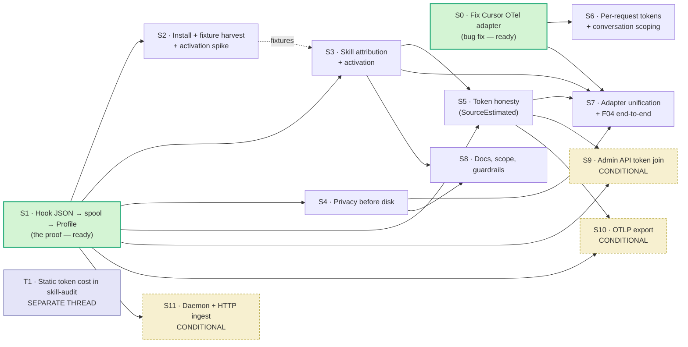

# Roadmap — E-CS · Cursor hook telemetry for the profiler (`skill-scope`)

**Status:** roadmap for user approval · **Date:** 2026-09-10 · **Groomer:** cursorscope-go
**Inputs:** `.scuba/teams/cursorscope-go/mandate-draft.md` · `.scuba/teams/research-profiling/ledger.md`
**Deliverable of this document:** an approved plan. No code is authorized by it.

Evidence labels per `AGENTS.md`: **Specification** / **External evidence** / **Repository fact** / **Design decision** / **Local hypothesis**.

---

## A. Thesis

**Attribution is the prize; tokens are three different numbers wearing one name.** `skill-architect` has four profiler adapters and all four return `skill_activation: unknown` and `attribution: unknown` (**Repository fact**, `profiler/{cursor,claude_code,codex,devin}.go`) — the profiler cannot say which skill did anything, which is exactly the signal F04's paired comparison needs. Cursor's free, local lifecycle hooks can supply it: session/turn/tool structure keyed by `conversation_id` → `generation_id` → `tool_use_id`, plus a skill name inferred from `beforeReadFile` on a `SKILL.md` path. That is the epic. Tokens are a separate, weaker story that the research settled: hooks give **estimates** (`chars/4`, accurate to −7%…+15% against `o200k_base` on markdown but *structurally* undercounting billed input, which is the cumulative conversation re-sent each turn); `preCompact.context_tokens` gives **one Cursor-reported number**, only when a session compacts; and real billed tokens come only from **outside the hook surface** — Cursor's Admin API `POST /teams/filtered-usage-events`, whose per-request `tokenUsage` joins to the hooks' own `conversationId` (Team plan), or Enterprise OTel `cursor.api.request`. Each has a different honesty level and the profile must say which one it used.

### What the research changed about the mandate

| Mandate assumption | Ledger verdict | Consequence |
|---|---|---|
| A07: `cursor.token.usage` / `.skill.activated` / `.hook.execution_complete` may be invented | **All four names are real** (wire reference), but **every attribute key the adapter reads is wrong**, `cursor.hook.execution_complete` is misused as a tool-call event, and `Probe()` claims a SQLite token capability the schema lacks | New **S0** — a bug fix in shipped code, dispatchable now, independent of the rest |
| R-CS-26 Admin API → **drop** (team-daily aggregates, unattributable) | Wrong endpoint was evaluated. `POST /teams/filtered-usage-events` is **per-request, has `tokenUsage`, and has `conversationId`** | **S9** — conditional keep, gated on plan tier |
| Fork (vi): tokens stay `unknown` | Three concrete sources of differing honesty now exist | Default flips to a **`SourceEstimated`** constant + per-source representation |
| Fork (v): "prefer" zero deps | Measured: OTel Go SDK = 2 direct + 22 indirect modules, 408 packages, **17.7 MB**; stdlib OTLP/JSON = **0 modules, 6.4 MB** | Fork closed, not merely defaulted |
| §5: semgrep is a marginal fit | Confirmed: cannot count tokens (`skill-validator` does, exactly, with `o200k_base`); adds a Python runtime `AGENTS.md` forbids | Guardrails ship as `grep` + `go vet` + tests |
| A09: the user runs Cursor locally | **Repository fact:** `~/.cursor/` and `~/Library/Application Support/Cursor/` are **absent on this machine** | The epic's premise is unverified at its root — **User Question 1** |

---

## B. Requirements register

Tags: **keep** (carry as-is) · **adapt** (carry the requirement, change the mechanism) · **drop** (deliberately out) · **conditional** (gated on a user answer).

### B.1 From cursorscope (R-CS-01 … R-CS-30) — carried from the mandate, deltas marked ⚠

| ID | Requirement (abbrev.) | Tag | Evidence | Slice |
|---|---|---|---|---|
| R-CS-01 | Cover Cursor's lifecycle hook set ⚠ **21 events, not 19** — the mandate's list omits `beforeTabFileRead` and `workspaceOpen` | adapt | **Specification** (cursor.com/docs/agent/hooks, ledger §A5.1) | S1 |
| R-CS-02 | Hook entrypoint reads JSON on stdin; base fields `conversation_id`, `generation_id`, `model`, `hook_event_name`, `cursor_version`, `workspace_roots`, `user_email`, `transcript_path` ⚠ ledger confirms the exact base-field set | keep | **Specification** | S1 |
| R-CS-03 | Hook failure never breaks the Cursor session | keep | **External evidence** (cursorscope) | S1 |
| R-CS-04 | Forward to a local HTTP ingestor | adapt → JSONL spool default; HTTP is S11 | **Design decision** (Fork i) | S11 |
| R-CS-05 | Correlate `conversation_id` → `generation_id` → `tool_use_id`, subagents branch | keep | **Specification** | S1 |
| R-CS-06 | TTL sweep for un-closed state | adapt → reader-side session-close heuristic; no long-lived process, no leak class | **Design decision** | S1 |
| R-CS-07 | Config via env/`.env` | adapt → flags + env, no dotenv | **Repository fact** (`AGENTS.md`) | S1 |
| R-CS-08 | `classifyInvocation` → `mcp`/`cli`/`skill`/`subagent`/`tool` with name + detail | **keep — highest value** | **External evidence** (`src/attribution.js`) | S3 |
| R-CS-09 | `skillNameFromPath`: `…/skills/<name>/…` or `…/<name>/SKILL.md` ⚠ ledger: **there is no skill activation hook**; this is inference and must be labelled so | keep | **Specification** (ledger §A5.1 finding 3) | S3 |
| R-CS-10 | Resolve MCP server/tool identity | adapt | **External evidence** | S3 |
| R-CS-11 | `chars/4` context-token estimate with a `source` label | adapt — via `SourceEstimated` | **Repository fact** (ledger §A4 calibration) | S5 |
| R-CS-12 | Extract MCP self-reported usage from `afterMCPExecution.result_json` | keep | **Specification** | S5 |
| R-CS-13 | `preCompact.context_tokens` + `context_usage_percent` ⚠ ledger adds `context_window_size` and confirms this is the **only** real hook token number | keep | **Specification** | S5 |
| R-CS-14 | Line-edit stats from `afterFileEdit` | adapt → no `Profile` field exists; defer to a v2 schema discussion | **Repository fact** (`profiler/types.go`) | deferred |
| R-CS-15 | Shell `exit_code` → honest `ToolCallEntry.Success` | keep | **Specification** | S1 |
| R-CS-16 | Reuse cursorscope's `cursor_*_total` metric names if we export | adapt (conditional) | **External evidence** | S10 |
| R-CS-17 | GenAI semconv attributes ⚠ ledger: semconv is **Development status**, and there is **no skill/rule convention at all** | adapt (conditional) + see R-RL-13 | **Specification** (semconv 1.44.0) | S10 |
| R-CS-18 | Redact prompts by default; record length only | keep | **Design decision** | S4 |
| R-CS-19 | Scrub bearer tokens, `sk-`/`key-` keys, emails; mask sensitive keys — **before the spool write** | keep | **Design decision** | S4 |
| R-CS-20 | Optional email masking; bounded payload length (8192) | keep | **External evidence** | S4 |
| R-CS-21 | Non-clobbering `~/.cursor/hooks.json` merge, timestamped backup, clean uninstall ⚠ reimplement — cursorscope's merge shells out to `python3` | keep | **External evidence** + **Repository fact** (`AGENTS.md`) | S2 |
| R-CS-22 | Auto-start ingestor, pidfile, version-match restart | drop under default fork | **Design decision** (Fork i) | S11 only |
| R-CS-23 | Debug HTTP endpoints | adapt → `skill-scope doctor`, one-shot, no server | **Design decision** | S2 |
| R-CS-24 | OTLP endpoint resolution semantics | keep (conditional) | **External evidence** | S10 |
| R-CS-25 | Setup CLI verbs | adapt → `hooks install/uninstall`, `doctor`, `--dry-run`, `--yes`; drop `start`/`stop`/wizard | **Design decision** | S2 |
| R-CS-26 | Cursor Admin API polling ⚠ **drop → conditional keep, retargeted** — see R-RL-07/08 | conditional | **Specification** (ledger §A5.3) | S9 |
| R-CS-27 | Bundled OTel Collector configs + docker-compose | drop | **Design decision** | — |
| R-CS-28 | Node ≥20 runtime, `npm install` on first run | drop → replaced by a single static Go binary. **This is the port's actual justification.** | **Design decision** | S1 |
| R-CS-29 | Unit tests per module + fake OTLP collector | keep — `attribution.test.js` / `privacy.test.js` are our behavioral oracle; `test/fake-collector.mjs` → `httptest.Server` | **External evidence** | S3, S4, S10 |
| R-CS-30 | Bounded memory; hook latency invisible in the editor | keep — needs a measured budget | **Design decision** | S1 |

### B.2 From `skill-architect` (R-SA-01 … R-SA-17) — carried unchanged except ⚠

| ID | Requirement (abbrev.) | Tag | Slice |
|---|---|---|---|
| R-SA-01 | Valid `skill-architect/profile/v1`; `Marshal→Unmarshal→Marshal` identical | keep | S1 |
| R-SA-02 | Every metric a `MetricResult`; no invented or zero-filled values | keep | all |
| R-SA-03 | Estimated values are not `present` values ⚠ **resolved** by R-RL-06 (`SourceEstimated`) | keep | S5 |
| R-SA-04 | Profile pinned to `snapshot_hash`; F04 revalidates | keep | S1 |
| R-SA-05 | `SourceHooks` exists in `types.go` and is used by **no adapter**; this epic is its first consumer | keep | S1 |
| R-SA-06 | Satisfy `CompareProfiles` — compares only metrics `present` on both sides | keep | S7 |
| R-SA-07 | Making `skill_activation` / `attribution` `present` for Cursor is the epic's primary success condition | keep | S3 |
| R-SA-08 | `conversation_id` / `generation_id` / `session_id` must map onto `--session` unambiguously ⚠ ledger: `conversation_id` is the join key to *both* the Admin API and Enterprise OTel — it is the right `SessionID` | adapt | S1 |
| R-SA-09 | Bash for scripts, Go for logic, **no Python** | keep | all |
| R-SA-10 | Prefer existing tools (`jq`, `skill-validator`, `skillscore`) | keep | S2, T1 |
| R-SA-11 | Evidence labels on every doc claim | keep | S8 |
| R-SA-12 | `profiler/` has zero external deps ⚠ **Fork (v) now closed**, see R-RL-14 | keep | all |
| R-SA-13 | Degrade gracefully with no Cursor present; never fail hard | keep | S1, S7 |
| R-SA-14 | No invented telemetry names ⚠ ledger **verified all four Cursor names are real**; the defect is the attribute keys | adapt | S0 |
| R-SA-15 | Slot into `experiment plan`/`run` — `Condition`/`ExperimentStep` need a hook-spool input path | keep | S7 |
| R-SA-16 | No regressions: 131 bash tests + 34 Go tests stay green | keep | all |
| R-SA-17 | Amend `.out-of-scope.md` + `README.md` if a live capture surface lands | keep | S8 |

### B.3 New from the research ledger (R-RL-nn)

| ID | Requirement | Tag | Evidence | Slice |
|---|---|---|---|---|
| **R-RL-01** | Correct every Cursor OTel attribute key to its namespaced form: `cursor.token.type` (`input\|output\|cache_read\|cache_creation`), `cursor.skill.name`, `cursor.skill.trigger` (`agent_read\|manually_attached\|skill_name_in_prompt`), `cursor.tool.kind\|.name\|.status`, `cursor.hook.name\|.type\|.outcome\|.duration_ms`. Delete the dead `reasoning`/`reasoning_output` token cases — the enum has no such member. | keep | **Specification** (Cursor OTel **Wire Reference**) | S0 |
| **R-RL-02** | `MetricToolCalls` must read the **`cursor.tool.calls` metric**, not `cursor.hook.execution_complete`. The latter describes *hook* executions and may only feed a separate hook-health signal, never `ToolCallEntry`. | keep | **Specification** (Wire Reference) | S0 |
| **R-RL-03** | `Probe()` must not set `MetricTokens = SourceSQLite` on a `state.vscdb`. The documented schema contains **no token data**; downgrade to `SourceNone` with the reason stated. | keep | **External evidence** (ledger §A5.4) | S0 |
| **R-RL-04** | Source tokens primarily from `cursor.api.request` per-request fields (`cursor.api.request.input_tokens\|.output_tokens\|.cache_read_tokens\|.cache_creation_tokens`), scoped by `cursor.conversation.id`; fall back to the aggregate `cursor.token.usage` metric. | keep | **Specification** (Wire Reference) | S6 |
| **R-RL-05** | `ActivationEntry` gains an additive `source` field carrying `cursor.skill.source` (`unspecified\|workspace\|user\|builtin\|plugin\|claude`) — it is what distinguishes a workspace skill from a builtin. Additive; no schema bump. | keep | **Specification** | S0 |
| **R-RL-06** | Add `SourceEstimated` to `MetricSource`. An estimate must never serialize with `Source: "otel"` or `"hooks"`. Resolves R-SA-03 and Fork (vi). | keep | **Design decision** (ledger Q1 recommendation) | S5 |
| **R-RL-07** | Real Cursor tokens without Enterprise: `POST /teams/filtered-usage-events` (Basic auth, API key as username) returns per-request `tokenUsage{inputTokens, outputTokens, cacheWriteTokens, cacheReadTokens}` with `conversationId` — **the same id the hooks emit**. Hooks for structure, Admin API for totals. Poll ≤1×/hour; 20 req/min/team; 30-day max range. | conditional | **Specification** (cursor.com/docs/account/teams/admin-api) | S9 |
| **R-RL-08** | Do **not** port cursorscope's `GET /teams/{teamId}/daily-usage-data` poller: wrong verb (`POST`), wrong auth (Basic, not Bearer), wrong path (no team segment), and the endpoint **has no token fields at all**. | drop | **Specification** + **Repository fact** (`src/cursor-api-poller.js`) | — |
| **R-RL-09** | Static per-skill token cost from `skill-validator check -o json` → `.token_counts.files[]` / `.token_counts.total`, real `o200k_base` BPE. Note `analyze content` does **not** emit it. Already flows into `audit.json` under `.spec.token_counts` but is not surfaced. | keep | **Repository fact** (measured; `tests/test_f02.sh:100`) | **T1** |
| **R-RL-10** | `chars/4` fallback is calibrated to −7%…+15% vs `o200k_base` on English markdown (worst on dense lists). Valid for ranking and relative deltas; invalid for absolute cost. Accuracy on code/JSON/non-English is **untested**. | adapt | **Repository fact** (ledger §A4) | S5, T1 |
| **R-RL-11** | Always-loaded budget rules to check statically: `description` + `when_to_use` combined ≤ **1,536 chars** (Claude Code truncates there); `SKILL.md` ≤ **500 lines**; listing budget is `skillListingBudgetFraction` default **0.01**. | keep | **Specification** (code.claude.com/docs/en/skills) | **T1** |
| **R-RL-12** | `/skill-doctor` (per-skill context cost + invocation count, Claude Code ≥2.1.252) is the target shape for a first-party per-skill cost number. Local Claude Code is **2.1.221** — unavailable. Whether `-p` output is parseable is **UNKNOWN**. | defer | **Specification** + **Repository fact** | out of epic |
| **R-RL-13** | If we export: namespace our own skill attributes as `skill_architect.skill.*`; map to `gen_ai.*` **only** where the convention actually defines the field. There is **no** skill/rule convention in OTel semconv, and `gen_ai.*` is Development status. Never put a `chars/4` estimate in `gen_ai.usage.*_tokens`. | keep | **Specification** (semconv 1.44.0) | S10 |
| **R-RL-14** | Hand-roll OTLP/HTTP JSON with `encoding/json` + `net/http`. Measured: OTel Go SDK = 2 direct + 22 indirect modules, 408 packages compiled (incl. 66 gRPC packages despite HTTP-only), **17.7 MB**; stdlib equivalent = **0 modules, 6.4 MB**. If the SDK ever becomes mandatory, isolate it in a **separate module** at `profiler/exporters/otlp/`. Closes Fork (v). | keep | **Repository fact** (ledger Q2, measured 2026-09-10) | S10 |
| **R-RL-15** | Do not adopt semgrep. It cannot count tokens (that is `skill-validator`'s exact job), parses markdown only in `generic` mode (≈`grep`), and is a Python package `AGENTS.md`'s self-containment rule excludes. Guardrails ship as `grep` + `go vet` + Go tests. | keep | **Design decision** (ledger Q3) | S8 |
| **R-RL-16** | The comparison report must express Skill Lift with a **confidence interval, not a point estimate** — a single paired run is not evidence. ACES: mean composite lift 0.2134, 95% CI [0.1967, 0.2301] over 947 paired cases; **positive lift rate only 72.8%**, so the engine must be able to report "this skill hurt." | keep | **External evidence** (arXiv:2608.20614) | S7 (informs F04) |
| **R-RL-17** | **Spike, load-bearing:** does Cursor's skill loading actually fire `beforeReadFile` on a `SKILL.md` path? cursorscope's entire local skill-attribution heuristic depends on it and it is **untested**. If Cursor loads skills internally without a file-read tool call, S3 yields nothing. | keep | **Local hypothesis** (ledger §A5.1, UNKNOWN #7) | S2 |
| **R-RL-18** | `preCompact.context_tokens` (with `context_window_size`, `context_usage_percent`) is the **only** Cursor-reported token number in the entire 21-event hook surface, and it fires **only on compaction** — short sessions emit nothing. | keep | **Specification** (ledger §A5.1 finding 1) | S5 |

---

## C. Slices

Cut per `sequence-verifiable-units`: each merges onto `epic/skill-scope` on its own, leaves the system working, names the test that proves it, and is sized to a PR a reviewer finishes in one pass.

| # | Goal (one line) | Definition of done (testable) | Test approach | Files touched | Depends on | Rests on |
|---|---|---|---|---|---|---|
| **S0** | **Stop the Cursor OTel adapter lying.** Correct every attribute key to its wire-reference form, rewire `tool_calls` off `cursor.hook.execution_complete` onto the `cursor.tool.calls` metric, and retract the false SQLite token capability. | A fixture written in the **real** wire-reference attribute shape yields `tokens`, `tool_calls`, and `skill_activation` `present` with correct values; `Probe()` on a bare `state.vscdb` reports `tokens: none` with a reason, not `sqlite`. | New golden fixtures using only Wire-Reference keys; assert the *old* keys now produce `unknown`-with-reason, not a silent zero; extend existing Cursor adapter tests. | `profiler/cursor.go`, `profiler/types.go` (additive `ActivationEntry.Source`), `profiler/profiler_test.go` | **none — ready now** | Ledger **Q4** (R-RL-01/02/03/05) |
| **S1** | **Hook JSON → spool → `Profile`.** The proof: a Go binary reads one Cursor hook payload on stdin, appends a normalized event to a JSONL spool, and `profiler capture --harness cursor --hook-spool <f>` emits a schema-valid `Profile`. | `tool_calls` and `timing` are `present` with `Source: "hooks"` from a hand-authored spool; the profile round-trips byte-identically; hook process exits 0 in <50 ms measured. | Golden fixture spool JSONL → expected `Profile` JSON in `profiler_test.go`; round-trip test (R-SA-01); a latency assertion with a measured number. | new `profiler/hooks.go`, `profiler/cmd/cursor-hook/main.go`, `profiler/cursor.go`, `profiler/cmd/main.go`, `profiler/profiler_test.go` | **none — ready now** | Ledger **§A5.1** (21-event payload table) |
| **S2** | **Real install + the activation spike.** `hooks install`/`uninstall` merge and unmerge `~/.cursor/hooks.json` without touching foreign hooks; one real session harvests redacted fixtures; **answer R-RL-17**. | A fake `$HOME` seeded with a foreign hook survives install *and* uninstall byte-identical apart from our entries; a timestamped backup exists; the spike reports yes/no on whether `beforeReadFile` fires for `SKILL.md`. | Bash test in `tests/` against a fake `$HOME`; `jq` (not `python3`) for the merge; manual capture step, result recorded as a **Repository fact** in the spike note. | new `tests/test_hooks_install.sh`, `profiler/cmd/skill-scope/` (`hooks`, `doctor`), fixtures under `tests/fixtures/` | S1 | Ledger **UNKNOWN #7** |
| **S3** | **Skill attribution + activation from hooks.** Port `classifyInvocation` / `skillNameFromPath` into Go and produce the first non-`unknown` activation any adapter has ever emitted. | A `Profile` reports `skill_activation: present` and `attribution: present` naming the exercised skill, with `Trigger` explicitly marked as *inferred from a file read*, not a Cursor activation event. | Table-driven Go tests transcribed from cursorscope's `attribution.test.js` / `gen-ai-semconv.test.js` cases as a behavioral oracle; end-to-end assertion on the S2 fixture. | `profiler/attribution.go` (new), `profiler/hooks.go`, `profiler/profiler_test.go` | S1 (S2 fixtures strengthen it) | Ledger **§A5.1 finding 3** (no skill hook exists → it is inference) |
| **S4** | **Privacy before disk.** Redaction runs before the spool write, not before export. | Given a payload containing an email, a bearer token, an `sk-` key, and a 4 KB prompt, the spool file on disk contains none of them and records prompt length only; payloads are truncated at 8192. | Go table tests transcribed from `privacy.test.js`; plus a `grep` absence assertion against the written spool file (absence check → `grep`, per `AGENTS.md`). | `profiler/privacy.go` (new), `profiler/hooks.go`, `profiler/profiler_test.go` | S1 | Mandate R-CS-18/19/20 |
| **S5** | **Token honesty — three sources, three labels.** Add `SourceEstimated`; represent `chars/4`, MCP-self-reported, and `preCompact.context_tokens` so no reader can mistake any of them for billed tokens. | No estimate ever serializes with `Source: "otel"` or `"hooks"`; each of the three sources has a fixture proving its label; `docs/profiler-spec.md` documents the representation and states the structural undercount. | Fixture per source; a negative test asserting `SourceEstimated` is required whenever the value originated in an `estimate*` function; spec-doc review. | `profiler/types.go`, `profiler/hooks.go`, `docs/profiler-spec.md`, `profiler/profiler_test.go` | S1, S3 | Ledger **Q1** (R-RL-06/10/18) |
| **S6** | **Per-request tokens + conversation scoping (Enterprise OTel).** Read `cursor.api.request.*_tokens` per request and scope a capture by `cursor.conversation.id`. | Given an export containing two conversations, `capture --session <conversation_id>` returns tokens for **only** that conversation; absent per-request events, it falls back to the aggregate `cursor.token.usage` metric and says so in `Source`. | Two-conversation fixture; a fallback fixture with only the aggregate metric; assert the scoped totals differ from the unscoped ones. | `profiler/cursor.go`, `profiler/profiler_test.go` | **S0** | Ledger **Q4 defect (4)** (R-RL-04) |
| **S7** | **Unify the Cursor adapter and close the F04 loop.** Hooks become a first-class source alongside the OTel file; `experiment plan/run` can drive a hook-sourced capture. | `Probe()` reports hooks and OTel independently; `Condition`/`ExperimentStep` carry a `HookSpool` path; `profiler compare` on two hook-sourced profiles returns `comparable: true` for `tool_calls` **and** `skill_activation`. | New compare test over two hook-sourced fixtures; an `experiment run` test driving a hook-spool condition; assert a retracted metric yields `unknown`-with-reason, never a silent zero. | `profiler/cursor.go`, `profiler/experiment.go`, `profiler/cmd/main.go`, `profiler/profiler_test.go` | S0, S1, S3, S4, S5 | Ledger **R-RL-16** (report lift with a CI) |
| **S8** | **Docs, scope amendment, guardrails.** Say what the plugin now actually does, and make the four footguns fail CI. | `docs/cursor-hooks-spec.md` exists with an evidence label on every claim; `.out-of-scope.md` + `README.md` reflect live capture; CI fails on a seeded violation of each of the four rules. | Guardrail rules (`grep` + `go vet` + a Go test) demonstrated red on a seeded violation and green after; docs reviewed for labels. | `docs/cursor-hooks-spec.md` (new), `.out-of-scope.md`, `README.md`, `.github/workflows/ci.yml`, `tests/test_guardrails.sh` (new) | S3, S4 | Ledger **Q3** (R-RL-15: grep, not semgrep) |
| **S9** | **Admin API token join — CONDITIONAL (User Q2).** Join hook `conversation_id` to `filtered-usage-events.conversationId` for genuinely billed tokens. | With a Team admin key, a hook-sourced profile's `tokens` become `present` with `Source: "server_api"` and four-way splits; without a key, the metric is `unknown` with an actionable reason and nothing else changes. | `httptest` fake Admin API returning a canned `filtered-usage-events` body; assert the join by `conversationId` and that a missing key degrades, never fails. | `profiler/cursor_admin_api.go` (new), `profiler/cursor.go`, `profiler/profiler_test.go` | S1, S5 · **gated on plan tier** | Ledger **§A5.3** (R-RL-07/08) |
| **S10** | **OTLP export — CONDITIONAL (Fork ii, User Q5).** `skill-scope export --spool <f>` POSTs OTLP/HTTP JSON, hand-rolled, zero deps. | A fake collector receives correctly nested spans (conversation → generation → tool) with wire-correct attribute keys; `go.mod` still declares **zero** requires; estimates never land in `gen_ai.usage.*_tokens`. | Go `httptest` fake collector modeled on `test/fake-collector.mjs`; a test asserting `go.mod` has no `require` block. | `profiler/otlp.go` (new), `profiler/cmd/skill-scope/`, `profiler/profiler_test.go` | S1, S5 | Ledger **Q2** (R-RL-14) + **R-RL-13** |
| **S11** | **Daemon + HTTP ingest — CONDITIONAL (Fork i).** `skill-scope serve` accepts `POST /cursor/hooks`. | POSTing the S2 fixtures through the server produces a spool byte-equivalent to the stdin path; a backdated entry is closed by the TTL sweep rather than leaked. | Integration test: start server, POST fixtures, diff spools; TTL test with backdated timestamps (cursorscope's `_testHooks` pattern). | `profiler/cmd/skill-scope/serve.go` (new), `profiler/hooks.go` | S1 | Mandate Fork (i) |
| **T1** | **Static token-cost dimension in `skill-audit` — RECOMMEND A SEPARATE THREAD, not this epic.** Surface the real BPE numbers already sitting unused in `audit.json`. | `audit.json` gains `summary.token_cost{body, references, total, always_loaded_chars}` from `.spec.token_counts`; the evaluation matrix gains a **Context budget** dimension scoring `description`+`when_to_use` ≤1,536 chars and `SKILL.md` ≤500 lines; `char/4` fallback used **only** when `skill-validator` is absent, labelled estimated. | Extend `tests/test_f02.sh` (which already asserts `.spec.token_counts` exists) with assertions on the new summary keys; a fixture skill exceeding the 1,536-char cap must score 0. | `skills/skill-audit/scripts/audit-report.sh`, `skills/skill-audit/references/evaluation-matrix.md`, `skills/skill-audit/SKILL.md`, `tests/test_f02.sh` | **none** | Ledger **§A4, §B1** (R-RL-09/10/11) |

### Why T1 does not belong in E-CS — recommendation

**Recommend T1 ships as its own one-PR thread, in parallel, starting today.** It shares **zero** files, zero dependencies, and zero risk with E-CS: it is static, needs no Cursor, no hooks, and no user hardware. `audit-report.sh` already runs `skill-validator check -o json` and already passes `.token_counts` through into `audit.json` (**Repository fact**, `tests/test_f02.sh:100`) — the work is surfacing it and adding one scoring dimension. Binding it to E-CS would park a cheap, certain win behind an epic whose premise (User Q1) is unverified. It is also the *only* token number in this whole plan that does not depend on the user owning anything.

### Minimum viable epic

> **S0 + S1 + S2 + S3 + S4 + S8** — six PRs.

That fixes shipped code that currently lies, delivers the prize (first-ever `present` attribution), keeps prompts and secrets off disk, and tells the truth in the docs. It ships **no token story at all**, and that is deliberate: tokens are the weakest, most-gated, least-honest half of the ask.

**Extension that pays F04 back:** `+ S5 + S7`. **Everything else is conditional** on a user answer: S6 and S9 on Cursor plan tier, S10 and S11 on whether an OTLP backend is actually wanted.

**Ships first: S0.** It is a bug in merged code, it has no dependencies, it needs no Cursor installed, it needs no user decision, and it is dispatchable to a bug-fixer *right now* — independently of whether the rest of this roadmap is ever approved. **S1 can start in parallel** with a different owner; the two touch `profiler/cursor.go` in different functions, and S7 is where they reconcile.

### Dependency graph

---

## D. Forks

| Fork | Options | Recommended default | Why (one line) | What flips it |
|---|---|---|---|---|
| **(i) Daemon vs stdin+spool** | long-running HTTP ingestor · stdin binary → JSONL spool | **stdin binary + JSONL spool. No daemon.** | Deletes an entire complexity class — no port, no pidfile, no auto-start bash, no long-lived maps (cursorscope shipped a memory-leak fix in 0.3.7 for exactly this) — and matches how every existing adapter works: read a file. | Wanting real-time steering, or multi-machine fan-in. Reversible: S11 consumes the same spool. |
| **(ii) OTLP first vs spool first** | OTLP as the primary output · spool now, OTLP later | **Spool first; OTLP deferred to S10, gated.** | `skill-architect`'s consumer is a `Profile` JSON file, not an observability backend; building OTLP first designs for a customer we do not have. | User Q5 says a real backend (Last9/Grafana/Honeycomb) is already in the workflow. |
| **(iii) Code location** | extend `profiler/` · new top-level Go module · separate repo | **Extend `profiler/`;** new binaries under `profiler/cmd/{cursor-hook,skill-scope}/`. | The `Profile` types already live there; a second module either duplicates them or forces a public API contract inside one repo. | Forks (i) **and** (ii) both going the daemon+OTLP way — at that point it is genuinely a separate product. |
| **(iv) Naming** | `skill-scope` · `cursorscope-go` · fold in as `profiler hook` | **`skill-scope`;** stdin entrypoint `cursor-hook`. Avoid the name "cursorscope". | `cursorscope` is Last9's published npm brand (`@last9/cursorscope`); reusing it invites confusion and an avoidable attribution question. | User preference only. |
| **(v) Go OTel SDK** ⚠ **updated — now decided, not defaulted** | import the OTel Go SDK · hand-roll OTLP/HTTP JSON | **Hand-roll. Zero dependencies.** If ever forced, isolate the SDK in a **separate module** at `profiler/exporters/otlp/`. | Measured 2026-09-10: SDK = 2 direct + 22 indirect modules, **408 packages** (incl. 66 gRPC packages despite being HTTP-only), **17.7 MB**; stdlib OTLP/JSON = **0 modules, 6.4 MB**. `profiler/go.mod` has no requires today. | A hard requirement for gRPC transport, or for consuming third-party instrumentation. Not "it would be convenient." |
| **(vi) Token honesty** ⚠ **updated — default flipped; three concrete sources now exist** | (1) tokens stay `unknown`, estimate in a side field · (2) **new `SourceEstimated` constant, `state: present`, source names the honesty level** · (3) `MetricResult.Estimated bool` · (4) do what cursorscope does — put estimates in `gen_ai.usage.*_tokens` | **(2) — `SourceEstimated`**, with three distinct representations: `chars/4` → `SourceEstimated`; `preCompact.context_tokens` → `SourceHooks` (Cursor-reported); Admin API / Enterprise OTel → `SourceServerAPI` / `SourceOtel` (billed). | The mandate defaulted to (1) because only one dishonest source was known. The ledger found three sources at three honesty levels — one flag cannot express that, but `Source` already can, and it is already required on every `present` result. Option (4) remains the failure mode this repo exists to prevent. | The user's honesty bar rejecting any estimate in a comparison report → revert to (1). Answer User Q3. |

---

## E. User-only questions

Ordered by how much the answer changes the plan. The mandate's semgrep question (its #6) is **dropped** — the ledger settled it (R-RL-15: semgrep cannot count tokens, duplicates `skill-validator`, and adds a Python runtime). Say so only if you disagree.

| # | Question | What it changes |
|---|---|---|
| **1** | **Is Cursor installed on a machine you'll use, and will you install a hook into `~/.cursor/hooks.json`?** The ledger found `~/.cursor/` and `~/Library/Application Support/Cursor/` **absent on this machine** (**Repository fact**). Without a real session there are no fixtures, R-RL-17's spike cannot run, and S2/S3's premise stays unverified. We back up first and uninstall cleanly. | If no: the entire hooks half (S1–S5, S7, S9–S11) is unbuildable-as-verified, and the epic collapses to **S0 + T1**. This is the gate. |
| **2** | **What Cursor plan are you on — Free/Pro, Team, or Enterprise?** | Team ⇒ **S9 flips on** and gives genuinely billed per-request tokens (the only honest token number available). Enterprise ⇒ S0 and S6 gain a live consumer and `cursor.skill.activated` becomes a *first-party* activation event, which would beat S3's inference outright. Free/Pro ⇒ both stay theoretical and S6/S9 park. |
| **3** | **Token honesty: is a `chars/4` estimate acceptable as a relative, ordinal signal in a paired comparison — or must Cursor tokens read `unknown`?** The estimate structurally undercounts billed input (billing is the *cumulative* conversation re-sent each turn; the estimate is per-event payload bytes) and misses the system prompt, the always-loaded skill listing, and the cache split entirely. | Fork (vi) option (2) vs (1). Changes S5's DoD and what the comparison report is allowed to claim. |
| **4** | **Reading (a) standalone product, (b) ingestion source for `skill-architect`, or (c) both, (b) first?** *Recommendation: (c).* | Repo layout (Fork iii), naming (iv), and whether S10/S11 ever exist. |
| **5** | **Do you actually want an OTLP backend** (Last9, Grafana, Honeycomb, a local collector) **in your workflow, or is a local JSON spool the whole ask?** | S10 and S11 go/no-go. Also re-opens Fork (ii)'s sequencing if yes. |
| **6** | **T1 — ship the static token-cost dimension as its own parallel thread now, or fold it into this epic?** *Recommendation: own thread, start today.* | Whether a certain, cheap win waits behind an epic gated on question 1. |
| **7** | **Naming `skill-scope`, and: reimplement from extracted requirements, or port cursorscope's MIT code with attribution?** *Recommendation: reimplement, using their tests as a behavioral oracle.* | Licensing obligations, and how literally S3/S4 transcribe `attribution.test.js` / `privacy.test.js`. |
| **8** | **Epic placement, and will you amend `.out-of-scope.md` and `README.md`?** Both currently promise the plugin does *not* run live comparisons. Does E-CS run alongside F04–F06, precede them, or displace F05/F06? | S8's DoD, and dispatch order against the existing roadmap. |

---

## F. Integration plan

- **Integration branch:** `epic/skill-scope`, cut from `main`.
- **One PR per slice**, each merging into `epic/skill-scope`. An agent may merge a cleared slice into the integration branch; **only the user merges `epic/skill-scope` → `main`.**
- **Every slice carries its own tests.** `go vet ./...`, `go build`, `gofmt` clean; 131 bash + 34 Go tests stay green (R-SA-16). No commit trailers (`AGENTS.md`).
- **Note, unowned:** CI pins `go-version: "1.23"` while `profiler/go.mod` declares `go 1.27.1` (**Repository fact**, mandate A18). A latent break this epic will trip over. Flag it to the manager as a separate one-line fix; do not fold it into a slice.

**Parallelism:**

| Wave | Parallel | Serial after |
|---|---|---|
| 1 | **S0** ‖ **S1** ‖ **T1** (separate thread) | — |
| 2 | **S2** ‖ **S4** ‖ **S6** (S6 needs S0) | S2 and S4 need S1 |
| 3 | **S3** (needs S1; S2's fixtures strengthen its end-to-end assertion but do not block the table tests) | — |
| 4 | **S5** ‖ **S8** | S5 needs S1+S3; S8 needs S3+S4 |
| 5 | **S7** — the reconciliation point; everything upstream must be merged | S0, S1, S3, S4, S5 |
| — | **S9 · S10 · S11** — conditional, dispatched only on a user answer | S1 (+S5 for S9/S10) |

Only S0 and S1 touch `profiler/cursor.go`, and in disjoint functions (S0 in the four `extractCursor*` helpers and `Probe`; S1 in the hook-spool source branch). S7 is where the two lines reconcile — expect one conflict there and plan for it rather than serializing everything to avoid it.

---

## G. What was NOT verified

Nothing below was confirmed in this repo or on this machine. Each is a hypothesis this roadmap deliberately builds around.

1. **Cursor is not installed here.** `~/.cursor/` and `~/Library/Application Support/Cursor/` are absent. No hook payload, no `state.vscdb`, and no `hooks.json` has ever been observed locally. Every hook field name in §B is **Specification** from Cursor's docs, not a captured payload.
2. **Whether Cursor's skill loading fires `beforeReadFile` on a `SKILL.md` path.** S3's entire attribution mechanism rests on this. Untested. Spike is S2. *(Ledger UNKNOWN #7.)*
3. **Whether Enterprise `cursor.skill.activated` fires for workspace `.cursor/skills/`** specifically, versus only marketplace/plugin skills. The `cursor.skill.source` enum includes `workspace`, which strongly suggests yes — inference, not confirmation. *(Ledger UNKNOWN #10.)*
4. **The `cursor.*` Wire Reference itself was read, not exercised.** No real Enterprise OTel export has ever been parsed by this repo. S0's fixtures are hand-authored from the published wire spec.
5. **The Admin API `filtered-usage-events` response shape** — Specification only. No key, no call, no response body observed. S9's `httptest` fixture is authored from docs.
6. **Hook process latency in a live editor.** R-CS-30's budget is unmeasured; S1 must produce the number.
7. **`chars/4` accuracy on code, JSON, and non-English text.** Calibrated only on this repo's English markdown (−7%…+15%). *(Ledger UNKNOWN #8.)*
8. **`/skill-doctor` output parseability.** Local Claude Code is 2.1.221, below the documented ≥2.1.252. Untestable here; R-RL-12 is deferred, not designed against. *(Ledger UNKNOWN #1.)*
9. **Cursor `state.vscdb` schema.** External evidence only, verified against Cursor 2.6/3.0 with a documented one-way breaking migration. Version-fragile — a reason S0 retracts the SQLite capability rather than implementing it. *(Ledger UNKNOWN #6.)*
10. **`gen_ai.*` semconv stability.** Development status at semconv 1.44.0; attribute names may change under S10. *(Ledger UNKNOWN #11.)*
11. **Semgrep behaviour on `SKILL.md`.** Not installed; R-RL-15 reasons from documented capability, not measurement. *(Ledger UNKNOWN #12.)*
12. **cursorscope's tests as a behavioral oracle.** `attribution.test.js` / `privacy.test.js` were listed, not executed. Their assertions are assumed correct for S3/S4 transcription.
13. **That `CompareProfiles` handles hook-sourced profiles unchanged.** Read, not exercised against a hook profile. S7's DoD exists to prove it; if it does not, S7 grows and R-SA-06 becomes a real constraint rather than a formality.
14. **SkillsBench / SkillJuror secondary figures.** Abstract numbers confirmed; trajectory counts, per-arm pass rates, and cost/pass come from summaries, not PDFs. Only R-RL-16's ACES CI figures are primary-sourced. *(Ledger UNKNOWNs #4, #5.)*
