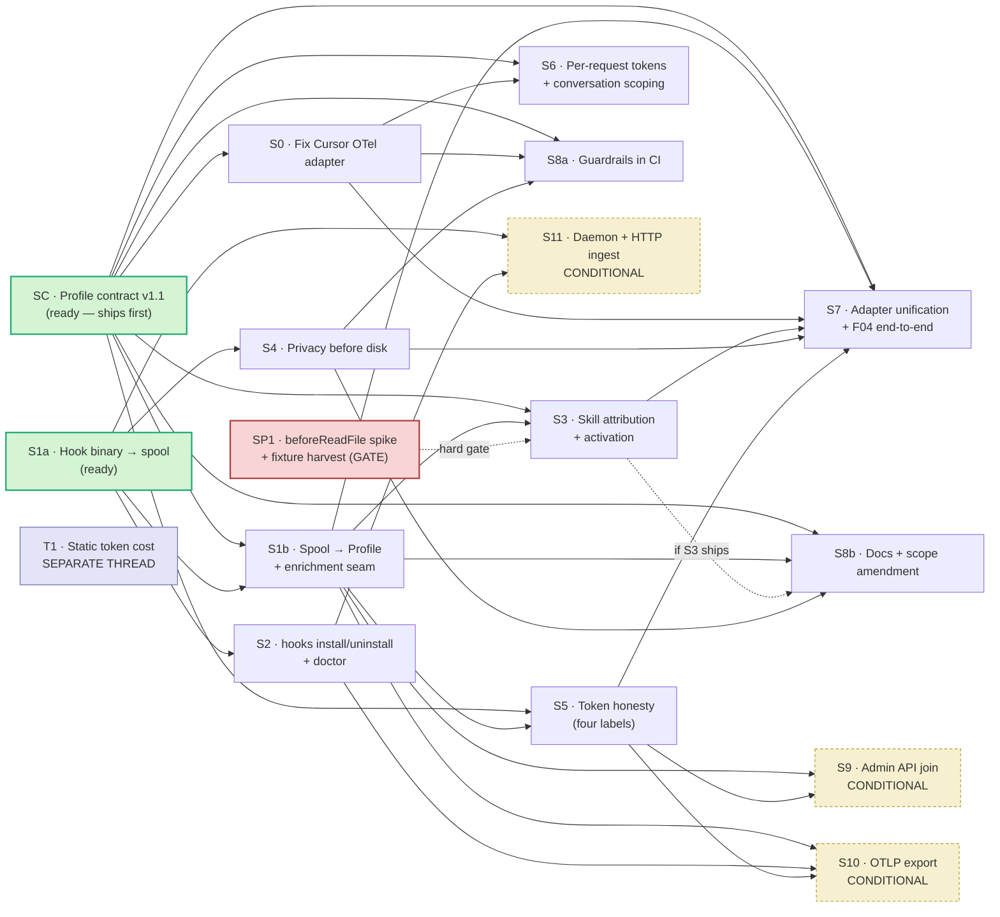

# Roadmap — E-CS · Cursor hook telemetry for the profiler (`skill-scope`)

**Status:** roadmap for user approval · **Date:** 2026-09-10 · **Groomer:** cursorscope-go
**Revision:** round 2, after a second NOT-CLEAN spec gate (2 hunters, 21 REAL + 1 suspected). Round 1 fixed named instances; round 2 fixes by **class**: (A) a representability sweep — every DoD assertion now names the contract field that carries it; (B) every enum literal and every evidence label re-derived from its source and cited; (C) every `Depends on` recomputed from DoD + Files, not memory; (D) **D10** records the reuse-vs-build decision `AGENTS.md:8-9` requires. Per-finding disposition and the three proof tables: `review/revision-log-round2.md`.
**Inputs:** `.scuba/teams/cursorscope-go/mandate-draft.md` · `.scuba/teams/research-profiling/ledger.md` · `cursor-profiler/docs/research/existing-per-skill-cost-tools.md`
**Deliverable of this document:** an approved plan. No code is authorized by it.

Evidence labels per `AGENTS.md:18-23`: **Specification** / **External evidence** / **Repository fact** / **Design decision** / **Local hypothesis**.

---

## A. Thesis

**Attribution is the prize; tokens are four different numbers wearing one name.** `skill-architect` has four profiler adapters. Three return `skill_activation: unknown` unconditionally (**Repository fact** — `claude_code.go:104`, `codex.go:74`, `devin.go:68`). The Cursor adapter is in a worse state than `unknown`: given an export containing `cursor.skill.activated`, `extractCursorSkillActivation` (`cursor.go:259-273`) returns **`present`** — but it reads `skill_name` / `trigger`, which are not the Wire Reference's `cursor.skill.name` / `cursor.skill.trigger`, so against a real export it emits a `present` activation with an **empty skill name**, and the repo's own test pins the defect (`profiler_test.go:560,605,644-652`, including `"trigger":"keyword"`, a value absent from Cursor's enum). All four adapters return `attribution: unknown` (**Repository fact**). Net: the profiler cannot say which skill did anything, and for Cursor it says so *confidently* — the exact failure this repo exists to prevent, and exactly the signal F04's paired comparison needs.

Cursor's free, local lifecycle hooks can supply attribution: session/turn/tool structure keyed by `conversation_id` → `generation_id` → `tool_use_id`, plus a skill name **inferred** from `beforeReadFile` on a `SKILL.md` path (inference, not an activation event — **Local hypothesis**, gated by spike SP1). That is the epic. Tokens are a separate, weaker story the research settled: hooks give **estimates** (`chars/4`, −7%…+15% vs `o200k_base` on markdown but *structurally* undercounting billed input, which is the cumulative conversation re-sent each turn); `afterMCPExecution.result_json` gives an MCP server's **self-report**; `preCompact.context_tokens` gives **one Cursor-reported number**, only on compaction; and genuinely billed tokens come only from **outside the hook surface** — `POST /teams/filtered-usage-events`, whose per-request `tokenUsage` joins the hooks' own `conversationId` (Team plan), or Enterprise OTel `cursor.api.request`. Four honesty levels. The profile must say which one it used, and the comparison engine must refuse to difference one against another.

### What the research and the spec gates changed

| Assumption | Verdict | Consequence |
|---|---|---|
| A07: the four `cursor.*` names may be invented | **All four names are real** (Wire Reference), but **every attribute key the adapter reads is wrong**, `cursor.hook.execution_complete` is misused as a tool-call event, and `Probe()` claims a SQLite token capability the schema lacks | **S0** — a bug fix in shipped code |
| `types.go` / `profiler-spec.md` are incidental edits | **Spec-gate root R1:** DoDs asserted distinctions the F03 contract cannot express — no reason channel (`types.go:50-55`), one source per metric (`:54`), `compareTokens` reports only the *candidate*'s source (`compare.go:115`), `present` means "captured from telemetry" (`types.go:12`), **no tool-call identity or hierarchy** (`types.go:88-93`, so `Attribution.Target` at `:114-118` dangles), **no context-window fields** (`:80-86`), and `countToolCalls` is `len(calls)` (`compare.go:148-149`), which a `Count` column silently breaks | **SC** — one slice owns the contract; every slice needing a channel depends on it |
| R-CS-26 Admin API → **drop** (team-daily aggregates) | Wrong endpoint was evaluated. `POST /teams/filtered-usage-events` is **per-request, has `tokenUsage`, has `conversationId`** | **S9** — conditional keep, gated on plan tier |
| Fork (vi): tokens stay `unknown` | Four concrete sources of differing honesty now exist | Default flips to per-source labels + **honesty classes** (D3) |
| Fork (v): "prefer" zero deps | Measured: OTel Go SDK = 2 direct + 22 indirect modules, 408 packages, **17.7 MB**; stdlib OTLP/JSON = **0 modules, 6.4 MB** | Fork closed, not merely defaulted |
| §5: semgrep is a marginal fit | Confirmed: cannot count tokens (`skill-validator` does, with `o200k_base`); adds a Python runtime | Guardrails ship as `grep` + `go/ast` + tests |
| Nobody has built this, so build it | **Two Go/hook prior-art tools exist** and `AGENTS.md:8-9` makes checking them mandatory | **D10** — build, with Dash0 as a reference implementation, not a fork base |
| A09: the user runs Cursor locally | **Repository fact:** `~/.cursor/` and `~/Library/Application Support/Cursor/` are **absent on this machine** | The epic's premise is unverified — **User Question 1** |

---

## B. Requirements register

Tags: **keep** · **adapt** (carry the requirement, change the mechanism) · **drop** · **conditional** (gated on a user answer).

### B.1 From cursorscope (R-CS-01 … R-CS-30) — ⚠ marks a delta from the mandate

| ID | Requirement (abbrev.) | Tag | Evidence | Slice |
|---|---|---|---|---|
| R-CS-01 | Cursor's lifecycle hook set ⚠ **21 events, not 19** (mandate omits `beforeTabFileRead`, `workspaceOpen`) | adapt | **Specification** (cursor.com/docs/agent/hooks; ledger §A5.1:115-137, 21 table rows) | S1a |
| R-CS-02 | Hook reads JSON on stdin; **10** documented base fields — `conversation_id`, `generation_id`, `model`, `model_id` (opt), `model_params` (opt), `hook_event_name`, `cursor_version`, `workspace_roots`, `user_email`, `transcript_path` ⚠ **not every event carries them**: `workspaceOpen` supplies only four, omitting `conversation_id`, `generation_id`, `model`, `model_id`, `transcript_path` | keep | **Specification** (ledger §A5.1:113 for the ten, §A5.1:137 for the exception) | S1a |
| R-CS-03 | Hook failure never breaks the Cursor session | keep | **External evidence** (cursorscope) | S1a |
| R-CS-04 | Forward to a local HTTP ingestor | adapt → **satisfied by S1a's JSONL spool** (D9); the HTTP form is S11 only | **Design decision** (Fork i) | S1a |
| R-CS-05 | Correlate `conversation_id` → `generation_id` → `tool_use_id`, subagents branch | keep | **Specification** (ledger §A5.1:120-121,131 — `tool_use_id`, `parent_conversation_id`) | S1b (needs SC's hierarchy IDs) |
| R-CS-06 | TTL sweep for un-closed state | adapt → reader-side session-close heuristic; no long-lived process | **Design decision** | S1b |
| R-CS-07 | Config via env/`.env` | adapt → flags + env, no dotenv ⚠ **label corrected:** `AGENTS.md` (23 lines) has **no** env/dotenv rule; this is our choice, not a repo fact | **Design decision** | S1a |
| R-CS-08 | `classifyInvocation` → `mcp`/`cli`/`skill`/`subagent`/`tool` with name + detail | **keep — highest value** | **External evidence** (cursorscope `src/attribution.js:174,183,193,226,234,242` — the five literal `category:` values) | S3 |
| R-CS-09 | `skillNameFromPath`: `…/skills/<name>/…` or `…/<name>/SKILL.md` | keep | ⚠ **Local hypothesis** — ledger §A5.1:143 says *"Local hypothesis (needs a spike)"*; there is **no** skill hook. Prior label "Specification" inverted the source | S3 (gated by SP1) |
| R-CS-10 | Resolve MCP server/tool identity | adapt | **External evidence** (ledger §A5.1:125-126) | S3 |
| R-CS-11 | `chars/4` context-token estimate with a `source` label | adapt → `SourceEstimated` | ⚠ **label split:** the mechanism is **External evidence** (cursorscope `src/telemetry.js:recordAttributedContextTokens`, ledger §A5.1:145); the **−7%…+15% calibration** is **Repository fact** (ledger §A4:83, measured 2026-09-10). Prior flat "Repository fact" overstated the mechanism | S5 |
| R-CS-12 | Extract MCP self-reported usage from `afterMCPExecution.result_json` | keep | ⚠ **External evidence** (cursorscope's probe, ledger §A5.1:142; the docs do not specify a `usage` block) | S5 |
| R-CS-13 | `preCompact.context_tokens` + `context_usage_percent` ⚠ ledger adds `context_window_size`; the **only** real hook token number | keep | **Specification** (ledger §A5.1:136) | S5 (needs SC's context fields) |
| R-CS-14 | Line-edit stats from `afterFileEdit` | **drop from E-CS** (D8) — no `Profile` field; SC records it as a v2 candidate | **Repository fact** (`profiler/types.go` has no such field) | — (SC note) |
| R-CS-15 | Shell `exit_code` → honest `ToolCallEntry.Success` | adapt | ⚠ **Local hypothesis** — Cursor documents only `command`/`output`/`duration`/`sandbox` on `afterShellExecution` (ledger §A5.1:124); `exit_code` traces only to cursorscope 0.3.7. S1b must not depend on it | S1b (SP1 confirms) |
| R-CS-16 | Reuse cursorscope's `cursor_*_total` metric names if we export | **drop** (D4 — conflicts with R-RL-13; emitting `cursor_*` from a non-Cursor tool is the R-SA-14 failure) | **External evidence** | — |
| R-CS-17 | GenAI semconv attributes ⚠ semconv is **Development status**; there is **no** skill/rule convention | adapt (conditional) + see R-RL-13 | **Specification** (semconv 1.44.0; ledger §A6:208,212) | S10 |
| R-CS-18 | Redact prompts by default; record length only | keep | **Design decision** | S4 |
| R-CS-19 | Scrub bearer tokens, `sk-`/`key-` keys, emails — **before the spool write** | keep | **Design decision** | S4 |
| R-CS-20 | Optional email masking; bounded payload length (8192) | keep | **External evidence** (cursorscope `src/privacy.js`) | S4 |
| R-CS-21 | Non-clobbering `~/.cursor/hooks.json` merge, timestamped backup, clean uninstall ⚠ reimplement — cursorscope shells out to `python3` | keep | **External evidence** + **Repository fact** (`AGENTS.md:6`) | S2 |
| R-CS-22 | Auto-start ingestor, pidfile, version-match restart | drop under default fork | **Design decision** (Fork i) | S11 only |
| R-CS-23 | Debug HTTP endpoints | adapt → `skill-scope doctor`, one-shot, no server | **Design decision** | S2 |
| R-CS-24 | OTLP endpoint resolution semantics | keep (conditional) | **External evidence** | S10 |
| R-CS-25 | Setup CLI verbs → `hooks install/uninstall`, `doctor`, `--dry-run`, `--yes`; drop `start`/`stop`/wizard | adapt | **Design decision** | S2 |
| R-CS-26 | Cursor Admin API polling ⚠ **drop → conditional keep, retargeted** | conditional | **Specification** (ledger §A5.3:180) | S9 |
| R-CS-27 | Bundled OTel Collector configs + docker-compose | drop | **Design decision** | — |
| R-CS-28 | Node ≥20 runtime, `npm install` on first run | drop → one static Go binary. **The port's actual justification.** | **Design decision** | S1a |
| R-CS-29 | Unit tests per module + fake OTLP collector — `attribution.test.js` / `privacy.test.js` are our behavioral oracle | keep | **External evidence** | S3, S4, S10 |
| R-CS-30 | Bounded memory; hook latency invisible in the editor ⚠ **budget is unmeasured** (§G7); S1a produces the number *before* anything gates on it, and proves the bounded-memory half with a 10 MB stdin case | keep | **Design decision** | S1a |

### B.2 From `skill-architect` (R-SA-01 … R-SA-17)

| ID | Requirement (abbrev.) | Tag | Slice |
|---|---|---|---|
| R-SA-01 | Valid `skill-architect/profile/v1`; `Marshal→Unmarshal→Marshal` identical | keep | S1b |
| R-SA-02 | Every metric a `MetricResult`; no invented or zero-filled values | keep | all |
| R-SA-03 | Estimated values are not `present` values ⚠ **superseded by D2/D3** — an estimate may be `present` iff its `Source` is `estimated` and `compare` refuses to difference it against a billed number | adapt | SC, S5 |
| R-SA-04 | Profile pinned to `snapshot_hash`; F04 revalidates | keep | S1b |
| R-SA-05 | `SourceHooks` exists and is used by **no adapter**; this epic is its first consumer | keep | S1b |
| R-SA-06 | Satisfy `CompareProfiles` — compares only metrics `present` on both sides | keep | SC, S7 |
| R-SA-07 | Making `skill_activation` / `attribution` name a real skill for Cursor is the epic's primary success condition | keep | S3 |
| R-SA-08 | `conversation_id` is the right `SessionID` — the join key to both the Admin API and Enterprise OTel | adapt | S1b, S6 |
| R-SA-09 | Bash for scripts, Go for logic, **no Python** | keep | all |
| R-SA-10 | Prefer existing tools (`jq`, `skill-validator`, `skillscore`) ⚠ **and prior-art tools before building** — discharged for this epic by **D10** | keep | S2, T1, **D10** |
| R-SA-11 | Evidence labels on every doc claim | keep | S8b |
| R-SA-12 | `profiler/` has zero external deps ⚠ **Fork (v) closed** | keep | all |
| R-SA-13 | Degrade gracefully with no Cursor present; never fail hard | keep | S1a, S1b, S7 |
| R-SA-14 | No invented telemetry names ⚠ all four Cursor names verified real; the defect is the attribute keys | adapt | S0, S8a (D5), **S10** |
| R-SA-15 | Slot into `experiment plan`/`run` — `Condition`/`ExperimentStep` need a hook-spool input path | keep | S7 |
| R-SA-16 | No regressions: 131 bash + 34 Go tests stay green ⚠ **except S0**, which must *replace* the tests that pin the defect (Root C) | adapt | all but S0 |
| R-SA-17 | Amend `.out-of-scope.md` + `README.md` if a live capture surface lands | keep | S8b |

### B.3 New from the research ledger (R-RL-nn)

| ID | Requirement | Tag | Evidence | Slice |
|---|---|---|---|---|
| **R-RL-01** | Correct every Cursor OTel attribute key to its namespaced form: `cursor.token.type` (`input\|output\|cache_read\|cache_creation`), `cursor.skill.name`, `cursor.skill.trigger` (`agent_read\|manually_attached\|skill_name_in_prompt`), `cursor.tool.kind\|.name\|.status`, `cursor.hook.name\|.type\|.outcome\|.duration_ms`. Delete the dead `reasoning`/`reasoning_output` cases — the enum has no such member. | keep | **Specification** (Wire Reference; ledger §A5.2:158,159,169,170) | S0 |
| **R-RL-02** | `MetricToolCalls` must read the **`cursor.tool.calls` metric**, not `cursor.hook.execution_complete` (which describes *hook* executions). ⚠ That metric is a **delta counter**: no timestamp, no `cursor.conversation.id`, and `cursor.tool.status` is **`success\|failure\|aborted`**. It yields counts, not per-call rows — see D3/S0. | keep | **Specification** (ledger §A5.2:159 for the metric and the exact three-value enum) | S0 |
| **R-RL-03** | `Probe()` must not set `MetricTokens = SourceSQLite` on a `state.vscdb`. Downgrade to `SourceNone` **with the reason recorded** — which requires SC's capability `Notes` channel. | keep | **External evidence** (ledger §A5.4:195,200) | SC, S0 |
| **R-RL-04** | Source tokens from `cursor.api.request.{input,output,cache_read,cache_creation}_tokens`, scoped by `cursor.conversation.id`; fall back to the aggregate `cursor.token.usage` metric **and label the fallback** (`otel_aggregate`). | keep | **Specification** (ledger §A5.2:152,166) | S6 |
| **R-RL-05** | `ActivationEntry` gains an additive `source` field carrying `cursor.skill.source` (`unspecified\|workspace\|user\|builtin\|plugin\|claude`). | keep | ⚠ **label split:** the six-value enum is **Specification** (ledger §A5.2:169); *adding the field additively with no wire schema bump* is a **Design decision** (D1) | SC (field), S0 (populate) |
| **R-RL-06** | Add `SourceEstimated` to `MetricSource`; an estimate must never serialize as `otel` or `hooks`. | keep | **Design decision** (ledger §A5.1:145 states it as a recommendation) | SC (constant), S5 (producer) |
| **R-RL-07** | Real tokens without Enterprise: `POST /teams/filtered-usage-events` (Basic auth, API key as username) returns per-request `tokenUsage{inputTokens, outputTokens, cacheWriteTokens, cacheReadTokens}` with `conversationId` — the same id the hooks emit. Aggregated hourly; poll ≤1×/hour. ⚠ **corrected:** the rate limit for *this* endpoint is **60 req/min**; "20 req/min" and the "30-day max range" are documented for `daily-usage-data`/`audit-logs`. The ledger (§A5.3:177) itself only says "20–250 req/min by endpoint" — re-verify against the live docs at implementation. | conditional | **Specification** (cursor.com/docs/account/teams/admin-api; field list at ledger §A5.3:180) | S9 |
| **R-RL-08** | Do **not** port cursorscope's `GET /teams/{teamId}/daily-usage-data` poller: wrong verb, wrong auth, wrong path, and no token fields. | drop | ⚠ **label corrected:** the *documented* endpoint shape is **Specification** (ledger §A5.3:179,186); the *defect being described* is **External evidence** — `src/cursor-api-poller.js:44,47` lives in the cursorscope clone (`cursor-profiler/tmp/research/cursorscope/`), a third-party tool, which is External per `AGENTS.md:20`, not a Repository fact per `:21` | — (S9 note only) |
| **R-RL-09** | Static per-skill token cost from `skill-validator check -o json` → `.token_counts`, real `o200k_base` BPE. ⚠ label split: *the tool emits it* is **Repository fact** (measured, `tests/test_f02.sh:100`); *`o200k_base` is real BPE* is **External evidence** (ledger §A4). | keep | mixed, as split | **T1** |
| **R-RL-10** | `chars/4` is calibrated to −7%…+15% vs `o200k_base` on English markdown. Valid for ranking; invalid for absolute cost. Accuracy on code/JSON/non-English **untested**. | adapt | **Repository fact** (ledger §A4:83, measured) | S5, T1 |
| **R-RL-11** | Always-loaded budget rules: `description`+`when_to_use` ≤ **1,536 chars**; `SKILL.md` ≤ **500 lines** (**Specification**, ledger §B1:228,230); listing budget `skillListingBudgetFraction` default **0.01** ⚠ **External evidence** (ledger §B1 — the skills doc page does not mention it), and it is a *fraction of the context window* (~200K reference), not an absolute. | keep | mixed, as split | **T1** |
| **R-RL-12** | `/skill-doctor` (Claude Code ≥2.1.252) is the target shape; local is **2.1.221**. `-p` parseability **UNKNOWN**. | defer | **Specification** + **Repository fact** | out of epic |
| **R-RL-13** | Namespace our own attributes `skill_architect.skill.*`; map to `gen_ai.*` only where the convention defines the field. Never put a `chars/4` estimate in `gen_ai.usage.*_tokens`. **Wins over R-CS-16** (D4). | keep | ⚠ **label split:** *semconv 1.44.0 defines no skill/rule convention, and `gen_ai.usage.*` names are as listed* is **Specification** (ledger §A6:210,212); *namespacing ours as `skill_architect.skill.*`* is a **Design decision** — ledger §A6:214 states it as a "Design decision recommendation"; nothing specifies it | S10 |
| **R-RL-14** | Hand-roll OTLP/HTTP JSON with `encoding/json` + `net/http`. Measured: SDK = 2+22 modules, 408 packages (66 gRPC despite HTTP-only), **17.7 MB**; stdlib = **0 modules, 6.4 MB**. If ever forced, isolate in a separate module at `profiler/exporters/otlp/`. Closes Fork (v). | keep | **Repository fact** (ledger Q2, measured 2026-09-10) | S10 |
| **R-RL-15** | Do not adopt semgrep: cannot count tokens, `generic` mode ≈ `grep`, Python runtime. Guardrails = `grep` + `go/ast` + Go tests. ⚠ ledger §C3:308 flags its own reasoning as unverified (semgrep not installed). | keep | **Design decision** over a **Local hypothesis** | S8a |
| **R-RL-16** | The comparison report must express Skill Lift with a **confidence interval**, not a point estimate. ACES: mean 0.2134, 95% CI [0.1967, 0.2301] over 947 paired cases; positive-lift rate only **72.8%** — the engine must be able to report "this skill hurt." | **defer → F04** (no E-CS slice implements a CI; S8b records the constraint and hands it off) | **External evidence** (arXiv:2608.20614) | S8b (doc), F04 (work) |
| **R-RL-17** | **Spike, gating:** does Cursor's skill loading actually fire `beforeReadFile` on a `SKILL.md` path? S3's entire mechanism depends on it and it is **untested**. | keep | **Local hypothesis** (ledger §A5.1:143, UNKNOWN #7) | **SP1 — before S3** |
| **R-RL-18** | `preCompact.context_tokens` (+`context_window_size`, `context_usage_percent`) is the **only** Cursor-reported token number in the 21-event surface, and fires **only on compaction**. | keep | **Specification** (ledger §A5.1:136,141) | S5 |

### B.4 Design decisions closing register conflicts and contract gaps

- **D1 — Schema version.** All contract changes are additive, so the wire string stays `skill-architect/profile/v1` (`profiler-spec.md:161` bumps the suffix for *versions*; `:200` validates the exact string). The **spec document** is revised to **v1.1** with a changelog. Old profiles must still unmarshal — and, because **every field SC adds is `omitempty` and declared after the existing fields**, a pre-v1.1 golden also re-marshals **byte-identically**. SC proves both.
- **D2 — `present` redefined.** `MetricPresent`'s comment "value captured from telemetry" (`types.go:12`, `profiler-spec.md:19,33`) is false once `estimated` exists. SC rewrites it: *a value is available; `Source` names its provenance.* The rule "`Reason` empty when present" stays; provenance rides on `Source`, not prose.
- **D3 — Honesty classes: total, and fail-closed.** Every `MetricSource` constant maps to exactly one class: `measured_billed` (`server_api`) · `harness_reported` (`otel`, `otel_aggregate`, `hooks`, `session_data`, `sqlite`) · `self_reported` (`mcp_reported`) · `estimated` (`estimated`) · **`none` (`SourceNone`, `types.go:46`) — a metric that is not `present` has no honesty class, and a `present` result carrying `none` is a contract violation the test catches.** The wire field is a free `string` (`types.go:23`), so the mapping is **fail-closed**: any value outside the nine constants maps to class **`unrecognized`**, and `compare` refuses it, naming the offending string. `compare` refuses every cross-class comparison and names both classes. This is what makes an estimate un-differenceable against a billed number, and it repairs `compareTokens` dropping the baseline's source (`compare.go:115`).
- **D4 — `cursor_*_total` (R-CS-16) vs `skill_architect.skill.*` (R-RL-13).** R-RL-13 wins; **R-CS-16 dropped.** Emitting `cursor_*` from a tool that is not Cursor is precisely the invented-telemetry failure R-SA-14 forbids.
- **D5 — Exactly two places may hold `cursor.*` literals:** `profiler/cursor_wirekeys.go` (created by S0, **extended by S6** for the `cursor.api.request.*` keys) **and `*_test.go` files**, which must spell wire keys to build fixtures. S8a's guardrail 4 allows these two and nothing else; per D4, S10 emits no `cursor.*` string at all, so the guardrail-4 vs S10-DoD conflict dissolves.
- **D6 — `Trigger` vocabulary, two disjoint sets.** First-party pass-through from `cursor.skill.trigger`: `agent_read | manually_attached | skill_name_in_prompt` (ledger §A5.2:169). Hook-inferred (this epic, **Design decision**): `inferred_file_read | inferred_shell_command | inferred_subagent`. A reader can always tell an observed activation from an inferred one. SC documents both; S3 may emit only `inferred_*`; S0 may emit only first-party values.
- **D7 — hooks.json merge owner is Go** (`skill-scope hooks install`) — it must be atomic, non-clobbering, backed up. `jq` appears only in the bash test's byte-comparison. Neither uses `python3`.
- **D8 — R-CS-14 dropped from E-CS.** Line-edit stats need a new `Profile` field; SC stays additive-only for what this epic needs. Recorded in the spec doc's "considered, not in v1.1" list.
- **D9 — R-CS-04 is satisfied** by S1a's spool (the adapted mechanism). S11 carries only the original HTTP-ingest form and claims no other requirement.
- **D10 — Reuse vs build (`AGENTS.md:8-9`, "prefer existing tools over building"). Decision: build; treat `dash0hq/dash0-agent-plugin` as a reference implementation to port patterns from, not a base to fork.** Prior art surveyed (**External evidence**, `cursor-profiler/docs/research/existing-per-skill-cost-tools.md:53,55,119-127,129-131`): **Dash0 Agent Plugin** — Apache-2.0, **Go binary + shell bootstrap**, v0.1.28 (2026-09-02) — registers **9 of Cursor's 21** hook events, emits one `chat default` span **per agent turn** plus `execute_tool` children, has **no skill-activation span**, produces **no span at all for Cursor subagent work**, does not state whether its token numbers are billed or estimated, and is Dash0-backend-oriented. **`o11y-dev/opentelemetry-hooks`** — MIT, 8 agents including Cursor — is **Python 3.12+** and is **excluded as a dependency** by `AGENTS.md:6`; retained as a design reference, and its pass-through-only token posture (no estimation) is stricter than cursorscope's and is what D3 mirrors. Forking Dash0 would inherit a 9-event ceiling and a Dash0-shaped span model in exchange for solving **transport** — the one part already measured as cheap (R-RL-14: 6.4 MB, zero modules) — and none of the per-skill attribution that is the actual product. **What flips it:** Dash0 shipping a skill-activation span **and** full 21-event coverage **and** a documented billed-vs-estimated distinction; or User Q5 naming Dash0 as the backend, which would make its span model the target rather than a constraint.

---

## C. Slices

Cut per `sequence-verifiable-units`: each merges onto `epic/skill-scope` on its own, leaves the system working, names the test that proves it, and is sized to a PR a reviewer finishes in one pass. **Each slice owns its own `_test.go` file** (only S0 edits the shared `profiler_test.go`), so parallel waves do not collide. **Every DoD assertion below names the contract field that carries it** — the representability table in `review/revision-log-round2.md` is the proof.

| # | Goal (one line) | Definition of done (testable) | Test approach | Files touched | Depends on |
|---|---|---|---|---|---|
| **SC** | **Profile contract v1.1 — every channel the rest of the epic asserts against.** One slice owns `types.go` + `compare.go` + `profiler-spec.md`. | `ActivationEntry` gains `Source`; `ToolCallEntry` gains `Status` (pass-through `success\|failure\|aborted`), `Count`, and the identity/hierarchy fields `ID` (`tool_use_id`), `GenerationID`, `ParentID` — so `Attribution.Target` (`types.go:114-118`, "tool call ID") has a referent; `TokenCounts` gains `ContextTokens`, `ContextWindowSize`, `ContextUsagePercent`; `MetricSource` gains `estimated`, `otel_aggregate`, `mcp_reported`; `CapabilityReport` gains `Notes map[MetricName]string` and `Available map[MetricName][]MetricSource`; **every added field is `omitempty` and declared after the existing ones**, so a pre-v1.1 golden re-marshals **byte-identically** (D1); honesty classes are total and fail-closed (D3); every comparator carries **both** sides' sources; tool-call comparison is **encoding-invariant** and `successRate` handles the tri-state (below); `present` redefined (D2). | `profiler/contract_test.go` (new): pre-v1.1 golden round-trips byte-identically; a table asserting all nine `MetricSource` constants map to exactly one class **and** that an unknown string maps to `unrecognized`; `compareTokens(estimated, server_api)` → `comparable:false` naming both classes; `compareTokens("wat", hooks)` → `comparable:false` naming the string; `compareTokens(hooks, otel)` → `comparable:true` reporting both sources; **encoding invariance** — one profile with 42 per-call rows and one with aggregate `Count` rows for the same session compare to zero delta on `count`, `successes`, `success_rate`; `Attribution.Target` referential-integrity test. All 34 existing Go tests stay green. | `profiler/types.go`, `profiler/compare.go`, `docs/profiler-spec.md`, `profiler/contract_test.go` (new) | **none — ready now** |
| **SP1** | **Gate: does Cursor's skill loading fire `beforeReadFile` on a `SKILL.md` path?** One real session; answer + fixtures. | With a hand-installed `beforeReadFile` hook and a skill in `.cursor/skills/`, the captured session either does or does not contain a `beforeReadFile` whose `file_path` matches `SKILL_PATH_RE` (cursorscope `src/attribution.js:1`). The answer is recorded as a **Repository fact** in the control plane, and one hand-redacted capture is committed to the branch. | `tests/test_spike_activation.sh` (new) greps the committed capture for a `SKILL.md` path. If the answer is **no**, the same test pins the negative and S3/S5/S7's value case is re-scoped rather than built. Redaction is manual and hand-reviewed (S4's code does not exist yet). | **Branch:** `tests/fixtures/cursor-hooks/session-01.jsonl` (new, redacted), `tests/test_spike_activation.sh` (new). **Control plane, not the branch:** `.scuba/teams/cursorscope-go/spike-r-rl-17.md` | **none in code — User Question 1 only** |
| **S0** | **Stop the Cursor OTel adapter lying.** Wire-Reference keys, `tool_calls` off the wrong event, retract the false SQLite capability. | Every `cursor.*` literal lives in `profiler/cursor_wirekeys.go` (D5); a Wire-Reference fixture yields `skill_activation: present` with a **non-empty** `ActivationEntry.SkillName` from `cursor.skill.name`, `ActivationEntry.Source` from `cursor.skill.source`, and a `Trigger` from the **first-party** enum only (D6); `tokens` present from `cursor.token.type`; `tool_calls` read from the **`cursor.tool.calls` metric** as one row per (`cursor.tool.name`, `cursor.tool.status`) with `ToolCallEntry.Count` set, `Status` carried as `success\|failure\|aborted`, `Timestamp`/`ID` empty and `Source: otel_aggregate` — because the metric is a delta counter with no timestamp and no conversation id; `Probe()` on a bare `state.vscdb` reports `tokens: none` **and `Notes["tokens"]`** states the schema has no token data; dead `reasoning`/`reasoning_output` cases deleted. | **Replaces** the Cursor tests that pin the defect (`profiler_test.go:560,564,565,605,626` encode `token_type`, `skill_name`, `trigger:"keyword"`, `Reasoning==150`, `cursor.hook.execution_complete`-as-tool-call). New goldens use only Wire-Reference keys; an assertion that the **old** keys now yield `unknown`-with-reason, never a `present` with an empty name. The Go test count changes here by design (R-SA-16 exempts S0). | `profiler/cursor.go`, `profiler/cursor_wirekeys.go` (new), `profiler/profiler_test.go`, `docs/profiler-spec.md` (adapter capability table) | **SC** |
| **S1a** | **Hook entrypoint: stdin JSON → JSONL spool.** One static Go binary, no daemon. | For **each of the 21** documented hook events a payload on stdin appends exactly one normalized JSONL line carrying **whichever of the 10 documented base fields that event actually supplies** — `workspaceOpen`'s four-field shape is its own table row (ledger §A5.1:137) and absent fields are empty, never invented (R-SA-02); malformed JSON, an unwritable spool, and an unknown `hook_event_name` each exit **0** with empty stdout; **stdin is read through a bounded reader**, so a 10 MB payload still exits 0 and writes one bounded line (R-CS-30's bounded-memory half); spool path from a flag or env var — **no dotenv**; `go.mod` still has no `require`. | `profiler/hooks_test.go` (new): table over 21 payload fixtures → expected spool lines, `workspaceOpen` asserted as the four-field case; three failure-mode tests asserting exit 0; one 10 MB-stdin bounded-memory test. `tests/test_hook_latency.sh` (new) runs the binary N times, **records** p50/p95 as a Repository fact, then pins the CI ceiling at 2× the measured p95 — §G7 says the budget is unmeasured, so this slice produces the number before anything gates on it. | `profiler/cmd/cursor-hook/main.go` (new), `profiler/hooks.go` (new), `profiler/hooks_test.go` (new), `tests/test_hook_latency.sh` (new), `.github/workflows/ci.yml` | **none — ready now** |
| **S1b** | **Spool → `Profile`.** The capture path; first consumer of `SourceHooks`; creates the enrichment seam. | `profiler capture --harness cursor --hook-spool <f>` emits a schema-valid `Profile` with `tool_calls` and `timing` `present`, `Source: "hooks"`; correlation lands **in the contract**: each `ToolCallEntry` carries `ID` (`tool_use_id`), `GenerationID`, and `ParentID` for subagent branches, with `Profile.SessionID` = `conversation_id` (SC's fields; R-CS-05); an un-closed session closes by a **reader-side** heuristic that sets `TimingData.EndTime` from the last event (no long-lived process); `snapshot_hash` survives `Marshal→Unmarshal→Marshal` byte-identically; `--session <conversation_id>` selects one conversation; with no spool and no Cursor the adapter returns all-`unknown` and exits 0. **Creates the enrichment seam**: `enrich()` calls `enrichAttribution` and `enrichTokens`, defined as no-op stubs in `attribution.go` and `tokens.go` — the files S3 and S5 then own outright, so no later slice edits this one. | `profiler/capture_hooks_test.go` (new): golden spool JSONL → expected `Profile` JSON; round-trip (R-SA-01); `snapshot_hash` (R-SA-04); a subagent spool asserting `ParentID` chains rather than flattens; two-conversation `--session` selection; no-Cursor degradation (R-SA-13). `Success`/`Status` derive from the **documented** `afterShellExecution` fields; `exit_code` is used only if SP1's real capture shows it (R-CS-15 is a Local hypothesis), else `Status` is empty and `successRate` falls back to `Success` (SC). | `profiler/cursor.go`, `profiler/hooks_read.go` (new), `profiler/enrich.go` (new), `profiler/attribution.go` (new, stub), `profiler/tokens.go` (new, stub), `profiler/cmd/main.go`, `profiler/capture_hooks_test.go` (new) | **SC, S1a** |
| **S2** | **`hooks install` / `uninstall` / `doctor`.** Real install, no Cursor required to verify. | Against a fake `$HOME` seeded with a foreign hook, `install` then `uninstall` leaves `hooks.json` **byte-identical** to the original; a timestamped backup exists after install; `install` twice is idempotent; `doctor` prints the resolved spool path, the installed entries and the binary version — one shot, no server. | `tests/test_hooks_install.sh` (new) against a fake `$HOME`. The merge is **Go** (D7); `jq` only in the test's byte-comparison; a `grep` assertion that no `python3` appears anywhere in the path. | `profiler/cmd/skill-scope/{main,hooks,doctor}.go` (new), `tests/test_hooks_install.sh` (new) | **S1a** |
| **S3** | **Skill attribution + activation from hooks — the prize.** The first activation entry any adapter emits **from a non-Enterprise surface**. | `classifyInvocation` returns `mcp\|cli\|skill\|subagent\|tool` with name + detail across the transcribed table; a `Profile` built from SP1's real fixture reports `skill_activation: present` with a **non-empty** `SkillName`, `Source: "hooks"`, `Trigger: "inferred_file_read"` (D6 — never a first-party value), and `attribution: present` with ≥1 `Attribution.Target` that **resolves to a `ToolCallEntry.ID`** in the same profile (SC's referential rule). | `profiler/attribution_test.go` (new), table-driven from `attribution.test.js` / `gen-ai-semconv.test.js` as the behavioral oracle; one end-to-end assertion against SP1's committed fixture; a referential-integrity assertion; a negative test that no `inferred_*` trigger can be written where a first-party value belongs, and vice versa. | `profiler/attribution.go` (fills S1b's stub), `profiler/attribution_test.go` (new) | **SC, S1b** · **hard gate: SP1 = yes** |
| **S4** | **Privacy before disk.** Redaction on the write path, not before export. | Given a payload with an email, a bearer token, an `sk-` key and a **16 KB** prompt, the spool file on disk contains none of the four and records prompt length only; the 16 KB payload is truncated to exactly **8192** bytes with a marker, while a **4 KB** payload is written untruncated — the boundary proven from both sides. The redactor is the **only** path to the spool writer, which is what S8a's guardrail 3 enforces. | `profiler/privacy_test.go` (new), cases transcribed from `privacy.test.js`; plus a `grep` absence assertion against the written spool file (absence check → `grep`, per `AGENTS.md:12`). | `profiler/privacy.go` (new), `profiler/hooks.go`, `profiler/privacy_test.go` (new) | **S1a** |
| **S5** | **Token honesty — four sources, four labels.** No reader can mistake any of them for billed tokens. | `chars/4` → `Source: "estimated"`; `afterMCPExecution.result_json` usage → `"mcp_reported"`; `preCompact.context_tokens` → `"hooks"`, landing in **SC's `TokenCounts.ContextTokens` / `.ContextWindowSize` / `.ContextUsagePercent`** (R-CS-13/R-RL-18 are representable only because SC adds them); billed → `"server_api"`/`"otel"` (**S9**/**S6**). No value produced by an `estimate*` function serializes with any other source. `docs/profiler-spec.md` states the structural undercount and that `preCompact` fires only on compaction. | `profiler/tokens_test.go` (new): one fixture per source asserting its exact label **and** its honesty class (D3); a no-compaction fixture asserting `preCompact` contributes nothing rather than zero; a negative test that `compare` refuses `estimated` vs `server_api`. | `profiler/tokens.go` (fills S1b's stub), `docs/profiler-spec.md`, `profiler/tokens_test.go` (new) | **SC, S1b** · **gated on User Question 3** |
| **S6** | **Per-request tokens + conversation scoping (Enterprise OTel).** | Given an export with two conversations, `capture --session <cursor.conversation.id>` returns tokens for **only** that conversation; absent per-request `cursor.api.request.*_tokens`, it falls back to the aggregate `cursor.token.usage` metric and labels it `Source: "otel_aggregate"` (SC), so the fallback is visible in the profile rather than only in prose. The new `cursor.api.request.*` keys are added to `cursor_wirekeys.go` (D5) — this slice owns that file jointly with S0. | `profiler/cursor_scope_test.go` (new): two-conversation fixture; an aggregate-only fixture asserting the fallback label; assert scoped totals differ from unscoped. | `profiler/cursor.go`, `profiler/cursor_wirekeys.go`, `profiler/cursor_scope_test.go` (new) | **SC, S0** · gated on User Question 2 |
| **S7** | **Unify the Cursor adapter and close the F04 loop.** | `Probe()` reports hooks **and** OTel for the same metric via `Capability.Available`, while `Capabilities` names the one it will use (SC makes this expressible); `Condition`/`ExperimentStep` carry a `HookSpool` path; `profiler compare` on two hook-sourced profiles returns `comparable: true` for `tool_calls` **and** `skill_activation`, with **both** sides' sources in the report. | `profiler/unify_test.go` (new): a probe test asserting two sources for one metric; compare over two hook-sourced fixtures; an `experiment run` test driving a hook-spool condition; assert a retracted metric yields `unknown`-with-reason, never a silent zero. | `profiler/cursor.go`, `profiler/experiment.go`, `profiler/cmd/main.go`, `profiler/unify_test.go` (new) | **SC, S0, S1b, S3, S4, S5** |
| **S8a** | **Guardrails: make four footguns fail CI.** No docs, no user answer — pure enforcement. | CI fails on a seeded violation of each of the four rules (slice file) and passes once removed. Rule 2's mechanism is named and executable: a **`go/ast` walk** in `profiler/guardrails_test.go` over every `FuncDecl` whose name matches `(?i)estimate`, flagging any `MetricPresent` result whose `Source` is not `SourceEstimated`. | Seeded-violation red→green per rule: rules 1, 3, 4 via `tests/test_guardrails.sh` (grep); rule 2 via the `go/ast` test. | `tests/test_guardrails.sh` (new), `profiler/guardrails_test.go` (new), `.github/workflows/ci.yml` | **SC** (rule 2 needs the `estimated` constant), **S0** (rule 4 needs `cursor_wirekeys.go`; `cursor.go:175-262` holds 8 live `cursor.` literals until it merges), **S4** (rule 3 needs the redaction write path to point at) |
| **S8b** | **Docs and scope amendment.** Say what the plugin now does, with a label on every claim. | `docs/cursor-hooks-spec.md` exists with an evidence label on every claim (incl. R-RL-16's CI constraint, handed off to F04); `.out-of-scope.md` + `README.md` reflect live capture. Documents **only what has merged** — if SP1 answered no, it documents honest plumbing with no attribution and says so. | Docs reviewed for a label on every claim against the `AGENTS.md:18-23` vocabulary; a `grep` test that every claim line in the new doc carries one of the five labels. | `docs/cursor-hooks-spec.md` (new), `.out-of-scope.md`, `README.md` | **SC, S1b, S4** · **+ S3 iff S3 ships** (docs follow the code) · partly gated on User Q8 |
| **S9** | **Admin API token join — CONDITIONAL (User Q2).** | With a Team admin key, a hook-sourced profile's `tokens` become `present`, `Source: "server_api"`, with four-way splits mapped `inputTokens→Input`, `outputTokens→Output`, `cacheReadTokens→CacheRead`, `cacheWriteTokens→CacheCreation`; without a key the metric is `unknown` with an actionable reason and nothing else changes. | `profiler/admin_api_test.go` (new): `httptest` fake Admin API returning a canned `filtered-usage-events` body; assert the join by `conversationId` and that a missing key degrades, never fails. | `profiler/cursor_admin_api.go` (new), `profiler/cursor.go`, `profiler/admin_api_test.go` (new) | **S1b, S5** · gated on plan tier |
| **S10** | **OTLP export — CONDITIONAL (Fork ii, User Q5).** Hand-rolled, zero deps. | A fake collector receives correctly nested spans (conversation → generation → tool, keyed off SC's `ToolCallEntry.ID`/`GenerationID`/`ParentID`) with `skill_architect.skill.*` for our own attributes; **no `cursor.*` string appears anywhere in the exporter** (D4/D5 — this is S10's half of R-SA-14); `go.mod` still declares zero requires; no estimate lands in `gen_ai.usage.*_tokens`. | `profiler/otlp_test.go` (new): Go `httptest` fake collector modeled on `test/fake-collector.mjs`; a test asserting `go.mod` has no `require` block; a `grep` assertion for the absent `cursor.` literal. | `profiler/otlp.go` (new), `profiler/cmd/skill-scope/export.go` (new), `profiler/otlp_test.go` (new) | **S1b, S2, S5** · gated on User Q5 |
| **S11** | **Daemon + HTTP ingest — CONDITIONAL (Fork i). Recommend it never ships.** | POSTing **S1a's 21 fixtures** through `skill-scope serve` produces a spool byte-equivalent to the stdin path's for the same input; a malformed body returns 4xx and writes nothing. The server holds **no per-session state** — that is what makes byte-equivalence true, and why no TTL sweep appears here (R-CS-06's reader-side form stays S1b's). | `profiler/cmd/skill-scope/serve_test.go` (new): start on an ephemeral port, POST the fixtures, run the same fixtures through the stdin binary, `diff` the two spools; a malformed-body test. | `profiler/cmd/skill-scope/serve.go` (new), `profiler/cmd/skill-scope/serve_test.go` (new) | **S1a, S2** · gated on Fork (i) reopening |
| **T1** | **Static token-cost dimension in `skill-audit` — SEPARATE THREAD, not this epic.** | `audit.json` gains `summary.token_cost{body, references, total, always_loaded_chars}` from `.spec.token_counts`; the matrix gains a **Context budget** dimension scoring `description`+`when_to_use` ≤1,536 chars and `SKILL.md` ≤500 lines; `char/4` fallback used **only** when `skill-validator` is absent, labelled estimated. | Extend `tests/test_f02.sh` (already asserts `.spec.token_counts` exists) with assertions on the new summary keys; a fixture skill exceeding the 1,536-char cap must score 0, one just under it scores full. | `skills/skill-audit/scripts/audit-report.sh`, `skills/skill-audit/references/evaluation-matrix.md`, `skills/skill-audit/SKILL.md`, `tests/test_f02.sh` | **none** |

### Minimum viable epic

> **SC + S0 + S1a + S1b + S2 + S3 + S4 + S8a + S8b** — nine PRs, plus the **SP1** gate. SP1 is small but **not** a "~40-line PR": it commits a hand-redacted real session capture, a bash test that pins the answer either way, and a recorded answer in the control plane — a fixture-bearing PR.

The MVE fixes shipped code that currently lies, gives the contract the vocabulary to *express* honesty, delivers the prize (an activation entry that names a real skill from a free surface), keeps prompts and secrets off disk, makes four footguns fail CI, and tells the truth in the docs. It ships **no token story at all** — deliberate: tokens are the weakest, most-gated, least-honest half of the ask.

**If SP1 answers no,** S3 is withdrawn and the MVE is **SC + S0 + S1a + S1b + S2 + S4 + S8a + S8b** — eight PRs. That set **closes**: S8a's deps are {SC, S0, S4} and S8b's are {SC, S1b, S4}, all inside it; S8b then documents honest plumbing with no attribution. At that point **T1 is the epic's value**, and the user should be told so plainly. (The round-1 plan did not close here: the single S8 depended on S3, the one slice that branch withdraws. Splitting the guardrails from the docs is what fixes it — the CI rules never needed attribution to exist.)

**Extension that pays F04 back:** `+ S5 + S7`. **Conditional on a user answer:** S6/S9 (plan tier), S10/S11 (OTLP backend).

**Ships first: SC.** No dependencies, no Cursor, no user answer, one additive PR — and it unblocks S0, S1b, S3, S5, S6, S7, S8a, S8b. **S1a ships in parallel** (also dependency-free), and **SP1 can start the moment the user installs a hook** (User Q1), because it needs no code from us. S0 is dispatchable to a bug-fixer as soon as SC merges.

**Why T1 does not belong in E-CS.** It shares zero files, zero dependencies and zero risk: static, needs no Cursor, no hooks, no user hardware. `audit-report.sh:36` already runs `skill-validator check -o json` and passes `.token_counts` into `audit.json` (**Repository fact**, `tests/test_f02.sh:100`) — the work is surfacing it. Binding it to E-CS parks a cheap, certain win behind an epic gated on User Q1. **Recommend it ships as its own one-PR thread, starting today.**

### Dependency graph

**32 edges**, recomputed from each slice's DoD and Files (see the dependency table in `review/revision-log-round2.md`), cross-checked against the table's `Depends on` column in both directions; acyclic.

---

## D. Forks

| Fork | Options | Recommended default | Why (one line) | What flips it |
|---|---|---|---|---|
| **(i) Daemon vs stdin+spool** | long-running HTTP ingestor · stdin binary → JSONL spool | **stdin binary + JSONL spool. No daemon.** | Deletes a complexity class — no port, no pidfile, no auto-start bash, no long-lived maps (cursorscope shipped a memory-leak fix in 0.3.7 for exactly this) — and matches how every existing adapter works: read a file. | Real-time steering, or multi-machine fan-in. Reversible: S11 consumes the same spool. |
| **(ii) OTLP first vs spool first** | OTLP primary · spool now, OTLP later | **Spool first; OTLP deferred to S10, gated.** | `skill-architect`'s consumer is a `Profile` JSON file, not an observability backend. | User Q5 says a real backend is already in the workflow. |
| **(iii) Code location** | extend `profiler/` · new module · separate repo | **Extend `profiler/`;** binaries under `profiler/cmd/{cursor-hook,skill-scope}/`. | The `Profile` types already live there; a second module duplicates them or forces a public API inside one repo. | Forks (i) **and** (ii) both going daemon+OTLP. |
| **(iv) Naming** | `skill-scope` · `cursorscope-go` · fold in as `profiler hook` | **`skill-scope`;** stdin entrypoint `cursor-hook`. | `cursorscope` is Last9's published npm brand (`@last9/cursorscope`); reusing it invites an avoidable attribution question. | User preference only. |
| **(v) Go OTel SDK** ⚠ **decided, not defaulted** | import the SDK · hand-roll OTLP/HTTP JSON | **Hand-roll. Zero dependencies.** If ever forced, isolate the SDK in a separate module at `profiler/exporters/otlp/`. | Measured 2026-09-10: SDK = 2 direct + 22 indirect modules, **408 packages** (incl. 66 gRPC despite HTTP-only), **17.7 MB**; stdlib = **0 modules, 6.4 MB**. | A hard requirement for gRPC, or for third-party instrumentation. Not convenience. |
| **(vi) Token honesty** ⚠ **updated — four sources, and the mechanism moved into SC** | (1) tokens stay `unknown` · (2) **per-source `MetricSource` labels + honesty classes (D3)** · (3) `MetricResult.Estimated bool` · (4) do what cursorscope does — estimates in `gen_ai.usage.*_tokens` | **(2)**: `chars/4` → `estimated` · MCP self-report → `mcp_reported` · `preCompact` → `hooks` · billed → `server_api`/`otel`. `compare` refuses to difference across honesty classes. | The mandate defaulted to (1) because only one dishonest source was known; the ledger found four at four levels. One boolean cannot express that; `Source` + a class function can. Option (4) is the failure mode this repo exists to prevent. | The user's honesty bar rejecting any estimate → revert to (1). **Only S5's producer changes: it stops emitting estimates. SC's `estimated` constant is retained, not deleted** — S8a's guardrail 2 and D3's class table both bind to it, and deleting it from S5's PR would break an MVE slice. Answer User Q3. |

---

## E. User-only questions

The mandate's semgrep question is **dropped** — the ledger settled it (R-RL-15). The reuse-vs-build question is **not** here: D10 decides it. Say so only if you disagree.

| # | Question | What it changes |
|---|---|---|
| **1** | **Is Cursor installed on a machine you'll use, and will you install a hook into `~/.cursor/hooks.json`?** `~/.cursor/` is **absent here** (**Repository fact**). We back up first and uninstall cleanly. | The gate. If no: **SP1 cannot run**, S3 is unbuildable-as-verified, and the epic collapses to the eight-PR fallback MVE (honest plumbing, no attribution) + T1. |
| **2** | **What Cursor plan — Free/Pro, Team, or Enterprise?** | Team ⇒ **S9 flips on** (the only genuinely billed token number). Enterprise ⇒ S0/S6 gain a live consumer and first-party `cursor.skill.activated` **beats S3's inference outright**. Free/Pro ⇒ S6/S9 park. |
| **3** | **Is a `chars/4` estimate acceptable as a relative, ordinal signal — or must Cursor tokens read `unknown`?** It structurally undercounts billed input and misses the system prompt, the always-loaded skill listing, and the cache split. | Fork (vi) (1) vs (2) → S5's producer only. SC ships either way, and keeps the constant either way. |
| **4** | **Standalone product, ingestion source for `skill-architect`, or both — (b) first?** *Recommendation: both, (b) first.* | Fork (iii)/(iv), and whether S10/S11 ever exist. |
| **5** | **Do you want an OTLP backend** (Last9, Grafana, Honeycomb, local collector) **or is a local JSON spool the whole ask?** | S10/S11 go-no-go; re-opens Fork (ii) sequencing if yes. **If the answer is Dash0 specifically, D10 reopens.** |
| **6** | **T1 — own parallel thread now, or folded into this epic?** *Recommendation: own thread, start today.* | Whether a certain, cheap win waits behind an epic gated on Q1. |
| **7** | **Naming `skill-scope`, and: reimplement from extracted requirements, or port cursorscope's MIT code with attribution?** *Recommendation: reimplement, using their tests as an oracle.* | Licensing, and how literally S3/S4 transcribe `attribution.test.js` / `privacy.test.js`. |
| **8** | **Epic placement, and will you amend `.out-of-scope.md` and `README.md`?** Both currently promise the plugin does *not* run live comparisons. | S8b's DoD and dispatch order against F04–F06. |

---

## F. Integration plan

- **Integration branch:** `epic/skill-scope`, cut from `main`. **One PR per slice.** An agent may merge a cleared slice into the integration branch; **only the user merges `epic/skill-scope` → `main`.**
- **Every slice carries its own tests** and its own `_test.go` file. `go vet ./...`, `go build`, `gofmt` clean; 131 bash + 34 Go tests stay green (R-SA-16) — **except S0**, which replaces the five Cursor assertions that pin the defect, so the Go count changes there by design.
- **Artifacts stay in the control plane.** SP1's recorded answer (`.scuba/teams/cursorscope-go/spike-r-rl-17.md`) is written to `.scuba/`, **not committed onto `epic/skill-scope`** — control-plane state lives on the human's branch, not inside a worker's tree. Only the redacted fixture and its test go on the branch.
- **Notes, unowned** (flag to the manager; do not fold into a slice): (a) CI pins `go-version: "1.23"` while `profiler/go.mod` declares `go 1.27.1` (**Repository fact**) — a latent break this epic will trip over; (b) `AGENTS.md:11` calls `skillscore` an "npm, 7-dimension" tool; upstream describes a **Dart** CLI with **six** dimensions (ledger §A4 note) — a one-line doc fix.

**Ownership map — rebuilt from all 17 slices' `Files` sections. Every file any slice touches appears here.**

| File | Written by (wave) | Same-wave overlap |
|---|---|---|
| `profiler/cursor.go` | S0 (2), S1b (2), S6 (3), S7 (5), S9 (cond) | **S0 ‖ S1b in wave 2 — the one real collision.** S0 owns the `extractCursor*` helpers and `Probe`; S1b adds a hook-spool source branch. Rebase S1b on S0; do not serialize the epic to avoid it |
| `profiler/cursor_wirekeys.go` | S0 (2, creates), S6 (3) | none |
| `profiler/profiler_test.go` | S0 (2) | none — the only shared test file, and only S0 edits it |
| `profiler/hooks.go` | S1a (1, creates), S4 (2, one call site) | none |
| `profiler/attribution.go` | S1b (2, stub), S3 (3, fills) | none — the seam is why S3 never edits S1b's files |
| `profiler/tokens.go` | S1b (2, stub), S5 (3, fills) | none — same seam |
| `profiler/cmd/main.go` | S1b (2), S7 (5) | none |
| `profiler/cmd/skill-scope/` | S2 (2, creates `main`/`hooks`/`doctor`), S10 (cond, `export.go`), S11 (cond, `serve.go` + its test) | none — one new file per slice |
| `docs/profiler-spec.md` | SC (1), S0 (2, adapter capability table), S5 (3, token-honesty note) | none — three waves, three sections |
| `docs/cursor-hooks-spec.md`, `.out-of-scope.md`, `README.md` | S8b (4) | none |
| `.github/workflows/ci.yml` | S1a (1, latency ceiling), S8a (3, guardrail rules) | none |
| Single-owner, no overlap | `types.go`+`compare.go` (SC 1) · `hooks_read.go`+`enrich.go` (S1b 2) · `privacy.go` (S4 2) · `cmd/cursor-hook/main.go` (S1a 1) · `experiment.go` (S7 5) · one `tests/*.sh` each for S1a, S2, SP1, S8a · `skills/skill-audit/*`+`tests/test_f02.sh` (T1) | none |

**Parallelism:**

| Wave | Parallel | Gate |
|---|---|---|
| 1 | **SC** ‖ **S1a** ‖ **SP1** ‖ **T1** (separate thread) | SP1 needs only User Q1 |
| 2 | **S0** (SC) ‖ **S1b** (SC, S1a) ‖ **S2** (S1a) ‖ **S4** (S1a) | — |
| 3 | **S3** (SC, S1b) ‖ **S5** (SC, S1b) ‖ **S6** (SC, S0) ‖ **S8a** (SC, S0, S4) | S3 hard-gated on SP1 = yes; S5 on Q3; S6 on Q2 |
| 4 | **S8b** (SC, S1b, S4, + S3 if it shipped) | partly Q8 |
| 5 | **S7** — the reconciliation point | SC, S0, S1b, S3, S4, S5 merged |
| — | **S9 · S10 · S11** — conditional | S9/S10: S1b + S5 (S10 also S2); S11: S1a + S2 |

---

## G. What was NOT verified

Nothing below was confirmed in this repo or on this machine. Each is a hypothesis this roadmap deliberately builds around.

1. **Cursor is not installed here.** No hook payload, no `state.vscdb`, no `hooks.json` has ever been observed locally. Every hook field name in §B is **Specification** from Cursor's docs, not a captured payload.
2. **Whether Cursor's skill loading fires `beforeReadFile` on a `SKILL.md` path.** S3's entire mechanism rests on it. **SP1 exists to answer it before S3 is dispatched.** *(Ledger UNKNOWN #7.)*
3. **Whether `exit_code` is present on `afterShellExecution`.** Cursor documents only `command`/`output`/`duration`/`sandbox`; `exit_code` traces to cursorscope only. **Local hypothesis** — S1b must not depend on it; SP1's capture settles it.
4. **Whether Enterprise `cursor.skill.activated` fires for workspace `.cursor/skills/`** versus only marketplace/plugin skills. The `cursor.skill.source` enum includes `workspace`, which suggests yes — inference. *(Ledger UNKNOWN #10.)*
5. **The `cursor.*` Wire Reference was read, not exercised.** No real Enterprise OTel export has ever been parsed here. S0's fixtures are hand-authored from the published spec.
6. **The Admin API `filtered-usage-events` response shape and its rate limit.** Specification only; no key, no call, no body observed. The ledger records "20–250 req/min by endpoint"; the per-endpoint figure in R-RL-07 must be re-read from the live docs before S9 is built.
7. **Hook process latency in a live editor.** R-CS-30's budget is unmeasured. **S1a produces the number first and derives the CI ceiling from it** — no slice gates on an invented threshold.
8. **`chars/4` accuracy on code, JSON, and non-English text.** Calibrated only on this repo's English markdown. *(Ledger UNKNOWN #8.)*
9. **`/skill-doctor` output parseability.** Local Claude Code is 2.1.221, below the documented ≥2.1.252. R-RL-12 is deferred. *(Ledger UNKNOWN #1.)*
10. **Cursor `state.vscdb` schema.** External evidence only, version-fragile — a reason S0 retracts the SQLite capability rather than implementing it. *(Ledger UNKNOWN #6.)*
11. **`gen_ai.*` semconv stability.** Development status at 1.44.0; names may change under S10. *(Ledger UNKNOWN #11.)*
12. **Semgrep behaviour on `SKILL.md`.** Not installed; R-RL-15 reasons from documented capability. *(Ledger UNKNOWN #12.)*
13. **cursorscope's tests as a behavioral oracle.** Listed, not executed. Their assertions are assumed correct for S3/S4 transcription.
14. **That `CompareProfiles` handles hook-sourced profiles.** Read, not exercised. SC changes it; S7 proves it end-to-end.
15. **SkillsBench / SkillJuror secondary figures.** Only R-RL-16's ACES CI figures are primary-sourced. *(Ledger UNKNOWNs #4, #5.)*
16. **Dash0 Agent Plugin was read, not run.** D10's 9-of-21-event ceiling and per-turn span model come from the plugin's `cursor/hooks.json` and README as recorded in the research report (**External evidence**), not from executing it here.
